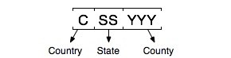
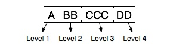
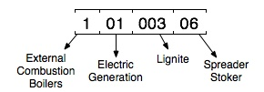
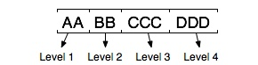
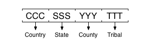
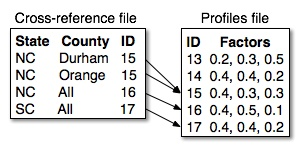
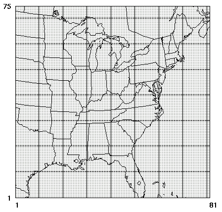

# 2 SMOKE概念

[2.1 简介](#2.1)

[2.2 分配（Assigns）文件和环境变量](#2.2)

[2.3 排放清单](#2.3)

[2.4 交叉引用和配置文件](#2.4)

[2.5 输入和输出文件类型](#2.5)

[2.6 模型参数](#2.6)

[2.7 排放模型的稀疏矩阵法](#2.7)

[2.8 区域源、生物源、移动源和点源处理摘要](#2.8)

[2.9 清单导入](#2.9)

[2.10 时间处理](#2.10)

[2.11 化学形态处理](#2.11)

[2.12 空间处理](#2.12)

[2.13 增长处理](#2.13)

[2.14 控制处理](#2.14)

[2.15 高架源处理](#2.15)

[2.16 使用MOVES进行移动源处理](#2.16)

[2.17 生物源处理](#2.17)

[2.18 创建预测模型使用的排放文件](#2.18)

[2.19 使用MOVES查表法创建预测模型使用的排放文件](#2.19)

[2.20 质量控制](#2.20)

<a id=2.1></a>

## 2.1 简介

SMOKE的目的是将排放清单中数据的分辨率转换为空气质量模型所需的分辨率。排放清单通常具有每个排放源的年总排放值，或者也许有平均日排放值。但是，空气质量模型通常需要每个模型网格单元（甚至可能是模型层）以及每个模型物种的每小时排放数据。因此，为了达到空气质量模型的输入要求，必须（至少）通过时间分配、化学形态、空间分配甚至可能是层分配来处理转换排放清单数据。

除了更改数据的分辨率外，SMOKE还必须以正确的文件格式向空气质量模型提供输入文件。SMOKE可以创建CMAQ模型所需的I/O API NetCDF格式数据。它还可以创建UAM和CAMX模型所需的Fortran二进制格式的2-D排放源文件，以及用于这些模型的ASCII格式高架点源数据（采用Ptsrce预处理程序处理）。文件格式对于SMOKE使用的输入文件也很重要，其中大多数是ASCII文件，也有一些是I/O API NetCDF或CF-兼容的NetCDF格式文件。

在本章中，我们向您介绍对理解SMOKE的处理技术至关重要的各种概念，并提供有关SMOKE的处理功能的更多详细信息。之后，[第5章，SMOKE实用工具](ch05.md)，[第6章，SMOKE核心程序](ch06.md)，[第7章，SMOKE质量控制](ch07.md)，[第8章，SMOKE输入文件](ch08.md)，[第9章，SMOKE中间文件](ch09.md)和[第10章，SMOKE输出文件](ch10.md)给出了有关每个程序的功能和每个文件的格式的更多细节内容。本章为用户手册的其余部分提供了目录和框架。为了帮助您阅读和使用本章，我们提供了[附录A 术语表](go01.md)用于排放清单和排放模型术语的定义。

<a id=2.2></a>

## 2.2 分配（Assigns）文件和环境变量

分配（Assigns）文件是用于设置SMOKE运行参数的脚本。该文件用于配置UNIX环境，以便SMOKE程序可以正确识别和使用输入、中间和输出过程的所有目录和文件。它还设置诸如网格的名称以及运行SMOKE的时间段之类的内容。它通过设置许多UNIX环境变量来做到这一点，这将在下一段中说明。分配（Assigns）文件还使用环境变量来配置编译器选项，以便SMOKE可以在其他操作系统上进行编译。有关分配（Assigns）文件的更多信息，请参见[第4.2.2.2节，分配（Assigns）文件](ch04.md#4.2.2.2)。

环境变量是可以由UNIX操作系统设置的别名。这些变量是在用户的UNIX会话期间定义的，通常由**xterm**或其他UNIX终端窗口定义。SMOKE使用的环境变量存储输入、中间和输出过程的所有目录和文件名称。例如，SMOKE根目录的环境变量为`SMKROOT`。在UNIX提示符下，可以将该环境变量定义为实际路径，例如`/home/mylogin/smoke`。要设置环境变量，需要使用**setenv**命令。在此示例中，将`SMKROOT`定义为给定路径的命令是：

```
setenv SMKROOT /home/mylogin/smoke
```

发出此命令后，`SMKROOT`环境变量将字符`/home/mylogin/smoke`存储为其值。要使用环境变量的值，必须在UNIX提示符下在变量名称之前使用`$`符号。比如如下命令：

```
echo $SMKROOT
```

UNIX系统执行此命令时，提示符下将显示以下内容：

```
/home/mylogin/smoke
```

在[第3章，SMOKE目录结构](ch03.md)中介绍了由分配（Assigns）文件为目录设置的环境变量。在[第4.2.4节，脚本设置](ch04.md#4.2.4)中介绍了SMOKE脚本用于控制SMOKE执行的变量。最后，在[第5章，SMOKE实用工具](ch05.md)、[第6章，SMOKE核心程序](ch06.md)和[第7章，SMOKE质量控制](ch07.md)中描述了控制程序行为的环境变量。

<a id=2.3></a>

## 2.3 排放清单

排放清单是SMOKE和排放模型的关键输入文件。这些清单包含的数据类型称为清单污染物（例如一氧化碳、氨、汞）。就其本身而言，SMOKE在读取清单文件中不需要特定的数据类型。但是，SMOKE支持的空气质量模型需要某些输入数据，称为模型物种，这反过来又要求SMOKE使用某些清单污染物。

在本节中，我们重点介绍SMOKE使用的清单文件。

<a id=2.3.1></a>

### 2.3.1 清单数据类型

SMOKE可以处理基本污染物、颗粒物、有毒污染物和活动数据清单。活动数据将在下一部分中与道路移动源一起讨论。基本污染物清单指的是包含EPA基本污染物的清单，包括：一氧化碳（CO）、氮氧化物（NOx）和挥发性有机化合物（VOC）或总有机气体（TOG）。颗粒物清单包含氨（NH3）、二氧化硫（SO2）、PM10和PM2.5。

此外，SMOKE可以按照预先指定的标准和/或颗粒物排放来处理清单。例如，可以将大小为2.5微米或更小的元素碳直接提供给SMOKE，而不是让SMOKE从PM2.5总排放量中计算得出。为确保在使用预先指定的排放时SMOKE可以正确处理数据，必须以特定方式配置其他输入文件，详见[第4.4.10节，使用其他物种形成机制或更改物种形成输入](ch04.md#4.4.10)中所述。

SMOKE可以处理的有毒物质清单是来自国家排放清单（National Emission Inventory，NEI）的有害空气污染物（Hazardous Air Pollutants，HAPs）数据。该清单包含数百种特定化合物，这些化合物代表《清洁空气法案（Clear Air Act）》中定义的188种有害空气污染物。可从[EPA网站]( http://www.epa.gov/ttn/atw/orig189.html )获得188种有害空气污染物的列表。清单中的污染物比188种更多，是因为188类中包含一些污染物组合，例如多环有机物、氰化物和许多金属化合物（包括铬化合物、镉化合物、锰化合物等）。请注意，由于这些污染物组合，不同年度中清单中的特定化合物可能不完全相同。例如，可能在第一年报告了氧化铅，但第二年却没有。但是，那些不属于组合的化合物可能会年复一年地出现在清单中，尤其是流动源排放的常见气态有害空气污染物，如苯、1,3-丁二烯、丙烯醛、甲醛和乙醛。

<a id=2.3.2></a>

### 2.3.2 清单污染源类别

<a id=2.3.2.1></a>

#### 2.3.2.1 概述

排放清单可分为几个污染源类别。这些划分源于两种不同的编制清单的方法，也源于污染源类别的不同特征和属性（稍后在这些术语上有更多说明）。通常，排放清单可分为以下污染源类别：

- **固定区域源/非点源：** 被视为在空间范围内散布（通常是县或空气区域）且不可移动（与移动源相比）的源。由于不可能收集每个排放源数据，因此在较大区域范围内进行估算。EPA引入术语“非点源”来代替“固定区域源”，以避免与术语“面源”混淆（术语“面源”在有毒污染物管理领域被用作监管术语）。但是，“非点源”这一术语尚未被基本污染物清单/模型社区所接受（到目前为止）。因此，在本手册中，当它们位于基本污染物清单中时，我们将使用术语“固定区域源”来指代这些污染源，而当它们处于有毒污染物清单中时，将使用术语“非点源”来指代这些污染源。非点源或固定区域源的例子是住宅供暖和建筑涂料。而诸如干洗设施之类的多种污染源则可以被视为固定区域源/非点源，也可以被视为点源。尤其是，有毒污染物清单包含了许多小的排放源（基于排放量），这些小的排放源由于已知并提供了位置而未被列入非点源清单。

- **非道路移动源：** 不包括在道路上行驶的车辆和其他移动源。这些源也被计算为分布在空间范围内（同样是县或空气区域）。非道路移动源的例子包括牵引机车、草坪和花园设备、建筑车辆和船舶排放。基本污染物清单和有毒污染物清单中都包含了非道路移动源。

- **道路移动源：** 在道路上行驶的车辆源。这些源可以计算为在空间范围内分布，也可以计算为在线路位置上分布（称为链接“link”）。道路清单中的数据可以是排放量数据或活动数据。活动数据包括车辆行驶里程数（VMT）和车辆速度（可选）。当SMOKE通过其他模型（例如MOVES）计算排放因子时，将使用活动数据。道路移动源的例子包括轻型汽油车和重型柴油车。基本污染物清单和有毒污染物清单中都包含了道路移动源。

- **点源：** 这些是按点位置标识的源，通常是因为它们受到管制并且在管制报告中有明确的位置。点源通常进一步细分为发电设施（electric generating utilities，EGUs）和非发电设施，尤其是在基本污染物清单中，发电设施是NOx和SO2的主要来源。非发电设施点源的例子包括化学品生产设施和家具喷漆设施。基本污染物清单和有毒污染物清单中都包含了点源。

- **野火源：** 传统上，野火排放被视为固定区域源。最近，还针对点位置开发了一些的数据，包括特定日期的排放和特定时间的烟羽抬升（排放量的垂直分布）。在这种情况下，SMOKE将野火排放作为点源处理。

- **生物土地利用数据：** 生物土地利用数据描述了县域总的或网格单元中存在的植被类型数据。北美的生物土地利用数据可使用两种不同的土地利用类别集获得：生物排放土地覆盖数据库（Biogenic Emissions Landcover Database，BELD）版本2（BELD2）和版本3（BELD3）。

SMOKE中的排放处理分为四个处理类别：区域源、生物源、移动源和点源。SMOKE使用的这些类别的定义与排放清单的定义不同。下表中列出了清单污染源类别、SMOKE可以处理的清单类型（基本污染物、颗粒物、有毒污染物和活动数据）、SMOKE可处理的时间周期，以及应用于处理清单的SMOKE处理类别。

**表2.1 清单污染源类别，SMOKE可处理的清单类型、时间周期、处理类别**

|**清单污染源类别**     |**活动数据**|**基本污染物**|**颗粒物** |**有毒污染物**|**SMOKE处理类别**|
|------------------------|------------|--------------|------------|--------------|-----------------|
|固定区域源/非点源       |N/A         |A, S, D, H    |A, S, D, H  |A, S, D, H    |区域源           |
|非道路移动源	         |N/A         |A, S, D, H    |A, S, D, H  |A, S, D, H    |区域源           |
|道路移动源(MOBILE6)     |A           |A, S, D, H    |A, S, D, H  |A, S, D, H    |移动源           |
|道路移动源(MOVES)       |A           |H             |H           |H             |移动源           |
|发电设施点源            |N/A         |A, S, D, H    |A, S, D, H  |A, S, D, H    |点源             |
|非发电设施点源          |N/A         |A, S, D, H    |A, S, D, H  |A, S, D, H    |点源             |
|预先计算烟气抬升的野火源|N/A         |D, H          |D, H        |N/A           |点源             |
|内部计算烟气抬升的野火源|N/A         |D             |D           |N/A           |点源             |
|生物土地利用            |N/A         |X             |N/A         |N/A           |生物源           |

表中：A=支持年均数据；S=支持日均数据；D=支持特定日数据；H=支持小时数据；X=支持可用数据。 

<a id=2.3.2.2></a>

#### 2.3.2.2 详细的污染源类别说明

每个清单污染源类别都有污染源特征、污染源属性、数据值和数据属性。**污染源特征**对于每种清单污染源类别都是唯一的，会将清单中的一种污染源与另一种污染源区分开来。**污染源属性**进一步描述了污染源具有的其他可用于排放处理的信息，例如点源烟道气出口高度和温度。**数据值**是排放值或活动值。**数据属性**是有关数据值的附加信息，例如已应用于污染源的控制措施减少排放的百分比。在以下小节中，我们总结了SMOKE用于每个清单类别的污染源特征、污染源属性、数据值和数据属性。

<a id=2.3.2.2.1></a>

##### 2.3.2.2.1 非点源/固定区域源和非道路移动源（SMOKE类别：区域源）

- **污染源特征：** 对于所有典型清单，标识这些污染源的特征为国家/州/县代码、SCC、和/或地理代码（GEOCODE LEVEL 1-4）。请参见[第2.3.4节，国家、州和县代码](#2.3.4)、[第2.3.5节，污染源分类代码（SCC）](#2.3.5)和[第2.3.7节，地理代码（GEOCODE LEVEL 1-4）](#2.3.7)以获取更多信息。

- **可选的污染源特征：** SMOKE还可以使用与区域源相同建模区域中的预网格化数据；这将在[第2.8.2.2节，预网格化排放源](#2.8.2.2)中详细描述。在这种情况下，污染源特性和属性（国家/州/县代码和SCC）将不在SMOKE中使用。SMOKE还可以使用来自不同建模区域的预网格化数据以及地理代码（GEOCODE LEVEL 1-4）和ARINV文件中的污染源信息来为每个网格单元指定污染源特征和关联的污染源属性。

- **污染源属性：** 清单基准年度与清单输入文件中的所有污染源相关联。此外，SMOKE还分配了一个时区（请参阅[第2.9.14节，分配国家代码、年和时区](#2.9.14)）和一种用于标准化时间配置的方法（请参阅[第2.9.13节，设置工作日平均方法](#2.9.13)）。仅在非点源有毒污染物清单中，标准行业分类（Standard Industrial Classification，SIC）代码（详见[第2.3.6节，标准行业分类代码](#2.3.6)）、最大可行控制技术（Maximum Achievable Control Technology，MACT）代码（详见[第2.3.8节，最大可行控制技术代码](#2.3.8)）和北美工业分类系统（North American Industrial Classification System，NAICS）代码是可选的污染源属性。SMOKE会读取NAICS代码，但此时没有其他用途。此外，非点源清单中有一个“污染源类型”字段，用于标识主要和《清洁空气法案（CAA）》112节的区域污染源（详见[第2.3.9节，源类型：主要和CAA-112节区域污染源](#2.3.9)）。

- **数据：** SMOKE可以读取非点源/固定区域源和非道路移动源清单的基本污染物、颗粒物和有毒污染物的排放数据。SMOKE系统不受所读取污染物的限制（尽管在[2.3.1节，清单数据类型](#2.3.1)中有典型示例）。SMOKE可以接受年度排放数据、平均日排放数据、或两者（尽管并非所有输入格式都支持所有类型）。SMOKE也可以读取排放因子值，但SMOKE对此不执行任何操作。

- **数据属性：** 非点源/固定区域源和非道路移动源的清单可以包含每种污染物的控制效率、规则渗透和规则有效性信息。如果提供这些数据，SMOKE将使用这些数据；否则，它将设置为默认值，该默认值指示未对清单污染物数据进行基于控制措施的调整。默认值以文件格式列出在[第8章，SMOKE输入文件](ch08.md)中。

<a id=2.3.2.2.2></a>

##### 2.3.2.2.2 道路移动源（SMOKE类别：移动源）

- **污染源特征：** 对于道路上的移动源清单，识别这些污染源的最小污染源特征是国家/州/县代码以及SCC或道路等级和车辆类型代码。提供SCC后，必须遵循特定的模式才能包含道路等级和车辆类型代码（请参见[第2.8.4.1节，道路移动源MOVES SCCs的特殊方法](#2.8.4.1)）。当道路等级和车辆类型代码直接提供给SMOKE时，SMOKE会将其转换为SCC值。

- **可选的污染源特征：** 链接（link）代码也可以标识道路上的移动源。该代码在每个县和SCC（或道路等级和车辆类型代码组合）中必须唯一。

- **污染源属性：** 清单基准年度与清单输入文件中的所有污染源相关联。此外，SMOKE还分配了一个时区（请参阅[第2.9.14节，分配国家代码、年和时区](#2.9.14)）和一种用于标准化时间配置的方法（请参阅[第2.9.13节，设置工作日平均方法](#2.9.13)）。对于具有链接（link）代码的源，SMOKE将使用链接的开始和结束坐标（经纬度或UTM坐标）。

- **数据：** SMOKE可以读取道路移动源清单中的基本污染物、颗粒物和有毒污染物的排放数据。SMOKE系统不受所读取污染物的限制（尽管在[2.3.1节，清单数据类型](#2.3.1)中有典型示例）。SMOKE可以接受年度排放数据、平均日排放数据、或两者（尽管并非所有输入格式都支持所有类型）。

	此外，道路移动源清单可能包含VMT和平均速度活动数据，当用户希望SMOKE运行MOVES来计算排放量时，就需要这些数据。预先计算的排放量和VMT数据的组合也可以输入SMOKE，但您有责任防止排放量重复计算。比如，如果你给某个源输入了预先计算的排放量，而对同一个源又使用SMOKE计算排放量（通过将MOVES的道路排放因子乘以每小时VMT，将MOVES的网络外排放因子乘以年度车辆保有量的方法），这时，重复就会出现。	

- **数据属性：** 没有数据属性与道路移动源相关联。

<a id=2.3.2.2.3></a>

##### 2.3.2.2.3 点源（SMOKE类别：点源）

- **污染源特征：** 点源的污染源特征取决于清单输入格式。SMOKE每行一个记录格式（one-record-per-line，ORL）和Flat File 10（FF10）格式按国家/州/县代码、工厂代码、点源代码、排气筒代码、段代码和SCC来标识源。

- **可选的污染源特性：**  SMOKE在一个工厂内最多可以支持五个位置标识符，尽管在当前实现的任何输入文件格式中使用最多的是四个。

- **污染源属性：** 与其他污染源类别一样，清单基准年度与清单输入文件中的所有污染源相关联。SMOKE还分配了一个时区（请参阅[第2.9.14节，分配国家代码、年和时区](#2.9.14)）和一种用于标准化时间配置的方法（请参阅[第2.9.13节，设置工作日平均方法](#2.9.13)）。此外，点源具有以下必需的污染源属性，这些属性与其他污染源类别无关：纬度、经度、烟囱高度、烟囱出口直径、烟气出口速度和烟气出口温度。最后，SMOKE还使用以下可选的污染源属性：SIC代码、MACT代码、工厂描述，排放释放类型点（例如水平烟囱、变化排放）、源类型（主要和CAA-112节区域污染源）、法规信息办公室系统（Office of Regulatory Information Systems，ORIS）识别码和锅炉识别码。另外，仅ORL格式支持MACT代码和污染源类型。请参阅[第2.3.6节，标准行业分类代码](#2.3.6)、[第2.3.8节，最大可行控制技术代码](#2.3.8)和[第2.3.9节，源类型：主要和CAA-112节区域污染源](#2.3.9)了解更多信息。

- **数据：** SMOKE可以读取点源清单中的基本污染物、颗粒物和有毒污染物的排放数据。SMOKE系统不受所读取污染物的限制（尽管在[2.3.1节，清单数据类型](#2.3.1)中有典型示例）。SMOKE可以接受年度排放数据、平均日排放数据、或两者。

	可选地，可以使用特定日期或特定小时的记录来提供点源排放数据。这些数据的格式详见[第8.2.6节，PTDAY：点源特定日排放量](ch08.md#8.2.6)和[第8.2.7节，PTHOUR：点源特定小时排放量](ch08.md#8.2.7)。

- **数据属性：**  EGU和非EGU点源可以包含每种污染物的控制效率和规则有效性信息。如果提供这些数据，SMOKE将使用这些数据；否则，它将设置为默认值，该默认值指示未对清单污染物数据进行基于控制措施的调整。默认值以文件格式列出在[第8章，SMOKE输入文件](ch08.md)中。

<a id=2.3.2.2.4></a>

##### 2.3.2.2.4 预先计算烟羽抬升的野火源（SMOKE类别：点源）

- **污染源特征：** 预先计算烟羽抬升的野火由国家/州/县代码和火灾名称标识。

- **可选的污染源特性：** 野火源没有可选的污染源特性。

- **污染源属性：** 与其他污染源类别一样，清单基准年度与清单输入文件中的所有污染源相关联。SMOKE还分配了一个时区（请参阅[第2.9.14节，分配国家代码、年和时区](#2.9.14)）和一种用于标准化时间配置的方法（请参阅[第2.9.13节，设置工作日平均方法](#2.9.13)）。另外，野火源污染源属性需要纬度和经度。最后，针对野火源**必须**提供额外的特定小时的源属性，用于表层排放量分数、烟羽底部高度和烟羽顶部高度。这些特定小时的属性使用[第8.2.7节，PTHOUR：点源特定小时排放量](ch08.md#8.2.7)中所述的点源特定小时格式提供给SMOKE。

- **数据：** 野火源清单可能包含基本污染物和颗粒物。SMOKE系统不受所读取污染物的限制（尽管在[2.3.1节，清单数据类型](#2.3.1)中有典型示例）。必须使用[第8.2.6节，PTDAY：点源特定日排放量](ch08.md#8.2.6)和[第8.2.7节，PTHOUR：点源特定小时排放量](ch08.md#8.2.7)中指定的点源格式，将这些数据作为特定日或特定小时的排放值提供。

- **数据属性：** 没有数据属性与野火源相关联。

<a id=2.3.2.2.5></a>

##### 2.3.2.2.5 内部计算烟气抬升的野火源（SMOKE类别：点源）

- **污染源特征：** 内部计算烟气抬升的野火源由国家/州/县代码、火灾ID、火灾名称、位置和SCC标识。

- **可选的污染源特性：** 野火源有可选的污染源特性，例如燃烧的材料、植被类型、燃烧的面积大小、燃料量、以及火灾的开始/结束时间。燃烧面积和燃料量用于计算特定火灾的烟羽抬升。火灾起止时间用来调整排放的每小时时间分布。

- **污染源属性：** 与其他污染源类别一样，清单基准年度与清单输入文件中的所有污染源相关联。SMOKE还分配了一个时区（请参阅[第2.9.14节，分配国家代码、年和时区](#2.9.14)）根据火灾的开始时间和结束时间标准化时间配置。此外，野火源需要经纬度来定位火源。请注意，一场火灾的所有排放物均假定来自包含火灾经纬度的单个网格单元。
最后，上面列出的野火源的其他特定日的污染源属性**必须**提供，以用来计算每场火灾的热通量。该热通量用于估算表层排放量分数、烟羽底部高度和烟羽顶部高度。可在[第4.4.17节，火灾的烟羽抬升计算](ch04.md#4.4.7)中查看有关如何处理的更多信息。

- **数据：** 野火源清单可能包含基本污染物和颗粒物。对于读取的污染物，SMOKE不受限制（尽管在[8.2.8.3节，ORL FIRE格式](ch08.md#8.2.8.3)中提供了典型示例）。这些数据必须使用[第8.2.6.2节，ORL FIREEMIS排放源格式](ch08.md#8.2.6.2)中指定的点源格式作为特定日的排放值提供。

- **数据属性：** 没有数据属性与野火源相关联。

<a id=2.3.2.2.6></a>

##### 2.3.2.2.6 生物土地利用（SMOKE类别：生物源）

- **污染源特征：** 生物源排放数据不能像先前描述的污染源类型那样完美地适合污染源特征范例。BELD2和BELD3处理的土地利用数据可以用来估算生物源的排放量。BELD2数据可以按美国州/县和BELD2土地利用类别获得，也可以按网格单元和BELD2土地利用类别获得。BELD3土地利用数据可通过北美和中美洲的1公里网格单元以及BELD3土地利用类别获得。

- **可选的污染源特征：** 生物土地利用数据不包括可选的污染源特征。数据可以按州/县划分，也可以按网格划分。

- **污染源属性：** 没有生物土地利用数据的污染源属性。

- **数据：** 生物土地利用数据由与每种土地利用类型相关的分数组成（在县或网格单元内）。

- **数据属性：** 没有生物土地利用数据的数据属性。

<a id=2.3.3></a>

### 2.3.3 清单文件格式

SMOKE支持用于基本污染物、颗粒物、有毒污染物和活动数据清单的多种清单格式，这些格式在[第8.2节，清单文件](ch08.md#8.2)中进行了详细描述。在这里，我们对这些格式进行了简要介绍，当您在本章其余部分和[第8章，SMOKE输入文件](ch08.md)之前的各章中阅读有关SMOKE的更多信息时，这将很有帮助。此处描述的所有格式均为文本文件。要将数据转换为这些格式，最好的方法是使用数据库或电子表格程序重新格式化并以请求的格式输出数据。SMOKE没有附带标准的格式转换方法。

在以下段落中，我们描述了可用于非点源/固定区域源、非道路移动源、道路移动源、点源和野火源的格式。

- **非点源/固定区域源：** SMOKE支持两种格式的非点源/固定区域源。ORL和FF10格式是列表定向的（用逗号或分号分隔），这些文件格式可用于表示许多不同的污染源。文件头信息可指示文件中包含了哪些源数据。

- **非道路移动源：** 非道路移动源有三种可用的清单格式。FF10格式是列表定向的（逗号或分号分隔），并且文件头用于指示文件内的非道路移动源数据。

- **道路移动源：** FF10格式为列表定向的（以逗号或分号分隔），并包含活动清单（例如VMT、速度和车辆保有量数据）。此格式需要VMT、速度和车辆保有量清单数据。

- **点源：** SMOKE具有年度、平均日、特定日、特定小时的清单格式。对于年度或平均日清单，可以将ORL和FF10格式用于基本污染物、颗粒物和有毒污染物清单。最后，CEM数据格式可用于特定日或特定小时的数据：SMOKE使用年度清单文件中的ORIS代码和锅炉代码来匹配CEM数据文件中的污染源。

- **野火源：** 您可以使用两种方法将野火数据提供为使用ORL和FF10点源格式的SMOKE点源。
     
	- **预先计算烟羽抬升的方法：** 由于某些字段不适用于野火源，因此必须将其留空（例如排气筒参数）。当使用提供的野火数据作为点源时，您还必须使用FF10特定日和特定小时的格式提供特定日或特定小时的野火排放以及特定小时的预先计算的烟羽抬升。

	- **内部计算烟羽抬升的方法：** 需要两个单独的清单文件，这些文件以经过修改的ORL格式提供：（1）具有特定火灾特征的火灾清单，包括县/州/县、火灾ID、位置坐标、火灾名称、SCC等，如[8.2.8.3节，ORL FIRE格式](ch08.md#8.2.8.3)所述；以及（2）特定日的火灾数据，包括燃烧面积、燃料量和火灾起止时间（详见[第8.2.6.2节，ORL FIREEMIS排放源格式](ch08.md#8.2.6.2)）。与上面列出的方法不同，此方法在内部使用燃烧区域的大小和燃料量来估算烟羽抬升，并通过火灾的开始和结束时间调整时间分布。请参阅[第4.4.17节，火灾的烟羽抬升计算](ch04.md#4.4.7)中的详细信息。

<a id=2.3.4></a>

### 2.3.4 国家，州和县代码

SMOKE使用6位整数代码来标识特定污染源的国家、州（或省）和县（或其他地区）。输入到SMOKE的大多数美国清单都有5位数字的美国联邦实施计划标准（Federal Implementation Planning Standards，FIPS）州和县代码。所有清单输入格式都经过修改，以包括一个特殊的文件头记录，您可以使用该记录指定国家，从而有效地为清单提供SMOKE使用的6位代码。6位数系统设计用于美国各州和县以及加拿大和墨西哥，但也可以用于其他用途。SMOKE用于代码的格式为：



SMOKE安装程序设置使用在`COSTCY`或`GEOCODE_LEVEL4`（如果`USE_EXP_GEOCODES`设置为Y）文件中定义的以美国为中心的代码，其中包含代码及其相关名称和时区的设置。在此文件中，美国国家代码为零，这使得美国国家/州/县代码可以与美国清单中的FIPS州/县代码相同。有关`COSTCY`文件格式的更多信息，请参见[第8.10.2节，COSTCY：国家，州和县名称和数据](ch08.md#8.10.2)。

要更改SMOKE中国家，州或县代码的含义，必须修改`COSTCY`或`GEOCODE_LEVEL4`（如果`USE_EXP_GEOCODES`设置为Y）文件，以使用与每个国家、州、县或部落代码相关的其他不同名称。所有SMOKE输入文件也必须使用此新的编号方案，包括清单文件和交叉引用文件。

SMOKE中国家代码的可接受值为0到9，州代码的可接受值为1到99，县级代码的可接受值为1到999，不接受字母代码，因为SMOKE将这些值存储为整数。

<a id=2.3.5></a>

### 2.3.5 源分类代码

EPA使用源分类代码（Source Classification Codes，SCCs）、区域源和移动源（area and mobile source，AMS）代码对不同类型的人为排放活动进行分类。SCCs的点源有8位数字；而AMS代码有10位数字，有时还前置“A”作为第11个字符。在SMOKE中，我们将两种代码都称为“SCCs”，并且忽略AMS代码中的前导前置“A”符号。此外，SMOKE允许非点源和点源有毒污染物清单在同一清单输入文件中使用8位和10位SCCs代码，因为1999年NEI的HAPs非点源和点源有毒污染物清单中同时包含了8位和10位代码。从SMOKE v4.0开始，SMOKE及其输入文件中SCCs的最大字段宽度为20个字符。同时仍然支持8位或10位SCC，但如果SCC大于10位，则不支持SCC分层方法。

对于不超过10个字符的SCCs，代码使用分层系统。从左到右，代码的定义变得越来越具体。（注意：如果SCC的长度大于10个字符，则不使用分层系统。）对于10个字符或更少的SCC，了解代码的分层系统很重要，因为您可以在构建交叉引用文件中利用分层系统将排放处理因子分配给清单排放源。在下图中，级别1是最不具体的，级别4是最具体的。

8位点源代码的代码结构为：



点源活动和相应的SCC的示例可以直接从SMOKE的SCC描述文件（`SCCDESC`）中获取：“外部燃烧锅炉：发电：褐煤：抛煤机炉排”由10100306表示。下面，我们已经将此描述的级别与SCC的级别进行了映射：



同样，10位区域源和移动源代码的代码结构为：



尽管在实践中，SMOKE将SCC视为字符串，但实际上清单和交叉引用文件中的值通常是数字。在[第2.4节，交叉引用和配置文件](#2.4)中，我们解释了SMOKE如何使用这些分层系统，以及如何在SMOKE中使用它们准备SMOKE输入文件。

对于道路移动源，与其他源类别相比，对SCC的处理有些不同。我们将在[第2.8.4.1节，道路移动源MOVES SCCs的特殊方法](#2.8.4.1)中对此进行详细说明。

<a id=2.3.6></a>

### 2.3.6 标准行业分类（Standard Industrial Classification，SIC）代码

尽管在EPA建立的排放清单中SIC代码已被NAICS代码取代，但SIC代码仍用于排放处理。从SMOKE v4.0开始，SIC代码的长度最多为20个字符，但是对于大于4位数字的SIC代码，则不使用分层系统。对于4位数的SIC，SMOKE将2级分层系统识别为适用于增加、控制和化学形态因子的应用。这两个代码级别如下所示：


<a id=2.3.7></a>

### 2.3.7 地理代码（GEOCODE_LEVEL 1-4）

可以使用GEOCODE_LEVEL 1-4文件将地理代码指定为用户所需的层级。GEOCODE_LEVEL1包含清单中每个国家的三个字符代码（CCC）。GEOCODE_LEVEL2包含六个字符代码（CCCSSS），用于用户希望在清单中跟踪的每个州。GEOCODE_LEVEL3包含用户要在清单中跟踪的每个县的九个字符代码（CCCSSSYYY）。GEOCODE_LEVEL4包含用户想要在清单中跟踪的每个部落区域的十二个字符代码（CCCSSSYYYTTT）。



<a id=2.3.8></a>

### 2.3.8 最大可行控制技术（MACT）代码

以下从EPA摘录的引文解释了什么是MACT代码以及为什么在某些清单中而不是在其他清单中使用它们：

	为了通过最大可行控制技术（MACT）标准评估EPA在减少空气有毒污染物排放方面的进展，并标识污染源用于模拟风险评估的一部分，在NTI中将受MACT标准约束的设施确定为4位数的MACT代码。请注意，术语NTI（National Toxics Inventory，国家有毒污染物​​清单）此后已被NEI取代，并且代码现在为6位数字。

	MACT类别是一种根据《清洁空气法案》第112（d）条（国家有害空气污染物排放标准）已经或正在制定排放控制措施的分类。EPA通过其MACT计划设定了污染源类别、基于技术的标准，从而大大减少了HAP的排放。EPA的[ATW网站]( http://www.epa.gov/ttn/atw/eparules.html )包含有关MACT污染源类别和MACT计划的信息。使用MACT代码标记数据可以使EPA确定由于MACT计划产生的减排量。NTI将对应于MACT源类别的MACT代码与固定的主要和CAA-112节区域污染源数据相关联。MACT代码可分配在点源数据中的工艺过程级别或站点级别，例如，城市垃圾焚烧炉（MWC）的MACT代码在站点级别分配，而炼油厂催化裂化的MACT代码是在工艺过程级别分配的。MACT代码也分配给非点源文件中的污染源类别。

在SMOKE中，MACT代码被视为6个字符的字符串，并且没有分层系统。

<a id=2.3.9></a>

### 2.3.9 污染源类型：主要和CAA-112节区域污染源

对于点源和非点源有毒污染物清单，每个污染源都可以标记为“主要源”或“CAA-112节区域源”，以输入到SMOKE（以下段落说明了如何将“区域”一词应用于点源清单）。《清洁空气法案》将“主要源”定义为每年排放或有可能排放10吨或更多任何一种有毒空气污染物，或每年排放25吨或更多任何组合有毒空气污染物的固定源。“CAA-112节区域源”包括有毒空气污染物排放量低于《清洁空气法案》第112条所定义的“主要源”阈值的设施，也就是每年排放的单一有毒空气污染物少于10吨，或每年排放的多种有毒空气污染物总和少于25吨。对于非点源，原则上存在另一种源类型：“其他源”；这种源类型的一个例子是野火。但是，这些污染源类型在非点源有毒污染物清单中与“CAA-112节区域源”的标签没有不同，因此，到目前为止，“其他源”这一污染源类型尚未包含在SMOKE中。

关于使用“区域”术语来描述点源（可能会造成困扰）的说明：在点源清单中将源指定为“CAA-112节区域源”与SMOKE的“区域源”处理类别没有任何关系。SMOKE仍会使用经纬度位置和排气筒参数将属于“CAA-112节区域源”的点源作为点源进行处理。

实际上，所有“主要源”都应仅出现在点源有毒污染物清单中，但在某些情况下，“主要源”会出现在非点源清单中（特别是在1996年度清单（2001年7月版）中）。因此，点源和非点源有毒污染物输入格式都提供了污染源类型名称。

当应用基于MACT的控制因子时，将使用主要和CAA-112节区域污染源名称。这些控制因子是根据污染源的MACT代码分配的，因此无论污染源名称如何，都可以将控制因子仅应用于“主要源”，或仅适用于“CAA-112节区域源”，或者两者都适用。

<a id=2.3.10></a>

### 2.3.10 污染源类型：非道路和道路移动源

当应用基于MACT的控制因子时，将使用非道路和道路移动源类型名称。这些控制因子是根据污染源的MACT代码分配的。

<a id=2.4></a>

## 2.4 交叉引用和配置文件

在[第2.3节，排放清单](#2.3)中描述的排放清单可能包含数十万甚至数百万个污染源。为每个污染源收集有关其时间分配、化学形态和空间分配的具体信息是不切实际的。因此，排放处理中涉及假设这些主要处理步骤的许多源共享相同的因子。例如，我们应用每月、每周和每小时的时间因子（称为配置文件），将年度排放量转换为特定小时排放量。各种研究提供了一组有限的按月划分、按星期划分和按一天的每小时划分的配置文件，这些配置文件都有自己唯一的编号（也称为配置文件代码或配置文件ID）。这组有限的配置文件使用一种称为交叉引用的方法分配给数量众多的清单污染源，该方法使用交叉引用文件实现。

交叉引用文件基于源特征（例如国家、州和县代码和/或SCC）指定配置文件，并使用配置文件编号将源特征与配置文件相关联。虽然配置文件中的编号是唯一的，但它们将在交叉引用中多次出现；这就是SOMKE对源进行分组的方式，以便以相同的方式处理它们。这种方法可用于时间分配配置文件、化学形态配置文件和空间配置文件（空间配置文件也被称为空间/网格替代文件）。

以循序渐进的方式将交叉引用表应用于污染源，以便始终应用可用的最具体的条目。例如，如果存在按州、县和SCC与污染源匹配的交叉引用条目，同时存在另一个仅按SCC与该污染源匹配的交叉引用条目，则SOMKE将应用前一个条目。描述每个交叉引用文件如何应用于清单的分层结构在[第6章，SOMKE核心程序](ch06.md)中针对每个程序进行了描述。

图2.1给出了交叉引用文件和配置文件如何协同工作的通用示例。在本例中，用于北卡罗来纳州大部分地区的配置文件ID是16。但是，达勒姆县和奥兰治县被分配了配置文件15，该配置文件将优先应用于达勒姆县和奥兰治县的所有来源，而不是使用常规的北卡罗来纳州配置文件16。南卡罗来纳州的污染源将被分配到配置文件17。

**图2.1 交叉引用文件和配置文件协同工作的通用示例**



该示例不对应于特定的处理步骤（即时间分配、化学形态形成或空间分配），而是基于交叉引用文件中的州和县信息，从配置文件15、16和17分配通用的“因子”。（请注意，我们在本例中使用了州和县名称，而真正的交叉引用文件将根据实际的文件格式使用国家、州和县代码。）

SOMKE以非常高效的方式处理交叉引用和配置文件。在读取交叉引用文件时，SOMKE首先使用与清单污染源相同的排序标准对交叉引用条目进行排序（例如，先按国家/州/县代码，然后按SCC，然后按剩余的源特征(如果有)）。接下来，根据每个条目的匹配“层级”对交叉引用条目进行分组。例如，仅使用州和县代码与清单匹配的所有条目将在一个组中，而仅使用SCC与清单匹配的条目将在另一个组中。交叉引用条目分组后，SOMKE会处理清单中的每个污染源，并尝试在其中一个交叉引用组中查找匹配的条目。首先搜索最特定的组，当找到特定源的匹配项时，则不再搜索其他组。这有助于提高效率。此外，因为交叉引用条目在每个组内被排序，所以可以对每个单独的搜索使用有效的搜索算法。当找到与其中一个交叉引用组的匹配项时，SOMKE将继续到清单中的下一个源，直到所有源都已处理完毕。

交叉引用和配置文件用于以下SOMKE处理步骤。这些步骤及其相关程序（在括号中列出）将在接下来的章节中介绍。
 
- 导入清单(**Smkinven**)
	- 交叉引用文件：`NHAPEXCLUDE`、`VMTMIX`、`PSTK`、`ARTOPNT`
    - 配置文件：无（需要时，因子会包含在交叉引用文件中）
- 时间分配(**Temporal**)
    - 交叉引用文件：`ATREF`、`MTREF`、`PTREF`
    - 配置文件：`ATPRO`、`MTPRO`、`PTPRO`
- 化学形态(**Spcmat**)
    - 交叉引用文件：`GSREF`、`GSCNV`
    - 配置文件：`GSPRO`
- 空间分配(**Grdmat**)
    - 交叉引用文件：`AGREF`、`MGREF`
    - 配置文件：`AGPRO`、`MGPRO`(**注意**)
- 增长和控制(**Cntlmat**)
    - 交叉引用文件：`GCNTL`
    - 配置文件：无（因子包含在交叉引用文件中）
- 移动源速度分配(**Movesmrg**)
    - 交叉引用文件：`MCXREF`、`MFMREF`
    - 配置文件：`SPDPRO`

[第6章，SOMKE核心程序](ch06.md)提供了每个SOMKE程序用来为污染源分配交叉引用文件条目的层次结构，其中对程序进行了详细描述。文件内容和格式在[第八章，SOMKE输入文件](ch08.md)中有更详细的描述。

**注意**：环境变量`AGPRO`(区域源空间替代文件)和`MGPRO`(移动源空间替代文件)已停止使用。在SOMKE中引入了两个新的环境变量：`SRGPRO_PATH`(空间替代文件位置)和`SRGDESC`(`SRGPRO_PATH`中替代内容的具体列表描述)，详见[第6.4.3，Grdmat输入和输出文件](ch06.md#6.4.3)。`SRGPRO_PATH`中的代理文件是旧的`AGPRO`和`MGPRO`文件的改进。它们与旧文件的格式相同，但是，现在可以有一个或多个替代文件。**Grdmat**现在可以单独处理每个替代文件。在单元数较大的区域上，此方法以稍微长一点的运行时间为代价来限制内存的使用。

<a id=2.5></a>

## 2.5 输入和输出文件类型

在我们详细描述SMOKE处理之前，我们首先需要解释您将在本文档中遇到的文件类型。SMOKE主要使用两种文件格式：ASCII文件和I/O API文件。此外，基于UAM的空气质量模型的输出文件为Fortran二进制文件格式。[第8章，SMOKE输入文件](ch08.md)、[第9章，SMOKE中间文件](ch09.md)、[第10章，SMOKE输出文件](ch10.md)描述了所有的输入、中间和输出文件，包括每个文件的格式。输入文件是至少一个核心SMOKE程序(列在[第6章，SMOKE核心程序](ch06.md)中)读取的文件，但不是由核心程序写入的文件。中间文件是由核心程序写入并由至少一个其他核心程序读取的文件。输出文件是由SMOKE核心程序输出但不被其他任何SMOKE程序读取的文件；这些文件包括报告、日志文件和要输入到空气质量模型的模型就绪文件。有个例外：一个由核心程序使用的中间文件同时也是为空气质量模型准备的输出文件：`STACK_GROUPS`文件，详见[第9.3.2节，STACK_GROUPS](ch09.md#9.3.2)。在本节中，我们将进一步介绍ASCII和I/O API文件，然后提供有关格式化SMOKE生成的模型就绪输出文件的两种方法的信息，分别是CMAQ/Models-3方法和基于UAM的方法。

SMOKE的输入文件主要是ASCII文件，但也使用了一些I/O API文件。SMOKE中的中间文件主要是I/O API文件，但也有几个重要的ACSII文件。SMOKE的输出文件主要是用于模型就绪排放文件的I/O API文件和Fortran二进制文件，以及用于报告和日志的ASCII文件。
 
<a id=2.5.1></a>

### 2.5.1 ASCII文件

ASCII文件是大多数计算机用户熟悉的文本文件。SMOKE输入的ASCII文件有两种结构：特定列（column-specific）和列表定向（list-directed）。

<a id=2.5.1.1></a>

#### 2.5.1.1 特定列（column-specific）的ASCII文件

在特定列文件中，文件中的字段必须出现在文件的某些列中。一行中的每个字符代表一列。以下各行表示特定列的ASCII数据文件：

```
TEST 1 2 3
Additional data
```

字符`TEST`位于文件的第1至4列，数字1、2和3分别位于第6、8和10列：

``` 
123456789012345
TEST 1 2 3
Additional data
```

<a id=2.5.1.2></a>

#### 2.5.1.2 列表定向（list-directed）的ASCII文件

在列表定向文件中，字段在行上的准确位置并不重要，但该行上字段的顺序至关重要。字段必须由称为分隔符的特殊字符分隔；在SMOKE中，有效的分隔符是**空格**、**逗号**或**分号**。如果某个特定字段恰好包含这些分隔符中的任何一个，则该字段必须在输入文件中用单引号或双引号引起来。

<a id=2.5.2></a>

### 2.5.2 I/O API文件

I/O API文件由SMOKE和其他程序使用的I/O API库读取和写入。库是为供多个程序使用而创建和编译的一组例程。反过来，I/O API库构建在另一个称为NetCDF库的库之上。因此，I/O API文件也称为I/O API NetCDF文件。有关这两个库的更多信息，请访问[I/O API网站]( https://www.cmascenter.org/ioapi/ )。
 [第12.4节，为UNIX编译SMOKE](ch12.md#12.4)包含获取I/O API和NetCDF库的说明。

无法使用文本编辑器查看I/O API文件，因为它们是二进制文件。与包含相同数据的ASCII文件相比，这些二进制文件使用的磁盘空间更少。它们还允许更高效地输入和输出数据，并且I/O API库提供了许多对所有输入和输出(I/O)有用的质量控制(QA)功能，包括用于排放处理的I/O。

基本I/O API文件的每个文件限制为120个变量。为了克服这一问题，SMOKE使用名为FileSetAPI的包装器，当SMOKE中的单个I/O API数据集中需要超过120个变量时，该包装器可以创建和管理多个I/O API文件。例如，如果SMOKE形态矩阵需要140个污染物到物种的变量，则默认情况下，SMOKE将打开两个标准I/O API文件：一个包含120个变量，另一个包含20个变量。生成的“文件组”将被其他SMOKE程序作为单个文件处理，这使得可以在一次运行中处理任意数量的污染物和物种，而不受I/O API变量的限制。

一些I/OAPI文件可以通过[VERDI]( https://www.cmascenter.org/verdi/ )查看。在SMOKE中，Verdi可以查看来自**Smkmerge**、**mgggrid**或**Smk2emis**程序的任何网格输出文件。

在某些情况下，以文本形式直接查看I/O API文件的内容会很有帮助。这提供了一种在模型就绪输出文件中检查网格设置、时间段或物种名称的快速方法。通过查看SMOKE生成的模型就绪输出文件的文本版本，您可以轻松确认是否已创建正确的物种或排放单位是否正确。要将I/O API文件转换为文本，可以组合使用NetCDF提供的**ncdump**实用程序和UNIX命令。**ncdump**实用程序是在编译NetCDF库时创建的，也可以从[NetCDF网站]( https://www.unidata.ucar.edu/software/netcdf/ )下载。 将I/O API文件转换为文本格式的命令为：

```
ncdump <infile> | cut -c1-80 > <outfile>
```

将上述命令中的`<infile>`替换为您输入的I/O API文件名，将`<outfile>`替换为您想要的ACSII输出文件名。输出文件包含存储在I/O API文件中的所有适用数据，包括网格信息、时间段、变量名称等。

<a id=2.5.3></a>

### 2.5.3 模型就绪文件

SMOKE支持两种主要方法来格式化用作空气质量模型输入的输出文件(即模型就绪文件)：CMAQ/Models-3方法和基于UAM的方法。CMAQ模型采用CMAQ/Models-3方法，UAM和CAMX模型采用基于UAM的方法。

CMAQ/Models-3方法使用一个必需的3D I/O API文件，该文件包含网格的、每小时的、特定的和垂直分布的排放。在SMOKE中，它被称为`EGTS3D_L`文件。要创建3D模型就绪的排放文件，SMOKE将计算部分或所有点源的烟羽抬升。对于CMAQ，可以为网格中的烟羽(plume-in-grid，PinG)处理提供另外两个可选文件。第一个必须包含PinG源的位置和排气筒参数，称为`STACK_GROUPS`文件。第二个必须在名为`PINGTS_L`的文件中包含相同PinG源的每小时排放量。

基于UAM的方法有两个必需的文件：(1)包含除点源和所有低架点源之外的所有源的2D排放Fortran二进制文件，以及(2)高架点源Fortran二进制文件。SMOKE程序**Smk2emis**可以通过转换I/O API格式的二维`EGTS_L`文件来创建二维排放Fortran二进制文件(称为`UAM_EGTS`文件)。为了获得高架点源的Fortran二进制文件，SMOKE程序**Smkmerge**可以创建一个ASCII高架点源文件，然后可以使用UAM预处理器[PTSRCE]( http://remsad.icfconsulting.com/ptsrce.htm )将该文件转换为所需的二进制格式。

<a id=2.6></a>

## 2.6 模型参数

排放模型需要有关将要进行的后续空气质量模型的信息。例如，要使用SMOKE生成适当的模型就绪文件，您必须知道将使用哪种空气质量模型、模型网格和地图投影、预测日期以及要使用的化学机制。在本手册中，我们将这些设置统称为“模型参数”。在本节中，我们将提供有关这些模型参数以及SMOKE支持它们的功能的信息。

SMOKE从脚本设置(环境变量)和输入文件中读取模型参数。在下面的小节中，我们提供了控制模型参数的相关设置和文件。有关如何配置您的脚本和文件以更改这些参数的更多信息，请参阅[第4.4节，如何使用SMOKE](ch04.md#4.4)；这些设置如何影响程序的说明请参见[第5章，SMOKE实用工具](ch05.md)和[第6章，SMOKE核心程序](ch06.md)。

<a id=2.6.1></a>

### 2.6.1 地图投影和模型网格

地图投影是地球球面在二维平面上的数学表示。SMOKE支持兰伯特正形、经纬度、UTM和极坐标地图投影。您可以使用许多不同的设置来定义兰伯特正形投影、UTM投影和极坐标投影，以使这些投影与您的气象模型和空气质量模型使用的投影相匹配。(经纬度是固定的投影，不能更改。)

模型网格是覆盖在地图投影上的二维区域。它由起点`xy`坐标、每个方向上的网格单元数和网格单元的大小来定义。图2.2显示了包括美国东部大部分地区的模型网格的示例。本例在`x`方向上有81个网格单元，在`y`方向上有75个网格单元，每个网格单元都是36乘36千米。每组10个单元格乘以10个单元格(从起始坐标开始计数)包含在黑色网格线中。

**图2.2 示例模型网格**


使用`IOAPI_GRIDNAME_1`在SMOKE中设置模型网格，以便从`GRIDDESC`输入文件中定义的网格和地图投影中选择网格和地图投影。使用`IOAPI_GRIDNAME_1`设置的网格名称必须与`GRIDDESC`文件中的网格名称匹配，以允许SMOKE从`GRIDDESC`文件获取网格和地图投影参数。

<a id=2.6.2></a>

### 2.6.2 基准年年和过去/未来某年

对于任何建模工作，排放基准年和未来某年都是执行排放处理所需的关键建模参数。基准年通常是运行空气质量模型的年份，以便将建模结果与观测到的空气质量数据进行比较。这样的比较允许建模人员调整排放数据和空气质量模型，以确保空气质量模型在建模过程中表现良好。

基准年通常是可获得排放清单的年份，通常也为同一年运行气象模型以准备SMOKE和空气质量模型输入，并且可以获得空气质量观测数据。当然，这一原则也有例外，但通常情况下，这就是人们如何建立基准年的方式。

几个不同的文件和设置用于在SMOKE中设置基准年，每个文件和设置都应该彼此一致，以获得理想的结果。

- SMOKE分配文件中的`YEAR`设置是脚本用来确定基准年份和设置各种特定年份输入文件名称的参考点。

- 事件和运行设置(参见[第2.6.3节，模型事件](#2.6.3)确定将在模型就绪输出文件中使用的基准年份。此基准年必须与`YEAR`设置匹配，以便使用正确的输入文件。

- 理想情况下，输入排放文件应包含相同基准年的数据，并且这些文件中的`#YEAR`设置应与分配文件中的`YEAR`环境变量一致。如果年度清单文件中的年份彼此不一致，SMOKE将确定来源最多的年份，并将其设置为基准年。如果使用特定日或特定小时的数据，则这些文件中的所有年份必须与年度排放的基准年保持一致。

- MOVES输入数据(如果使用)也应与基准年一致。SMOKE可以使用来自不同年份的输入运行MOVES，但某些输入可能不正确。

- 最后，来自MCIP的I/O API气象数据中的日期必须与基准年以及事件和运行设置保持一致。

未来(或过去)某年是建模人员需要运行空气质量模型的未来(或过去)选定的年份；例如，对特定排放控制措施的未来影响进行建模。要使用SMOKE对未来年份进行建模，您必须具有已为未来年份计算的清单，或者必须具有增长和控制系数以将基准年清单投射到未来年份。必须考虑的设置和文件如下：

- 设置`FYEAR`是在运行脚本中设置的，脚本使用`FYEAR`自动分配**Cntlmat**输入文件`GCNTL`的名称，其中包含增长因子。即使没有创建未来年度的清单，也必须将`FYEAR`设置为未来年度，因为它已经提供给您。

- 如果您已有未来年度的清单，因此不需要使用SMOKE从基准年清单中投射一个，则排放数据年份必须与未来年份匹配，并且清单文件中的`#YEAR`标头也必须与该年份匹配。在这种情况下，还必须使用`SMK_BASEYR_OVERRIDE`设置来指示基准年是什么(将与气象数据的年份相同)。

- MOVES输入数据(如果使用)还必须包括未来感兴趣年份的正确设置。

- 事件和运行设置、气象文件和特定日或小时的清单**不应**与未来年份匹配，而应使用基准年事件日期。

<a id=2.6.3></a>

### 2.6.3 模型事件

模型事件是您将运行SMOKE和空气质量模型的总时间段。除非事件只有几天长，否则用户通常会设置SMOKE来创建比模型事件持续时间更短的排放文件，通常会为事件的每一天创建一个一天的排放文件。虽然SMOKE可以为整个事件创建一个文件，但该文件通常会变得太大，一些计算机无法处理(32位操作系统的限制是2GB文件)，因此需要而不是偏好决定由SMOKE创建较小的文件(通常是一天的文件)。我们使用术语“运行周期”来区分这些较短的持续时间和完整的模型事件；除非另有说明，否则我们将假设“运行周期”为一天。例如，一个典型的SMOKE事件可能涵盖1996年7月1日至1996年7月31日。这一事件将有31个“运行周期”(天)，第一个时段(天)从1996年7月1日开始，最后一个时段(天)从1996年7月31日开始。

在SMOKE分配文件中，需要更改几个设置，以使SMOKE为感兴趣的事件创建排放。[第4.4节，如何使用SMOKE](ch04.md#4.4)提供了有关使用这些设置所需的特定形式和方法的更多指导。
 
- 必须设置事件开始日期(`EPI_STDATE`)、事件开始时间(`EPI_STTIME`)、事件时长(`EPI_RUNLEN`)、事件天数(`EPI_NDAY`)才能覆盖模型事件。请注意，SMOKE只能在单个日历年内包含的时段内运行。例如，它不能从1996年12月开始，一直持续到1997年1月。在这种情况下，需要设置两个独立的事件，第一个事件将于1996年12月31日结束，第二个事件将于1997年1月1日开始。

- 第一个运行周期的开始日期需要通过`G_STDATE`和`ESDATE`来设置。`G_STDATE`是SMOKE程序使用的年份和儒略日设置；在上面的示例中，`G_STDATE`将设置为1996183，因为7月1日是1996年的第183天。`ESDATE`是命名SMOKE中间和输出文件时使用的格里高利日期；对于我们的示例，`ESDATE`将是19960701。SMOKE脚本将使用`EPI_NDAY`设置自动循环该事件的运行周期数，从分配文件中的第一个`G_STDATE`值开始。对于每个运行周期，`G_STDATE`和`ESDATE`设置都会更改。

- 还必须设置运行周期开始时间(`G_STTIME`)和持续时间(`G_RUNLEN`)，以指明每个运行周期的开始时间和时长。这两个值都使用HHMMSS(时、分、秒)格式以小时数的形式提供。

	运行周期持续时间(`G_RUNLEN`)通常与事件时长(`EPI_RUNLEN`)不同。例如，如果事件时长为30天(720小时)，则运行周期持续时间设置可以仅为1天(25小时)、2天(49小时)或3天(73小时)(每种情况下额外1小时的原因如下所述)。在第一种情况下，SMOKE将创建30个25小时的文件；在第二种情况下，SMOKE将创建15个49小时的文件；在第三种情况中，SMOKE将创建10个73小时的文件。

- `NDAYS`、`MSDATE`、`MDAYS`设置用于命名文件。`NDAYS`应设置为每个运行周期的天数，默认用于命名基于时间的文件。`NDAYS`还与`EPI_NDAY`一起用于循环事件中的运行周期。`MSDATE`和`MDAYS`可用于命名气象输入文件，但SMOKE提供的默认分配文件不使用它们。

当您验证是否正确的设置事件时，需要记住以下几个关键事项：
 
- SMOKE不能在跨日历年处理排放。因此，可以运行的最长时间是365天，事件开始日期是1月1日。如果建模事件跨越多年，则必须为每年创建不同的分配文件、脚本和输入文件集。

- SMOKE支持的空气质量模型在每个排放输入文件中总是需要额外的一个小时，这取决于它们计算边界条件的方式。因此，如果您输入排放量以运行24小时周期，则应将`G_RUNLEN`设置为250000来输入25个小时。

- CMAQ和CAMX模型可以接受多天的排放文件，但UAM必须只有25小时的文件。然而，如前所述，所有这些模型通常都使用25小时的文件运行，每个事件个每一天用同一个文件。

- 所有时间都与时区关联，包括事件和运行周期开始时间设置。这些设置必须与气象文件的时区一致。如果气象数据是使用MM5创建的，则时区很可能是格林威治标准时间(GMT)；因此，必须在同一时区提供`EPI_STDATE`、`EPI_STTIME`、`G_STDATE`和`G_STTIME`设置。气象文件中的任何时区设置也将是SOMKE排放输出文件中日期和时间的时区。这确保了排放和气象文件的日期和时间是一致的，以便输入到空气质量模型。

<a id=2.6.4></a>

### 2.6.4 化学机理

SMOKE可以适应它所支持的模型的各种化学机理。从排放处理的角度来看，化学机理是将排放清单中提供的污染物映射到感兴趣的空气质量管理所需的物种。例如，CMAQ模型的五种化学机制的输入文件可从EPA下载；这些机制是碳键6(CB6)、带颗粒物的CB6、区域酸沉积模型2(RADM2)、带颗粒物的RADM2以及带有毒污染物的CB6研究版本。

在[第4.4.10节，使用不同的物种形成机制或更改物种形成输入](ch04.md#4.4.10)中，我们在分配文件中提供了在SMOKE中使用不同的化学机制所需的设置。SMOKE不限于上述可供下载的文件。如果您需要使用SMOKE处理其他数据(例如一种示踪剂物种)，可以将它们添加到几个输入文件中，包括化学机理文件，以输出到空气质量模型。一些化学机制的添加比其他的更容易，我们解释了如何确定您是否可以根据您的情况创建所需的文件。我们还给出了如何将物种添加到化学机理文件以及如何确保清单污染物映射到正确的化学物种的说明。

使用者必须知道在SMOKE输出排放的空气质量管理中将使用什么化学机制。一旦确定了这一点，在通过SMOKE采用MOVES创建道路移动源时，必须配置以下文件以与正在使用的清单和化学机理保持一致：清单表(`INVTABLE`)、物种形态配置文件(`GSPRO`)、物种形态交叉引用文件(`GSREF`)和移动处理文件(`MEPROC`)。

<a id=2.6.5></a>

### 2.6.5 层结构

SMOKE需要有关层结构的信息，以便在**Laypoint**程序中处理高架点源的烟羽抬升，并使用**Smkmerge**程序创建ASCII高架点源文件(`ELEVTS_L`或`ELEVTS_S`)。根据您是使用基于CMAQ的方法还是使用基于UAM的方法来创建排放，SMOKE获取层结构信息的方式会有所不同(请参阅[第2.5.3节，模型就绪文件](#2.5.3)。对于基于CMAQ的方法，SMOKE根据`GRID_CRO_3D`气象文件头中包含的结构确定层结构。对于基于UAM的方法，SMOKE实际上不需要知道层结构，除非将其输出到ASCII高架点源文件。在这种情况下，**Smkmerge**从以`UAM_`开头的环境变量名中获取了很多设置。

<a id=2.7></a>

## 2.7 排放模型的稀疏矩阵法

The paradigm for atmospheric emissions models prior to SMOKE was a
network of pipes and filters. This means that at any given stage in the
processing, an emissions file includes self-contained records describing
each source and [*all*] of the attributes acquired from
previous processing stages. Each processing stage acts as a filter that
inputs a stream of these fully-defined records, combines it with data
from one or more support files, and produces a new stream of these
records. Redundant data are passed down the pipe at the cost of extra
I/O, storage, data processing, and program complexity. Using this
method, all processing is performed one record at a time, without
necessarily a structure or order to the records.

This old paradigm came about as a way to avoid repeatedly searching
through data files for needed information, which would be very
inefficient. It is admirably suited to older computer architectures with
very small available memories and tape-only storage, but is not suitable
for current desktop machines or high-performance computers. SMOKE
developers demonstrated this when the Emissions Preprocessor System
(EPS) 2.0 was run on a Cray Y-MP. It ran four times slower on the Cray
machine (a much faster computer) than on a desktop 150 MHz DEC
Alphastation 3000/300. This paradigm also fostered a serial approach to
the emissions processing steps, as shown in [Figure 2.3, "Serial
approach to emissions
processing"](ch02s07.html#fig_concepts_serial_approach "Figure 2.3. Serial approach to emissions processing").


**Figure 2.3. Serial approach to emissions processing**


The new paradigm implemented in SMOKE came about from analyses
indicating that emissions computations should be quite adaptable to
high-performance computing if the paradigm were appropriately changed.
For each SMOKE processing category (i.e., area, biogenic, mobile, and
point sources), the following tasks are performed:

 
-   read emissions inventory data files

-   optionally grow emissions from the base year to the (future or past)
    modeled year (except biogenic sources)

-   transform inventory species into chemical mechanism species defined
    by an AQM

-   optionally apply emissions controls (except for biogenic sources)

-   model the temporal distribution of the emissions, including any
    meteorology effects

-   model the spatial distribution of the emissions;

-   merge the various source categories of emissions to form input files
    for the AQM

-   at every step of the processing, perform quality assurance on the
    input data and the results


Each processing category has its particular complexities and deviations
from the above list; these are described in [Section 2.8, "Area,
biogenic, mobile, and point processing
summaries"](ch02s08.html "2.8. Area, biogenic, mobile, and point processing summaries").
For all categories, however, most of the needed processing steps are
[*factor-based*]; they are linear operations that can be
represented as multiplication by matrices. Further, some of the matrices
are [*sparse*] matrices (i.e., most of their entries are
zeros).

SMOKE is designed to take advantage of these facts by formulating
emissions modeling in terms of sparse matrix operations, which can be
performed by optimized sparse matrix libraries. Specifically, the
inventory emissions are arranged as a vector of emissions sorted in a
particular order, with associated vectors that include characteristics
about the sources such as the state/county and SCCs. SMOKE then creates
matrices that apply the control, gridding, and speciation factors to the
vector of emissions. In many cases, these matrices are independent from
one another, and can therefore be generated in parallel and applied to
the inventory in a final "[merge]" step, which combines the
inventory emissions vector (now an hourly inventory file) with the
control, speciation, and gridding matrices to create model-ready
emissions. [Figure 2.4, "Parallel approach to emissions
processing"](ch02s07.html#fig_concepts_parallel_approach "Figure 2.4. Parallel approach to emissions processing")
shows how the matrix approach allows for a more parallel approach to
emissions processing, in which fewer steps depend on other needed steps.

Note that in [Figure 2.4, "Parallel approach to emissions
processing"](ch02s07.html#fig_concepts_parallel_approach "Figure 2.4. Parallel approach to emissions processing"),
temporal allocation outputs hourly emissions instead of a temporal
matrix. This is because of some peculiarities with temporal modeling for
point sources, which can use hourly emissions as input data. To be able
to overwrite the inventory emissions with these hourly emissions, the
temporal allocation step must output the emissions data. The matrix
approach is used internally in the temporal allocation step.

The growth and controls steps shown in [Figure 2.4, "Parallel approach
to emissions
processing"](ch02s07.html#fig_concepts_parallel_approach "Figure 2.4. Parallel approach to emissions processing")
are optional. If the inventory is not grown to a future or past year,
then the temporal allocation step uses the original inventory vectors to
calculate the hourly emissions.


**Figure 2.4. Parallel approach to emissions processing**


Several benefits can be realized from this more parallel approach. For
example, given a single emissions inventory, temporal modeling is
performed only once per inventory and episode (though in practice, this
step is often performed once per episode day). Also, gridding matrices
typically need only be calculated once per inventory and model grid
definition, without having to reprocess other steps. As shown in
[Figure 2.5, "Processing steps for running an additional grid in
SMOKE"](ch02s07.html#fig_concepts_additional_grid "Figure 2.5. Processing steps for running an additional grid in SMOKE"),
SMOKE usually needs to rerun only the gridding and merge steps to
process a different grid for the same inventory. The merge step in the
figure will read the previously created results from the temporal
allocation, chemical speciation, and control processing steps.


**Figure 2.5. Processing steps for running an additional grid in SMOKE**


In addition, speciation matrices need only be calculated once per
inventory and chemical mechanism. Similar to the gridding example,
[Figure 2.6, "Processing steps for running an additional chemical
mechanism in
SMOKE"](ch02s07.html#fig_concepts_additional_chemical "Figure 2.6. Processing steps for running an additional chemical mechanism in SMOKE")
shows the SMOKE steps that generally need to be rerun for running an
additional chemical mechanism.


**Figure 2.6. Processing steps for running an additional chemical
mechanism in SMOKE**


A final example of how this approach is beneficial is processing with a
control strategy. Because of SMOKE's parallel processing, changing a
control strategy requires only the control and merge steps to be
processed again ([Figure 2.7, "Processing steps for running a control
scenario in
SMOKE"](ch02s07.html#fig_concepts_running_control "Figure 2.7. Processing steps for running a control scenario in SMOKE")).
In serial processing, on the other hand, the growth and controls step
occurs as the second processing step, which requires that all downstream
steps be redone. In [Figure 2.7, "Processing steps for running a control
scenario in
SMOKE"](ch02s07.html#fig_concepts_running_control "Figure 2.7. Processing steps for running a control scenario in SMOKE"),
the speciation, temporal allocation, and gridding steps have already
been run, and can be fed to the merge step without being altered or
regenerated.


**Figure 2.7. Processing steps for running a control scenario in SMOKE**


Although SMOKE processing generally follows the structure shown in
[Figure 2.4, "Parallel approach to emissions
processing"](ch02s07.html#fig_concepts_parallel_approach "Figure 2.4. Parallel approach to emissions processing"),
there are some exceptions. In the list below, we summarize these
exceptions and provide references to the sections of this chapter where
these exceptions are explained and shown through diagrams. These
exceptions are also described in more detail in [Section 2.8.2,
"Area-source
processing"](ch02s08s02.html "2.8.2. Area-source processing"),
[Section 2.8.3, "Biogenic-source
processing"](ch02s08s03.html "2.8.3. Biogenic-source processing"),
[Section 2.8.4, "Mobile-source processing using
MOVES"](ch02s08s04.html "2.8.4. Mobile-source processing using MOVES"),
and [Section 2.8.5, "Point-source
processing"](ch02s08s05.html "2.8.5. Point-source processing").

 
-   [**On-road mobile processing with MOVES:**  One way of
    processing on-road mobile-source emissions is to have SMOKE run the
    MOVES model based on hourly, gridded meteorology data. To run a
    different grid or control strategy using this approach, users
    usually need to run a number of additional processing steps that we
    have not yet discussed. These differences from the standard
    processing approach are described in [Section 2.8.4, "Mobile-source
    processing using
    MOVES"](ch02s08s04.html "2.8.4. Mobile-source processing using MOVES").

-   [**Biogenics processing:**  Biogenics processing uses
    different processors than those for anthropogenic sources. The
    emissions from biogenic sources are based on land use data and
    meteorology data instead of on actual emission inventories. For more
    information, please see [Section 2.8.3, "Biogenic-source
    processing"](ch02s08s03.html "2.8.3. Biogenic-source processing").

-   [**Toxics processing for different chemical speciation
    mechanisms:**  Toxics processing may require some special
    processing steps during import of the inventory data when
    integrating the criteria and toxics inventories. This step depends
    on which chemical speciation approach is going to be used.
    Therefore, when changing the toxics speciation mechanism, it is
    sometimes necessary to rerun the data import step. See
    [Section 2.9.5, "Combine toxics and criteria
    inventories"](ch02s09s05.html "2.9.5. Combine toxics and criteria inventories")
    for more information.

-   [**Point-source processing for CMAQ versus UAM, or CAM~X~:** 
    Point-source processing for CMAQ uses some different programs than
    processing for UAM or CAM~X~. In some cases, it may be necessary to
    rerun several programs in order to run for one model rather than
    another. Further details on this additional processing can be found
    in [Section 2.8.5, "Point-source
    processing"](ch02s08s05.html "2.8.5. Point-source processing").

-   [**Adding hour-specific or day-specific point-source data:** 
    If you want to add hour-specific or day-specific point-source data
    after a point source run has already been performed, several
    processing steps must be rerun. Further details on this additional
    processing can be found in [Section 2.8.5, "Point-source
    processing"](ch02s08s05.html "2.8.5. Point-source processing").

## 2.8 区域源、生物源、移动源和点源处理摘要

### 2.8.1. Summary of SMOKE processing categories

Each SMOKE processing category is defined by its source
[*characteristics*], which correspond to the identifiers used
in creating the emission inventory (e.g., state/county FIPS code and
SCC). The processing categories also have source
[*attributes*], which are the other useful data in the
emission inventories that SMOKE uses; examples are point-source flue gas
exit height and temperature. Source characteristics
[*define*] the sources as area, biogenic, mobile, or point
sources and also distinguish one source in the inventory from another.
Source attributes are additional data about the source that do not
contribute to the source's uniqueness in SMOKE. We have previously
described in [Section 2.3.1, "Inventory data
types"](ch02s03.html#sect_concepts_inv_data_types "2.3.1. Inventory data types")
the data types and the data attributes that are contained in the
inventories that SMOKE uses. In the subsections below, we summarize the
source characteristics of area, biogenics, mobile, and point sources.
Please refer to [Table 2.1, "Inventory source categories and SMOKE
processing capabilities and
categories"](ch02s03s02.html#tbl_concepts_inv_categories "Table 2.1. Inventory source categories and SMOKE processing capabilities and categories")
for more information about how SMOKE processing categories map to the
inventory source categories.

In SMOKE, each processing category is defined by source characteristics
as follows:

 
-   [**Area sources**  are defined by (1) [country, state, and
    county
    codes](ch02s03s04.html "2.3.4. Country, state, and county codes"), (2)
    [SCCs](ch02s03s05.html "2.3.5. Source Classification Codes"),
    and (3) optionally, grid cell.

-   [**Biogenic sources**  are defined differently depending on
    the type of processing you are using. They can be defined either
    by (1) [country, state, and county
    codes](ch02s03s04.html "2.3.4. Country, state, and county codes")
    and (2) land use code, or by (1) grid cell and (2) land use code.

-   [**Mobile sources**  are defined by (1) [country, state, and
    county
    codes](ch02s03s04.html "2.3.4. Country, state, and county codes"), (2)
    [SCCs](ch02s03s05.html "2.3.5. Source Classification Codes"),
    and (3) optionally link codes.

-   [**Point sources**  are defined by (1) [country, state, and
    county
    codes](ch02s03s04.html "2.3.4. Country, state, and county codes"), (2)
    plant/facility codes, and (3) characteristics 1 through 5, one of
    which must be the
    [SCC](ch02s03s05.html "2.3.5. Source Classification Codes").
	
### 2.8.2. Area-source processing

In SMOKE, there are two major processing routes that you can take for
area sources: the typical route and the pregridded data route. (Recall
that by "[area sources]" in SMOKE we mean stationary
area/nonpoint sources and nonroad mobile sources.)

 
#### []{#d0e2298}2.8.2.1. Typical route 

The typical route involves processing data identified by
country/state/county codes and SCCs. The processing steps vary depending
on whether you are doing base-case processing or future- or past-year
processing. The steps for base-year processing are shown in [Figure 2.8,
"Base case area-source processing
steps"](ch02s08s02.html#fig_concepts_area_base "Figure 2.8. Base case area-source processing steps").
In [Figure 2.4, "Parallel approach to emissions
processing"](ch02s07.html#fig_concepts_parallel_approach "Figure 2.4. Parallel approach to emissions processing"),
we also included the major intermediate vectors and matrices; please
refer to that diagram for those details. The inventory import step reads
the raw emissions data, screens them, processes them, and converts the
raw data to the SMOKE intermediate inventory file (inventory vectors in
[Figure 2.4, "Parallel approach to emissions
processing"](ch02s07.html#fig_concepts_parallel_approach "Figure 2.4. Parallel approach to emissions processing")).
The emissions in the inventory file are subdivided to hourly emissions
during temporal allocation; assigned chemical speciation factors during
speciation, and assigned spatial allocation factors during gridding. The
merge step combines the hourly emissions, speciation matrix, and
gridding matrix to create model-ready emissions.


**Figure 2.8. Base case area-source processing steps**


In [Figure 2.9, "Future- or past-year growth and optional control
area-processing
steps"](ch02s08s02.html#fig_concepts_area_growth "Figure 2.9. Future- or past-year growth and optional control area-processing steps"),
we show the area-source processing steps for future- or past-year
processing. This processing is similar to the base-year processing flow,
except the growth and controls step is added to create the growth matrix
and optionally one or more control matrices. The grow inventory step
applies the growth matrix to convert the base-year inventory to a future
or past year. Also, the control matrix can optionally be used in the
merge step to apply control factors to the future- or past-year
emissions. The steps shown with dotted lines represent steps that can be
reused from the base-year processing because they do not depend on any
of the new steps.


**Figure 2.9. Future- or past-year growth and optional control
area-processing steps**


Finally, inventory controls as well as growth can be applied at the
front end of processing if such a scheme is needed ([Figure 2.10,
"Alternative future- or past-year growth and control area-processing
steps"](ch02s08s02.html#fig_concepts_area_projection "Figure 2.10. Alternative future- or past-year growth and control area-processing steps")).
This method permits up to 80 growth and/or control matrices to be
applied to an inventory, whereas the method shown in [Figure 2.9,
"Future- or past-year growth and optional control area-processing
steps"](ch02s08s02.html#fig_concepts_area_growth "Figure 2.9. Future- or past-year growth and optional control area-processing steps")
allows only one control matrix in the merge step, although any number of
growth matrices on the front end. The processing scheme shown in
[Figure 2.10, "Alternative future- or past-year growth and control
area-processing
steps"](ch02s08s02.html#fig_concepts_area_projection "Figure 2.10. Alternative future- or past-year growth and control area-processing steps")
can therefore be useful when mixing and matching many control strategies
for simulations.


**Figure 2.10. Alternative future- or past-year growth and control
area-processing steps**


In sections later in this chapter, we describe the SMOKE programs that
are needed for each of these processing steps and additional details
about what activities are accomplished during each step. These sections
are:

 
-   [Section 2.9, "Inventory
    import"](ch02s09.html "2.9. Inventory import")
-   [Section 2.10, "Temporal
    processing"](ch02s10.html "2.10. Temporal processing")
-   [Section 2.11, "Chemical speciation
    processing"](ch02s11.html "2.11. Chemical speciation processing")
-   [Section 2.12, "Spatial
    processing"](ch02s12.html "2.12. Spatial processing")
-   [Section 2.13, "Growth
    processing"](ch02s13.html "2.13. Growth processing")
-   [Section 2.14, "Control
    processing"](ch02s14.html "2.14. Control processing")
-   [Section 2.18, "Creating model-ready
    emissions"](ch02s18.html "2.18. Creating model-ready emissions")
-   [Section 2.20, "Quality
    assurance"](ch02s20.html "2.20. Quality assurance")


#### 2.8.2.2. Pre-gridded Emissions 

##### 2.8.2.2.1. Pregridded data route for same modeling domain

The second processing approach for area sources involves using
pregridded data. As indicated in [Section 2.8.1, "Summary of SMOKE
processing
categories"](ch02s08.html#sect_concepts_summary_source_processing "2.8.1. Summary of SMOKE processing categories"),
area sources can be specified by grid cell instead of by
country/state/county code and SCC. This optional approach to modeling
area sources requires the inventory emissions data to be gridded prior
to inventory import. The gridded area sources do [*not*] have
country/state/county codes or SCCs, and can be provided via an I/O API
time-independent gridded data file. The flow diagrams that describe this
type of processing are identical to those in [Figure 2.8, "Base case
area-source processing
steps"](ch02s08s02.html#fig_concepts_area_base "Figure 2.8. Base case area-source processing steps"),
[Figure 2.9, "Future- or past-year growth and optional control
area-processing
steps"](ch02s08s02.html#fig_concepts_area_growth "Figure 2.9. Future- or past-year growth and optional control area-processing steps"),
and [Figure 2.10, "Alternative future- or past-year growth and control
area-processing
steps"](ch02s08s02.html#fig_concepts_area_projection "Figure 2.10. Alternative future- or past-year growth and control area-processing steps").
Although the gridding step is quite trivial when the grid cell numbers
are already specified, the gridding step must still be run to create a
gridding matrix required for the merge step.

The disadvantage of using pregridded emissions for area-source
processing is that there are no country/state/county codes and SCCs to
use in the cross-referencing of any processing step. Therefore, temporal
profiles, speciation profiles, growth factors, and control factors must
be applied uniformly across the model grid by pollutant.


##### 2.8.2.2.2. Pregridded data route for a different modeling domain 

The sequence for processing global emissions data (e.g., EDGAR, RCP and
HTAP) for hemispheric CMAQ involves projecting the data from
latitude-longitude projection to polar stereographic projection,
converting the inventory species to the terms required by the CMAQ
chemical mechanism, and extrapolating the annual emissions to hourly
estimates.

[Detail
information](https://docs.google.com/document/d/1veqEjaTPbDpkqHAIcyReokvv6MaENz0TrwOcFl1ewac/edit#heading=h.xo1iz1nkhapd)
on how to process pregridded global emissions data for CMAQ Hemispheric
Modeling in SMOKE is available at [this
link](https://docs.google.com/document/d/1veqEjaTPbDpkqHAIcyReokvv6MaENz0TrwOcFl1ewac/edit#heading=h.xo1iz1nkhapd).


#### 2.8.2.3. Day-specific and Hour-specific Emissions

Emissions from area sources are sometimes available as day- or
hour-specific values. **Smkinven** can import the day- and hour-specific
data, and it can also convert the hour-specific data to hour-specific
temporal profiles. When these data are available, the **Temporal**
program overrides the annual or daily emissions with the most specific
data available. If day-specific data are available, **Temporal** uses
them to overwrite the annual or average-day emissions during the time
periods that these data are available. If hour-specific data are
available, **Temporal** uses them to overwrite the annual, average-day
emissions, or day-specific emissions data.


 
### 2.8.3. Biogenic-source processing

SMOKE biogenic emissions modeling can be accomplished with the Biogenic
Emissions Inventory System, version 3 (BEIS3) approach using the
processing scheme ([Figure 2.11, "Biogenic-source processing steps and
intermediate
files"](ch02s08s03.html#fig_concepts_biogenic_base "Figure 2.11. Biogenic-source processing steps and intermediate files")).
The raw land use inventory data are imported and output as normalized
emissions. Meteorology adjustments are then applied to the normalized
emissions to create hourly model-ready emissions estimates.


**Figure 2.11. Biogenic-source processing steps and intermediate files**

 {.mediaobject}


The land use import can start with gridded BELD3 or BELD4 land use data
and uses BEIS3 summer and winter emission factors. In [Section 2.17,
"Biogenic processing"](ch02s17.html "2.17. Biogenic processing"), we
provide additional details about the SMOKE programs used for BEIS3
processing and its capabilities.

A variation can be run on the processing steps shown in [Figure 2.11,
"Biogenic-source processing steps and intermediate
files"](ch02s08s03.html#fig_concepts_biogenic_base "Figure 2.11. Biogenic-source processing steps and intermediate files")
(see [Figure 2.12, "Biogenic-source processing steps and intermediate
files using both winter and summer emission
factors"](ch02s08s03.html#fig_concepts_biogenic_seasons "Figure 2.12. Biogenic-source processing steps and intermediate files using both winter and summer emission factors")).
In this variation, some grid cells use summer emission factors and some
use winter emission factors. This is useful during the changes of
seasons. Based on guidance from EPA, the summer emissions factors should
be used for time periods after the last frost of the spring until the
first frost of the fall, and winter emission factors should be used at
other times of the year. To make such assignments by grid cell, the
SMOKE utility **Metscan** analyzes the meteorology data for the entire
year (or the period of interest) to establish which days each grid cell
should use winter and summer emission factors. **Metscan** creates a
winter/summer switch file that indicates the appropriate season for each
grid cell for each day. More information on **Metscan** is available in
[Section 5.3.11, "**Metscan**"](ch05s03s11.html "5.3.11. Metscan"). The
results of the meteorology analysis can then be used in the
[Figure 2.12, "Biogenic-source processing steps and intermediate files
using both winter and summer emission
factors"](ch02s08s03.html#fig_concepts_biogenic_seasons "Figure 2.12. Biogenic-source processing steps and intermediate files using both winter and summer emission factors")
processing approach, in which both the summer and winter normalized
emissions are provided to the meteorology adjustments step, along with
the winter/summer switch file. The resulting model-ready emissions data
have used the winter emission factors for all grid cells of the domain
that have experienced the first freeze date of the year but not the last
(within a calendar year, this is the time periods January through March
and November through December in many regions), and the summer emission
factors for all grid cells between the last and first freeze dates.


**Figure 2.12. Biogenic-source processing steps and intermediate files
using both winter and summer emission factors**

 {.mediaobject}


In [Section 2.17, "Biogenic
processing"](ch02s17.html "2.17. Biogenic processing") we describe the
SMOKE programs that are needed for each of these processing types for
BEIS3 processing, and additional details about what activities are
accomplished during each step.


### 2.8.4. Mobile-source processing using MOVES

SMOKE provides two ways of processing mobile sources using MOVES.
(Recall that by "[mobile sources]" in SMOKE we mean on-road
mobile sources.) The first approach is to compute mobile emissions
values prior to running SMOKE and provide them to SMOKE as input; we
call this the precomputed-emissions approach. The second approach is to
provide SMOKE with VMT data, Vehicle population (VPOP) data, meteorology
data, and MOVES outputs, and have SMOKE compute the mobile emissions
based on these data; this is called the MOVES approach. These approaches
are not mutually exclusive, so it is possible to provide both
precomputed emissions and VMT and VPOP data to SMOKE and have the system
compute only some of the emissions using MOVES outputs. Both processing
approaches can produce criteria, particulate, and toxics emissions
results.

The precomputed-emissions approach is quite similar to the processing
method for area sources. In fact, [Figure 2.8, "Base case area-source
processing
steps"](ch02s08s02.html#fig_concepts_area_base "Figure 2.8. Base case area-source processing steps"),
[Figure 2.9, "Future- or past-year growth and optional control
area-processing
steps"](ch02s08s02.html#fig_concepts_area_growth "Figure 2.9. Future- or past-year growth and optional control area-processing steps"),
and [Figure 2.10, "Alternative future- or past-year growth and control
area-processing
steps"](ch02s08s02.html#fig_concepts_area_projection "Figure 2.10. Alternative future- or past-year growth and control area-processing steps")
from [Section 2.8.2, "Area-source
processing"](ch02s08s02.html "2.8.2. Area-source processing") show
exactly the processing steps needed for processing mobile sources using
SMOKE and the precomputed-emissions approach. As in base-case processing
for area sources, emissions in the inventory file are subdivided to
hourly emissions during temporal allocation, assigned chemical
speciation factors during speciation, and assigned spatial allocation
factors during gridding. The merge step combines the hourly emissions,
speciation matrix, and gridding matrix to create model-ready emissions.
For future- or past-year processing, the growth and controls step is
added to create the growth and control matrices, while the grow
inventory step converts the inventory from the base year to a future or
past year. The control matrix can be optionally used in the merge step
to apply control factors to the future- or past-year emissions. Note
that, unlike the VMT approach, in the precomputed-emissions approach
SMOKE will not model the variations in emissions caused by temperature,
humidity, or other meteorological settings.

The MOVES approach is much different from the precomputed-emissions
approach. [Figure 2.13, "MOVES mobile RatePerDistance processing
steps"](ch02s08s04.html#fig_concepts_mobile_moves_onroad "Figure 2.13. MOVES mobile RatePerDistance processing steps")
and [Figure 2.14, "MOVES mobile RatePerVehicle and RatPereProfile
(off-network) processing
steps"](ch02s08s04.html#fig_concepts_mobile_moves_offroad "Figure 2.14. MOVES mobile RatePerVehicle and RatPereProfile (off-network) processing steps")
summarize the MOVES approach. First, county total activity inventory VMT
data by road class and vehicle type or county total activity inventory
VPOP by vehicle type are input to SMOKE. The chemical speciation step
computes the chemical speciation factors for each county, road class,
vehicle type, emissions process (e.g., exhaust start, exhaust running,
evaporative processes, extended idle, and crankcase), and pollutant and
stores the necessary factors for this transformation. The gridding step
allocates the sources to grid cells and uses spatial surrogates to
allocate county-total emissions to grid cells, storing the emission
rates needed for these allocations based on hourly gridded ambient
temperature meteorology.

The approach for running MOVES for SMOKE relies on the concept of
representative counties and fuel months. The concept of representative
county refers to running MOVES for a single county, which is the
representative county, to represent itself and other counties that share
the same MOVES input parameters and thus have the same emission rates
for any given speed, temperature and humidity. A reference fuel month
similarly refers to a reference fuel month\'s MOVES run that contains
the temperatures that occur in neighboring months as well as the
representative month. The mapping of calendar months to a representative
month should be assigned on the basis of shared fuel parameters, because
it is the interaction of fuel and temperature that is important. For
example, an average-hourly temperature of 70°F may occur in some hour of
any day in each of four months: May, June, July and August. If those
four months share the same fuel properties (i.e. summer fuel) then an
emission factor will be determined for just the representative month,
reducing by a factor of four the number of calculations that MOVES needs
to perform.

Unlike MOBILE6, MOVES differentiates between on-roadway emission
processes and off-network emission processes. [Figure 2.13, "MOVES
mobile RatePerDistance processing
steps"](ch02s08s04.html#fig_concepts_mobile_moves_onroad "Figure 2.13. MOVES mobile RatePerDistance processing steps")
summarizes the approach used by MOVES for on-roadway mobile sources. The
on-roadway emission process includes county-total VMT and average speed
inventory as input. The off-network emission processes use the
county-total vehicle population by vehicle type as input. [Figure 2.14,
"MOVES mobile RatePerVehicle and RatPereProfile (off-network) processing
steps"](ch02s08s04.html#fig_concepts_mobile_moves_offroad "Figure 2.14. MOVES mobile RatePerVehicle and RatPereProfile (off-network) processing steps")
summarizes the approach used by MOVES for off-network mobile sources.
Both on-roadway and off-network emission processes do require real
gridded meteorology data from MCIP files to estimate
temperature-dependent emission rates.

 {.figure}
[]{#fig_concepts_mobile_moves_onroad}

**Figure 2.13. MOVES mobile RatePerDistance processing steps**

 {.mediaobject}


 {.figure}
[]{#fig_concepts_mobile_moves_offroad}

**Figure 2.14. MOVES mobile RatePerVehicle and RatPereProfile
(off-network) processing steps**

 {.mediaobject}


In sections later in this chapter, we describe the SMOKE programs that
are needed for each of the processing steps just described for MOVES
processed mobile sources, and additional details about what activities
are accomplished during each step. These sections are:

 
-   [Section 2.9, "Inventory
    import"](ch02s09.html "2.9. Inventory import")
-   [Section 2.10, "Temporal
    processing"](ch02s10.html "2.10. Temporal processing")
-   [Section 2.11, "Chemical speciation
    processing"](ch02s11.html "2.11. Chemical speciation processing")
-   [Section 2.12, "Spatial
    processing"](ch02s12.html "2.12. Spatial processing")
-   [Section 2.16, "Mobile-source processing with
    MOVES"](ch02s16.html "2.16. Mobile-source processing with MOVES")
-   [Section 2.19, "Creating model-ready emissions using MOVES lookup
    tables"](ch02s19.html "2.19. Creating model-ready emissions using MOVES lookup tables")


Processing mobile sources involves a number of concepts that are unique
to mobile sources. These include a special classification of road types
in MOVES, SMOKE and MOVES vehicle types, emissions processes, MOVES
emission factors, representative counties, reference fuel months, and
meteorological processing using **Met4moves**. The following subsections
explain these topics in more detail.

 

#### 2.8.4.1. Special approach for on-road mobile MOVES SCCs

SMOKE handles SCCs differently for on-road mobile sources compared with
all other source categories. SMOKE programs assume that on-road mobile
SCCs have the following form:

 {.informalfigure}
 {.mediaobject}


#### 2.8.4.2. Fuel types in MOVES 

MOVES can model six different fuel types: Gasoline, Diesel, Compressed
Natural Gas (CNG), Liquefied Petroleum Gas (LPG), Ethanol, and
Electricity. [Table 2.2, "MOVES Fuel
Type"](ch02s08s04.html#tbl_concepts_moves_fuel "Table 2.2. MOVES Fuel Type")
indicates a list of original MOVES fuel types.

 {.table}
[]{#tbl_concepts_moves_fuel}

**Table 2.2. MOVES Fuel Type**

  MOVES Fuel Type   Description
  ----------------- 
  01                Gasoline
  02                Diesel
  03                Compressed Natural Gas (CNG)
  04                Liquefied Petroleum Gas (LPG)
  05                Ethanol (E-85)
  09                Electricity


#### 2.8.4.3. MOVES Vehicle Types 

The vehicle types used in SMOKE's on-road mobile source processing are
described in [Table 2.3, "MOVES Vehicle type codes and
descriptions"](ch02s08s04.html#tbl_concepts_vehicle_types "Table 2.3. MOVES Vehicle type codes and descriptions").

 {.table}
[]{#tbl_concepts_vehicle_types}

**Table 2.3. MOVES Vehicle type codes and descriptions**

  MOVES Vehicle Type   Description
  -------------------- --
  11                   Motorcycle
  21                   Passenger Car
  31                   Passenger Truck
  32                   Light Commercial Truck
  41                   Intercity Bus
  42                   Transit Bus
  43                   School Bus
  51                   Refuse Truck
  52                   Single Unit Short-haul Truck
  53                   Single Unit Long-haul Truck
  54                   Motor Home
  61                   Combination Short-haul Truck
  62                   Combination Long-haul Truck


#### 2.8.4.4. MOVES Road Types

MOVES can model nine different road types: rural restricted/unrestricted
access with ramps, rural restricted/unrestricted access without ramps,
urban restricted/unrestricted access with ramps, urban
restricted/unrestricted access without ramps, and off-network
([Table 2.4, "Road class and corresponding MOVES road
type"](ch02s08s04.html#tbl_concepts_moves_roads "Table 2.4. Road class and corresponding MOVES road type")).

 {.table}
[]{#tbl_concepts_moves_roads}

**Table 2.4. Road class and corresponding MOVES road type**

  MOVES Road Type   Description
  ----------------- -
  01                Off-Network
  02                Rural Restricted Access
  03                Rural Unrestricted Access
  04                Urban Restricted Access
  05                Urban Unrestricted Access
  06                Rural Restricted without Ramps
  07                Urban Restricted without Ramps
  08                Rural Restricted only Ramps
  09                Urban Restricted only Ramps


#### 2.8.4.5. MOVES Process Types


MOVES can model 14 different process types: including on-roadway and
off-network emissions processes, for the selected pollutants.
Off-network emission processes (e.g., parked engine-off, engine starts,
and idling, and fuel vapor venting in MOVES ([Table 2.5, "Process types
and corresponding MOVES road
type"](ch02s08s04.html#tbl_concepts_moves_proc "Table 2.5. Process types and corresponding MOVES road type")).

 {.table}
[]{#tbl_concepts_moves_proc}

**Table 2.5. Process types and corresponding MOVES road type**

  MOVES Process   Description
  --------------- ----
  01              Running Exhaust
  02              Start Exhaust
  09              Brakewear
  10              Tirewear
  11              Evaporative Permeation
  12              Evaporative Fuel Vapor Venting
  13              Evaporative Fuel Leaks
  15              Crankcase Running Exhaust
  16              Crankcase Start Exhaust
  17              Crankcase Extended Idle Exhaust
  18              Refueling Displacement Vapor Loss
  19              Refueling Spillage Loss
  90              Extended Idle Exhaust
  91              Auxiliary Power Exhaust
  99              Well-to-Pump


#### 2.8.4.6. Representative Counties

The approach for running MOVES for SMOKE relies on the concept of
representative counties. These are counties that are used during the
creation and use of emission rates to represent a set of similar
counties (i.e., inventory counties) called a county group. The purpose
of the representative county approach is to reduce the computational
burden of running MOVES on every county in your modeling domain. By
using a represenative county, the user generates key emission rates for
the single county in MOVES and then utilizes these factors to estimate
emissions for all counties in the county group through SMOKE. The
representative county is modeled at a range of speeds and temperatures
to produce emission rate lookup tables (grams/mile or
grams/vehicle/hour, depending on mobile emission process). The variables
that are assumed to be constant across the county group members (and the
representative county) are fuel parameters, fleet age distribution and
inspection/maintenance (I/M) programs. The variables that can vary
within the county group are vehicle miles traveled (VMT), source type
vehicle population, roadway speed, and grid cell temperatures.
Determining the representative counties and their respective county
groups is a key aspect of utilizing the SMOKE-MOVES tool. It is ideal
for the user to create each county group based on the similarity between
the county characteristics (e.g., urban and rural) and the
meteorological conditions (e.g., temperature and relative humidity). The
user should avoid grouping counties that have significantly different
meteorological conditions.


#### 2.8.4.7. Reference Fuel month

Along with the concept of representative county approach, the concept of
a fuel month is very important. It is used to indicate when a particular
set of fuel properties should be used in a MOVES simulation. Similar to
the representative county, the fuel month reduces the computational time
of MOVES by using a single month to represent a set of months. To
determine the fuel month and which months it corresponds to, the user
should review the State-provided fuel supply data in the MOVES database
for each representative county. If the fuel supply data change
throughout the year, then group the months by fuel parameters. For
example, if the grams/mile exhaust emission rates in January are
identical to February\'s rates for a given representative county, then
use a single fuel month to represent January and February. In other
words, only one of the months needs to be modeled through MOVES.


 

#### 2.8.4.8. Meteorological Data Processing

The meteorological data processor program **Met4moves** prepares
spatially and temporally averaged temperatures and relative humidity
data to set up the meteorological input conditions for MOVES and SMOKE
using the Meteorology-Chemistry Interface Processor (MCIP) output files.

[**Met4moves** (ch06s07.html "6.7. Met4moves") must be run after MCIP
and before the MOVES Driver script **"[Runspec\_generator.pl]"**
and SMOKE modeling system.

The following are the major processing steps that **Met4moves**
performs:

 
-   Read the representative county cross-reference file
    [`MCXREF`](ch08s09s02.html#sect_input_mcxref "8.9.2.1.3. MCXREF: Mobile representative county cross-reference file")
    that contains a list of representative counties and the county
    groups that map to those representative counties.

-   Read the surrogate description file
    [`SRGDESC`](ch08s04.html#sect_input_srgdesc "8.4.1. SRGDESC: Surrogate Designation, Description and Surrogate profile filename.")
    and a list of associated spatial surrogate(s) chosen for use in
    selecting grid cells.

-   Determine a list of grid cells for each county. Only the selected
    grid cells are used to estimate the min/max temperatures, 24-hour
    temperature profiles, and RH over the user-specified modeling
    period.

-   Set the dates of the modeling episode in local time using the flags
    `STDATE` and `ENDATE`

-   Determine the fuel month for the representative county using the
    [`MFMREF`](ch08s09s02.html#sect_input_mfmref "8.9.2.1.5. MFMREF: Mobile fuel month file for MOVES")
    input file.

-   Read the country/state/county
    [`COSTCY`](ch08s10s02.html "8.10.2. COSTCY: Country, state, and county names and data")
    or
    [`GEOCODE_LEVEL[1-4]`](ch08s10s03.html "8.10.3. GEOCODE_LEVEL[1-4]: Geographical Input Files")
    (if USE\_EXP\_GEOCODES Y) file to define the time zones for county
    groups.

-   Read the meteorology data that have been processed by MCIP.

-   Calculate the min/max temperatures hourly and over the modeling
    period.

-   Calculate average RH for the specified hour range over the modeling
    period.

-   Once min/max temperatures and averaged RH are estimated for all
    representative counties and all inventory counties in the county
    groups, estimate diurnal 24-hour temperature profiles for use by the
    MOVES Driver script. The result is a normalized 24-hour shape
    profile over the user-specified period or fuel month.


#### 2.8.4.9.  MOVES Emission Processes by Emission Rate Tables 

When the MOVES model runs for SMOKE, it runs for all emissions processes
(or modes), including on-roadway and off-network emissions processes,
for the selected pollutants. Off-network emission processes (e.g.,
parked engine-off, engine starts, and idling, and fuel vapor venting) in
MOVES are hour-dependent due to vehicle activity assumptions built into
the MOVES model; the emission rate depends on both hour of the day and
temperature. On-roadway emission processes (e.g., running exhaust,
crankcase running exhaust, brake wear, tire wear, and on-road
evaporative), on the other hand, do not depend on hour. In MOVES, these
emission processes are categorized into three major groups:

 
-   [**RatePerDistance (RPD) -** ]The emission rate of on-roadway
    vehicles (i.e., driving) from MOVES. The rate is expressed in
    grams/mile traveled.
-   [**RatePerVehicle (RPV) -** ]The emission rate of vehicles
    off-network (e.g., idling, starts, refueling, parked) from MOVES.
    The rate is given in grams/vehicle/hour.
-   [**RatePerProfile (RPP) -** ]The emission rate of vehicles
    off-network specifically, the evaporation from parked vehicles
    (vapor-venting emissions) from MOVES. The rate is expressed in
    grams/vehicle/hour.
-   [**RatePerHour (RPH) -** ]The emission rate of extended idle
    exhaust from on-roadway vehicle. The rate is expressed in grams/hour
    traveled.


MOVES emission rates are organized into four lookup tables (RPD, RPV,
RPP, RPH), depending on emission process and whether the vehicle is
parked or in motion. The approach to running MOVES for SMOKE is unique
for each emission rate table listed in [Table 2.6, "MOVES Emission
Processes by Emission Rate
Tables"](ch02s08s04.html#tbl_concepts_moves_emission_rate_tbl "Table 2.6. MOVES Emission Processes by Emission Rate Tables").
A complete inventory must use the emission rates from all three tables.
Note that refueling emission process is not a subject to MOVES emission
rate table approach yet.

 {.table}
[]{#tbl_concepts_moves_emission_rate_tbl}

**Table 2.6. MOVES Emission Processes by Emission Rate Tables**

MOVES Lookup Table


Units

Emissions Process

RatePerDistance (RPD)

Grams/mile

  ---------
  Running Exhaust
  Crankcase Running Exhaust
  Tire Wear
  Brake Wear
  On-road Evaporative Permeation
  On-road Evaporative Fuel Leaks
  On-road Evaporative Fuel Vapor Venting
  ---------

RatePerVehicle (RPV)

Grams/vehicle/hour

  -----
  Start Exhaust
  Crankcase Start Exhaust
  Off-network Evaporative Permeation
  Off-network Evaporative Fuel Leaks
  Crankcase Extended Idle Exhaust
  Extended Idle Exhaust
  -----

RatePerProfile (RPP)

Grams/vehicle/hour

Off-network Evaporative Fuel Vapor Venting

RatePerHour (RPH)

Grams/hour

On-roadway Extended Idle Exhaust

[*The RPD lookup table*] is used to provide estimates of
on-roadway emissions processes from mobile sources, using a separate
file for each representative county. The on-road running processes that
appear in this table include running exhaust, crankcase running exhaust,
brake wear, tire wear, on-road evaporative permeation, on-road
evaporative fuel leaks, and on-road evaporative vapor venting. The units
of the emission rates in this table are grams/mile. The lookup fields
for the factors are temperature and average speed. There are 16 set
speed bins defined in [Table 2.7, "MOVES Default Speed
Bins"](ch02s08s04.html#tbl_moves_speed_bins "Table 2.7. MOVES Default Speed Bins")
(i.e., avgSpeedBinID 1=2.5mph, 2=5mph, 3=10mph, ...16=75mph). The
avgBinSpeed is used for interpolation in the RPD table.

[*The RPV lookup table*] is used to provide estimates of
off-network emission processes (parked engine-off, engine starts, and
idling), except for the evaporative off-network vapor venting emissions
process. A separate file is provided for each representative county. The
off-network emission processes include start exhaust, crankcase start
exhaust, off-network evaporative permeation, off-network evaporative
fuel leaks, extended idle exhaust, and crankcase extended idle exhaust.
Fuel month, temperature, and local hour are the lookup fields in this
table, and hours are in the local time of the modeling county. The units
of the emission rates are grams/vehicle/hour. Note: Although the units
are grams/vehicle/hour, the number of vehicles (i.e., population) should
not be temporally allocated to hours in SMOKE. Instead, a county total
of vehicle population should be multiplied by emission rates at any
given hour. The number of starts per vehicle by hour is already
accounted for in the MOVES lookup table.

[*The RPP table*] is used only to estimate emissions for
off-network fuel vapor venting when the vehicle is parked. This process
type includes diurnal (when the vehicle is parked during the day) and
hot soak (immediately after a trip when the vehicle parks) emissions
types. The process depends on the rate of rise in temperature and the
maximum temperature achieved during the day for the diurnal emissions
type, and on the hourly temperatures for the hot soak emission type. The
lookup fields for this table are reference fuel month and hour of day.
As with the RPV table, the units of the emission rates are
grams/vehicle/hour. The estimated emissions rates need to be multiplied
by the county vehicle population. The representative county lookup
tables contain 24-hour emission rates per hour per vehicle using a
representative county temperature profile with different minimum and
maximum temperatures. The average day county emissions are determined by
interpolating between the minimum and maximum temperatures for the
modeling county generated by **Met4moves**. [Section 2.8.4.8,
"Meteorological Data
Processing"](ch02s08s04.html#sect_concepts_moves_met_processing "2.8.4.8. Meteorological Data Processing")
summarizes how **Met4moves** processes meteorological data for both
MOVES and SMOKE.

[*The RPH table*] is used only to estimate emissions for
on-roadway extended idle exhaust process from mobile sources, using a
separate file for each representative county.

 {.table}
[]{#tbl_moves_speed_bins}

**Table 2.7. MOVES Default Speed Bins**

   avgSpeedBinId   avgBinSpeed        AvgSpeedBinDesc
  --------------- ------------- 
         1             2.5            speed \< 2.5mph
         2              5         2.5mph ≤ speed \< 7.5mph
         3             10        7.5mph ≤ speed \< 12.5mph
         4             15        12.5mph ≤ speed \< 17.5mph
         5             20        17.5mph ≤ speed \< 22.5mph
         6             25        22.5mph ≤ speed \< 27.5mph
         7             30        27.5mph ≤ speed \< 32.5mph
         8             35        32.5mph ≤ speed \< 37.5mph
         9             40        37.5mph ≤ speed \< 42.5mph
        10             45        42.5mph ≤ speed \< 47.5mph
        11             50        47.5mph ≤ speed \< 52.5mph
        12             55        52.5mph ≤ speed \< 57.5mph
        13             60        57.5mph ≤ speed \< 62.5mph
        14             65        62.5mph ≤ speed \< 67.5mph
        15             70        67.5mph ≤ speed \< 72.5mph
        16             75             72.5mph ≤ speed


#### 2.8.4.10. MOVES Pollutant Groups

The following [Table 2.8, "MOVES Pollutant
Groups"](ch02s08s04.html#tbl_concepts_moves_pollutant_groups "Table 2.8. MOVES Pollutant Groups")
provides a list of available MOVES pollutant groups that the user can
specify to model within MOVES. The choice of pollutant groups(s)
determines what pollutants are included in the three emission rate
lookup tables (RPD, RPV, and RPP) output by MOVES. The letter \'X\'
marks the key pollutants for inclusion, and a letter \'d\' signifies
that the pollutant is included as a default in the MOVES run because a
key pollutant depends on it. The user modifies the
[control.in](ch08s09s02.html#sect_input_runctlfile "8.9.2.2.1. Run Control File for MOVES Driver Script")
input file to specify the pollutant group.

 {.table}
[]{#tbl_concepts_moves_pollutant_groups}

**Table 2.8. MOVES Pollutant Groups**

pollutantID


pollutantName

Pollutant Group

Ozone

Toxics

PM

GHG

1

Total Gaseous Hydrocarbons

d

d

d

 

79

Non-Methane Hydrocarbons

d

d

d

 

80

Non-Methane Organic Gases

d

d

d

 

86

Total Organic Gases

X

X

X

 

87

Volatile Organic Compounds

X

X

X

 

2

Carbon Monoxide (CO)

X

 

 

 

3

Oxides of Nitrogen

X

 

X

 

30

Ammonia (NH3)

 

 

X

 

32

Nitrogen Oxide

X

 

X

 

33

Nitrogen Dioxide

X

 

X

 

31

Sulfur Dioxide (SO2)

 

 

X

 

100

Primary Exhaust PM10 - Total

 

d

X

 

101

Primary PM10 - Organic Carbon

 

d

X

 

102

Primary PM10 - Elemental Carbon

 

d

X

 

105

Primary PM10 - Sulfate Particulate

 

d

X

 

106

Primary PM10 - Brakewear Particulate

 

 

X

 

107

Primary PM10 - Tirewear Particulate

 

 

X

 

110

Primary Exhaust PM2.5 - Total

 

 

X

 

111

Primary Exhaust PM2.5 - Organic Carbon

 

 

X

 

112

Primary Exhaust PM2.5 - Elemental Carbon

 

 

X

 

115

Primary Exhaust PM2.5 - Sulfate Particulate

 

 

X

 

116

Primary Exhaust PM2.5 - Brakewear Particulate

 

 

X

 

117

Primary Exhaust PM2.5 - Tirewear Particulate

 

 

X

 

91

Total Energy Consumption

 

d

d

X

92

Petroleum Energy Consumption

 

 

 

X

93

Fossil Fuel Energy Consumption

 

 

 

X

5

Methane (CH4)

d

d

d

X

6

Nitrous Oxide (N2O)

 

 

 

X

90

Atmospheric CO2

 

 

 

X

98

CO2 Equivalent

 

 

 

X

20

Benzene

 

X

X

 

21

Ethanol

 

 

 

 

22

MTBE

 

X

 

 

23

Naphthalene

 

X

 

 

24

1,3-Butadiene

 

X

 

 

25

Formaldehyde

 

X

 

 

26

Acetaldehyde

 

X

 

 

27

Acrolein

 

X

 

 

### 2.8.5. Point-source processing


Point-source emissions processing in SMOKE focuses on converting annual,
daily, or hourly emissions to hourly, gridded model-ready emissions of
the chemical species used by an AQM. Recall that by "[point
sources]" in SMOKE we mean point sources in the usual sense plus
wildfires with/without precomputed plumes. SMOKE processing may be
performed either with or without growth and control of emissions. SMOKE
can process both criteria and toxics inventories for point sources and
combine consistent criteria and toxics inventories in one run (as
explained in more detail in [Section 2.9.5, "Combine toxics and criteria
inventories"](ch02s09s05.html "2.9.5. Combine toxics and criteria inventories")).

Point-source processing can be performed using a CMAQ-based approach or
a UAM-based approach, as previously described in [Section 2.5.3,
"Model-ready files"](ch02s05s03.html "2.5.3. Model-ready files"). The
processing steps for CMAQ base-year processing are shown in
[Figure 2.15, "Base case point-source processing steps for the
CMAQ-based
approach"](ch02s08s05.html#fig_concepts_point_base_CMAQ "Figure 2.15. Base case point-source processing steps for the CMAQ-based approach").
In [Figure 2.4, "Parallel approach to emissions
processing"](ch02s07.html#fig_concepts_parallel_approach "Figure 2.4. Parallel approach to emissions processing"),
we also included the major intermediate vectors and matrices; please
refer to that diagram for those details.

 {.figure}
[]{#fig_concepts_point_base_CMAQ}

**Figure 2.15. Base case point-source processing steps for the
CMAQ-based approach**

 {.mediaobject}


The inventory import step reads the raw emissions data, screens them,
processes them, and converts the data to the SMOKE intermediate
inventory file (inventory vectors in [Figure 2.4, "Parallel approach to
emissions
processing"](ch02s07.html#fig_concepts_parallel_approach "Figure 2.4. Parallel approach to emissions processing")).
The import can optionally include day-specific and hour-specific data.
The emissions in the inventory file are subdivided to hourly emissions
during temporal allocation; assigned chemical speciation factors during
speciation, and assigned spatial allocation factors during gridding. The
plume-rise computation estimates vertical plume rise of emissions
sources and computes the fraction of emissions from the sources to go
into the model layers. The results of these steps are combined in a
merge step, which creates model-ready files for CMAQ.

Users may optionally choose to select specific sources to be elevated
sources and/or PinG sources. If this approach is taken, the selection
process can depend on daily-total emissions summed from the **Temporal**
output files. Hence, [Figure 2.15, "Base case point-source processing
steps for the CMAQ-based
approach"](ch02s08s05.html#fig_concepts_point_base_CMAQ "Figure 2.15. Base case point-source processing steps for the CMAQ-based approach")
shows that the elevated-source selection may optionally depend on the
output from the **Temporal** program. If elevated-source selection is
being included, the plume-rise computation uses that information to skip
the point sources that have not been selected as elevated. Thus, plume
rise is only computed for the elevated sources. The elevated-source
selection also provides its results to the merge step, which is where
the special PinG data files for CMAQ are created in addition to the 3-D
model-ready file.

[Figure 2.16, "Base case point-source processing steps for the UAM-based
approach"](ch02s08s05.html#fig_concepts_point_base_UAM "Figure 2.16. Base case point-source processing steps for the UAM-based approach")
describes base-case processing for the UAM-based approach. For this type
of modeling, the elevated-source selection step is required, and the
plume rise computation is not performed. Otherwise, the major processing
steps are the same as for the CMAQ-based approach.

 {.figure}
[]{#fig_concepts_point_base_UAM}

**Figure 2.16. Base case point-source processing steps for the UAM-based
approach**

 {.mediaobject}


In [Figure 2.17, "Future- or past-year growth and control point-source
processing steps for the CMAQ-based
approach"](ch02s08s05.html#fig_concepts_point_growth_CMAQ "Figure 2.17. Future- or past-year growth and control point-source processing steps for the CMAQ-based approach"),
we show the point-source CMAQ-based processing steps for future- or
past-year processing. This processing is similar to the base-year
processing flow, except the growth and controls step in added to
calculate the growth and control matrices. The grow inventory step is
added to convert the inventory from the base year to a future or past
year. The control matrix can optionally be merged to apply control
factors to the future- or past-year emissions. The steps shown with
dotted lines represent steps that can be reused from the base-year
processing because they do not necessarily depend on any of the new
steps. However, if the elevated-source selection is to be performed
based on the grown emissions, then the elevated-source selection and
plume rise computation steps would need to be redone. Note that usually
the same elevated-source list is used in both the base- and future-year
modeling.

 {.figure}
[]{#fig_concepts_point_growth_CMAQ}

**Figure 2.17. Future- or past-year growth and control point-source
processing steps for the CMAQ-based approach**

 {.mediaobject}


Growth and control can also be used for UAM-based processing
([Figure 2.18, "Future- or past-year growth and control point-source
processing steps for the UAM-based
approach"](ch02s08s05.html#fig_concepts_point_growth_UAM "Figure 2.18. Future- or past-year growth and control point-source processing steps for the UAM-based approach")).
As with the other figures, the dotted lines indicate steps that may be
reused from the base-case processing. If the elevated-source selection
depends on the grown emissions then you will need to regenerate the
elevated-source list, though it is the usual practice in modeling to use
the same elevated-source list in both the base- and future-year
modeling. This allows the air quality modeling results to be more
comparable.

 {.figure}
[]{#fig_concepts_point_growth_UAM}

**Figure 2.18. Future- or past-year growth and control point-source
processing steps for the UAM-based approach**

 {.mediaobject}


As with area sources, you may apply many growth and control matrices at
the front end of processing. The area-source diagram for this approach
was provided as [Figure 2.10, "Alternative future- or past-year growth
and control area-processing
steps"](ch02s08s02.html#fig_concepts_area_projection "Figure 2.10. Alternative future- or past-year growth and control area-processing steps"),
and the point-source approach is quite similar, with the addition of the
elevated-source selection and plume rise computation steps.

In sections later in this chapter, we describe the SMOKE programs that
are needed for each of the processing steps just discussed and
additional details about what activities are accomplished during each
step. These sections are:

 
-   [Section 2.9, "Inventory
    import"](ch02s09.html "2.9. Inventory import")
-   [Section 2.10, "Temporal
    processing"](ch02s10.html "2.10. Temporal processing")
-   [Section 2.11, "Chemical speciation
    processing"](ch02s11.html "2.11. Chemical speciation processing")
-   [Section 2.12, "Spatial
    processing"](ch02s12.html "2.12. Spatial processing")
-   [Section 2.13, "Growth
    processing"](ch02s13.html "2.13. Growth processing")
-   [Section 2.14, "Control
    processing"](ch02s14.html "2.14. Control processing")
-   [Section 2.15, "Elevated-source
    processing"](ch02s15.html "2.15. Elevated-source processing")
-   [Section 2.18, "Creating model-ready
    emissions"](ch02s18.html "2.18. Creating model-ready emissions")
-   [Section 2.20, "Quality
    assurance"](ch02s20.html "2.20. Quality assurance")


Point-source processing includes a number of additional features that
are not applicable for other SMOKE source categories:

 {.orderedlist}
1.  Flexible source definitions
2.  Stack parameters
3.  Day- and hour-specific emissions
4.  Different approaches for elevated sources for different AQMs,
    including the use of PinG sources
5.  Elevated-source selection
6.  Wild and prescribed fires point sources


#### 2.8.5.1. Flexible source definitions

[2.8.5.1.1. Point definition header row in cross-reference
files](ch02s08s05.html#d0e3803)]


Depending on the input format of the point-source emissions (e.g., FF10,
ORL), the set of characteristics that are used to uniquely identify a
point source can be different. For example, the ORL-formatted
inventories define a point source using a country, state, and county
code, an SCC, a plant identifier, a stack number, a point identifier,
and a segment number. The FF10 format, however, identifies a source
using a FIPS state/county code, a plant code, a unit ID, a segment ID,
and SCC. To better support the formats and be adaptable if new formats
are created in the future, SMOKE uses a flexible definition of point
sources. This definition consists of the following source
characteristics to uniquely define the sources:

 
-   Country, state, and county code

-   Plant ID (15 characters or less)

-   Characteristics 1 through 5 (each 15 characters or less)


Depending on the input format, SMOKE assigns different variables from
the input format to the parts of the SMOKE point-source definition. The
assignments for the remaining characteristics are as follows:

[*ORL format:*]

 
-   Char 1: Point ID
-   Char 2: Stack ID
-   Char 3: Segment ID
-   Char 4: SCC
-   Char 5: unused


[*FF10 format:*]

 
-   Char 1: Stack ID
-   Char 2: Unit ID
-   Char 3: Segment ID
-   Char 4: SCC
-   Char 5: unused


The meaning of these source characteristics for a given inventory type
needs to be considered when cross-reference files are created, if
cross-reference entries other than state/county and SCC-specific entries
are provided.

 
##### 2.8.5.1.1. Point definition header row in cross-reference files 

As just described, SMOKE uses a flexible definition of point sources.
This definition may or may not include the SCC (although SCC is always
at least a source attribute). Cross-reference files for point sources
can contain source-specific records, and they usually use the SCC to
perform the needed assignments during emissions processing. For the
files to be self-describing, they use a header that indicates the number
of characteristics in addition to the plant ID that are being used in
the cross-reference file. This number needs to be consistent with the
number of point-source characteristics used in the inventory files. In
addition, the header indicates which, if any, of the point-source
characteristics is the SCC. This header starts with the characters
/POINT DEFN/, and the files that use it describe it as part of the file
format definition in [Chapter 8, *SMOKE Input
Files*](ch08.html "Chapter 8. SMOKE Input Files").


#### 2.8.5.2. Stack parameters

Several of the source attributes for point sources are stack parameters
- specifically, the stack height, stack diameter, and the stack flue gas
exit temperature, velocity, and flow rate. SMOKE can use hourly data for
the stack flue gas exit temperature, velocity, and flow rate when using
the CMAQ-based approach to modeling with SMOKE computing hourly plume
rise. The hourly stack parameters cannot be used when modeling using a
UAM-based elevated-point-source approach.

During the **Smkinven** program's import of the stack parameters from
the annual or average-day inventory file (i.e., not the hourly stack
parameters), SMOKE needs to read or assign stack parameters for all
point sources. [Section 2.9.9, "Fill in and check point-source stack
parameters"](ch02s09s09.html "2.9.9. Fill in and check point-source stack parameters")
explains in greater detail what the **Smkinven** program does with stack
parameters. The hourly stack parameters are read in without modification
or adjustment.


#### 2.8.5.3. Day-specific and hour-specific emissions

Emissions from point sources are sometimes available as day- or
hour-specific values. **Smkinven** can import the day- and hour-specific
data, and it can also convert the hour-specific data to hour-specific
temporal profiles. When these data are available, the **Temporal**
program overrides the annual or daily emissions with the most specific
data available. If day-specific data are available, **Temporal** uses
them to overwrite the annual or average-day emissions during the time
periods that these data are available. If hour-specific data are
available, **Temporal** uses them to overwrite the annual, average-day
emissions, or day-specific emissions data.


#### 2.8.5.4. Different approaches for elevated sources for different AQMs 

As introduced in [Section 2.5.3, "Model-ready
files"](ch02s05s03.html "2.5.3. Model-ready files"), there are two
different major approaches for creating emissions inputs to AQMs: the
CMAQ-based approach and the UAM-based approach. The two approaches
differ only on how point sources are being treated. In the CMAQ-based
approach, SMOKE calculates the plume rise using an algorithm based on a
Briggs plume rise formulation. SMOKE then includes the vertical
distribution of the point-source emissions in the 3-D model-ready file
for CMAQ. For the CMAQ model only, SMOKE can also create two special
PinG files: one to identify the sources, their locations, and their
stack parameters, and the other to provide the hour-specific emissions
for just these sources. In the UAM-based approach, SMOKE creates a
special elevated-point-source file that both identifies the elevated and
PinG sources and includes the hourly emissions values for those sources.

PinG sources are those sources that will be treated in greater detail by
the AQM. In simple terms, the AQMs preprocess the chemistry of the plume
emissions before those emissions are provided to the AQM grid cells and
layers. The intent of the PinG approach is to provide more accurate
modeling at and around very large point sources.

[Section 2.15, "Elevated-source
processing"](ch02s15.html "2.15. Elevated-source processing") describes
in greater detail the steps taken by SMOKE in the layer fraction
processing using a Briggs formulation and the elevated and PinG source
selection.

#### 2.8.5.5. Wild and prescribed fires point sources

You may also either provide either precomputed point-source plume rise
to SMOKE or internally compute plume rise using acres burned and fuel
loading of fires with both the CMAQ-based and UAM-based approaches to
modeling point sources. Precomputed plume rise point sources are called
explicit plume sources. This capability was implemented for modeling
wildfire sources as point sources in SMOKE using plume rise computed
with a different approach from the Briggs-based approach used for
stack-based plumes ([Section 4.4.17, "Plume Rise Calculation for
Fires"](ch04s04s17.html "4.4.17. Plume Rise Calculation for Fires")).
The input data for this approach are the fraction of emissions in layer
1, the bottom of the plume, and the top of the plume. SMOKE distributes
the emissions across the layers by weighting the emissions by the
pressure difference in each layer over the total pressure difference
between the top and bottom of the plume.

For the UAM-based modeling approach, the file format does not readily
allow you to provide precomputed plume rise; in fact, the entire premise
of the format is that the AQM will compute the plume rise. To enable you
to provide precomputed rise for the UAM-based modeling approach, the
**Smkmerge** program creates an ASCII elevated-point-source file with an
imaginary stack for each layer of each source (e.g., each wildfire). The
stack parameters of the imaginary stack are set to values that will
ensure a zero plume rise will be computed for the stack, and the x-y
location of the stacks are the same for all imaginary stacks
representing the same source. The emissions associated with the
imaginary stacks are provided based on the emissions values that are to
be entered in each layer for the source. The emissions for layer 1 are
written in the point-source file to the imaginary stack associated with
layer 1, and the same is done for all of the other layers. SMOKE uses a
zero value for the imaginary stack when the emissions from a given
source are not in a layer for an hour or when the source stops (e.g.,
once a wildfire ends). While not particularly elegant, this approach
permits providing precomputed plume rise to the UAM-based models without
having to change those models.

## 2.9 清单导入


The importing of emission inventory and related data is the first
processing step needed for any emissions processing effort. The
**Smkinven** program imports data for anthropogenic sources, and the
**Normbeis3** program imports BEIS3 land use data for biogenic sources.
In this section, we focus on the import of the anthropogenic inventories
using **Smkinven**. The biogenic import is further described in
[Section 2.17, "Biogenic
processing"](ch02s17.html "2.17. Biogenic processing").

**Smkinven** performs many types of activities during import of the
anthropogenic inventories. Though the primary purpose is reading the
data from ASCII formats and outputting and I/O API SMOKE intermediate
inventory, there are many other actions that need to be performed
duringthe inventory import stage of processing. These actions are the
following:

 {.orderedlist}
1.  Check that the formats of the input files are correct and
    consistent, and ensure that all data can be read properly.

2.  Assign pollutant names to data input by code numbers.

3.  Select pollutants from the input files to keep for further SMOKE
    processing.

4.  When multiple files are provided, combine all annual and/or
    average-day data into aconsistent inventory. This includes checking
    for duplicates and possibly aborting, depending on program options
    set by the user.

5.  Combine toxics and criteria inventories, and eliminate duplicate
    mass using either an integrate or no-integrate approach.

6.  Sort the inventory records into the order expected by other SMOKE
    programs.

7.  Aggregate or disaggregate toxics emissions data as specified by user
    inputs.

8.  Assign point-source locations to area sources, when available.

9.  Fill in and check point-source stack parameters.

10. Convert stack locations from UTM to lat-lon.

11. Optionally ensure that lat-lon coordinates are in the Western
    Hemisphere.

12. Convert units of emissions and activities to the units used in the
    SMOKE intermediate inventory.

13. Set the weekday averaging approach.

14. Assign country codes and/or geographic codes
    (GEOCODE\_LEVEL\[1-4\]), years, and time zones.

15. Handle inventories that have data for multiple years.

16. Set the base year.

17. Report results of import including pollutant totals for toxics data
    and other information needed for quality assurance.

18. Import day-specific and hour-specific data, if available, and ensure
    that records in these files match inventory records provided in the
    annual or average-day inputs.


In the following subsections, we describe what SMOKE does for each of
these activities.

 

### 2.9.1. Check the correctness and consistency of input file formats
**Smkinven** can read the following ASCII formats for annual and
average-day inventory data:

 
-   [**ORL format:**  This set of input formats is used for
    inputting point, nonpoint, on-road, and nonroad HAP emissions
    inventories, also called toxics emission inventories. There is a
    different ORL format for nonpoint, point, nonroad mobile, and
    on-road mobile sources.

-   [**List format:**  This is the input format used to provide
    multiple files to **Smkinven** in a single run. This format is
    simply an ASCII file that contains a list of other files.

-   [**List GRID format:**  This is the input format used to
    provide multiple global gridded emission inventory files to
    **Smkinven** in a single run. This format is simply an ASCII file
    that contains a list of other files. To support input of multiple
    pre-gridded NetCDF files, the keyword \#LIST GRID in the header of
    this file will switch SMOKE into gridded inventory processing mode.
    This approach is described more in [Section 2.8.2.2, "Pre-gridded
    Emissions"](ch02s08s02.html#sect_concepts_pregridded_data "2.8.2.2. Pre-gridded Emissions")

-   [**Gridded I/O API format:**  This format is a gridded I/O
    API file for allowing the import of pregridded data from the same
    modeling domain. This approach is described more in
    [Section 2.8.2.2, "Pre-gridded
    Emissions"](ch02s08s02.html#sect_concepts_pregridded_data "2.8.2.2. Pre-gridded Emissions").


**Smkinven** ensures that all file formats provided to SMOKE are correct
and include the required data fields. The formats and their required
fields are provided in [Chapter 8, *SMOKE Input
Files*](ch08.html "Chapter 8. SMOKE Input Files").


### 2.9.2. Assign pollutant names to data input by code numbers

The ORL format use code numbers (usually Chemical Abstracts Service
\[CAS\] numbers) to distinguish which chemical compound or inventory
pollutant is provided on each line of the file. **Smkinven** matches
these numbers with the CAS numbers from an inventory table
(`INVTABLE`) file, described in [Section 8.10.4,
"`INVTABLE`: Inventory
table"](ch08s10s04.html "8.10.4. INVTABLE: Inventory table"). The CAS
number does not necessarily have to be a valid CAS number; it can be any
number as long as there is a match between the numbers in the ORL file
and the inventory table. The inventory table provides the inventory data
names, such as the pollutant names that SMOKE uses in the remaining
processing steps. Note that the SMOKE inventory pollutants may not be
identical to the pollutants in the inventory fed to SMOKE because of the
aggregation/disaggregation that is performed by **Smkinven** (see
[Section 2.9.7, "Aggregate or disaggregate toxics
emissions"](ch02s09s07.html "2.9.7. Aggregate or disaggregate toxics emissions")
for more information).

For toxics processing, if multiple inventory data names apply for the
same CAS number, the Factor column of `INVTABLE` will contain
the split factor used by **Smkinven** to disaggregate the emissions from
that CAS number to multiple inventory data values. If multiple CAS
numbers apply for the same pollutant name, then **Smkinven** will sum
these emissions, but will not report duplicate records unless there are
indeed duplicates in the inventory file. This is described more fully in
[Section 2.9.7, "Aggregate or disaggregate toxics
emissions"](ch02s09s07.html "2.9.7. Aggregate or disaggregate toxics emissions").
Duplicate reporting is described more in [Section 2.9.4, "Check for
duplicate
records"](ch02s09s04.html "2.9.4. Check for duplicate records").

The use of the inventory data name as the unique pollutant identifier in
SMOKE differs from the approach of EMS-HAP, in which the SAROAD code is
the unique identifier for the pollutants to be modeled. Because we
anticipated that some toxics pollutants that do not have unique SAROAD
codes (e.g., divalent particulate mercury) would need to be modeled
explicitly, we did not want to take this approach. If we had, the user
would have been required to create fake and unique SAROAD codes to be
able to model these emissions explicitly.


 
### 2.9.3. Select pollutants from the input files for further SMOKE processing

In version 1.5 and higher of SMOKE, users can specify the valid data
(pollutants and activities) using the inventory table discussed in
[Section 8.10.4, "`INVTABLE`: Inventory
table"](ch08s10s04.html "8.10.4. INVTABLE: Inventory table"), as
described in [Section 2.9.2, "Assign pollutant names to data input by
code
numbers"](ch02s09s02.html "2.9.2. Assign pollutant names to data input by code numbers").
**Smkinven** will read only those entries that have a "[Y]" (for
"[Yes]") in the Keep column of the inventory table. If a
pollutant has an "[N]" (for "[No]") in the Keep column,
it will not be output to the SMOKE intermediate files, but will be
included in the inventory reports that **Smkinven** creates. If the
pollutant is not listed at all in the inventory table, it will be
dropped as well; **Smkinven** will also write a warning message and will
not include the pollutant in any reporting. It is a good work practice
for users to put all pollutants in the input inventory in the inventory
table even if it the pollutant will not be used for the AQM. Use of the
`INVTABLE` file replaces the use of the `SIPOLS` and
`ACTVNAMS` files from previous versions of SMOKE.


 


  --------------------- -------------------- ------
  [Prev](ch02s09s02.html)                                         [Up](ch02s09.html)                [Next](ch02s09s04.html)
  2.9.2. Assign pollutant names to data input by code numbers     [Home](index.html)     2.9.4. Check for duplicate records
  --------------------- -------------------- ------

 
2.9.4. Check for duplicate records


[Prev](ch02s09s03.html) 

2.9. Inventory import

 [Next](ch02s09s05.html)


 
 


### []{#sect_concepts_check_duplicates}2.9.4. Check for duplicate records {#check-for-duplicate-records .title}


In [Section 2.9.1, "Check the correctness and consistency of input file
formats"](ch02s09.html#sect_concepts_check_inventory "2.9.1. Check the correctness and consistency of input file formats"),
we explained that **Smkinven** ensures that the input files are correct
and that the same format is used. In addition, **Smkinven** checks for
duplicate records across the entire set of inventory input files. A
duplicate record is one that has the same source characteristics
(defined in [Section 2.8.1, "Summary of SMOKE processing
categories"](ch02s08.html#sect_concepts_summary_source_processing "2.8.1. Summary of SMOKE processing categories"))
and pollutants as another record in the inventory. **Smkinven** provides
an option that allows you to instruct **Smkinven** whether duplicates
should cause a warning message or an error. In some cases, you may not
expect duplicates in your inventory, in which case you can have
**Smkinven** abort after reporting all duplicates. In other cases, you
can instruct **Smkinven** to sum the emissions across all duplicate
records. See [Section 6.13,
"**Smkinven**"](ch06s13.html "6.13. Smkinven") for more information on
the different approaches.


 


  ----- -------------------- --------
  [Prev](ch02s09s03.html)                                                        [Up](ch02s09.html)                            [Next](ch02s09s05.html)
  2.9.3. Select pollutants from the input files for further SMOKE processing     [Home](index.html)     2.9.5. Combine toxics and criteria inventories
  ----- -------------------- --------

 
2.9.5. Combine toxics and criteria inventories


[Prev](ch02s09s04.html) 

2.9. Inventory import

 [Next](ch02s09s06.html)


 
 


### []{#sect_concepts_combine_toxics}2.9.5. Combine toxics and criteria inventories {#combine-toxics-and-criteria-inventories .title}


For point, nonpoint, on-road mobile, and nonroad-mobile sources, the
toxics inventory contains emissions for VOC pollutants that are provided
as explicit chemical compounds (for example, benzene). These same VOC
emissions are also included as an aggregated VOC value in the criteria
emissions inventory. To use these inventories together, **Smkinven**
provides the necessary options to ensure that double counting of VOC
emissions will not occur. These two options are the
"[integrate]" and "[no-integrate]" options.

The "[integrate]" option involves subtracting toxic VOC
emissions from the criteria VOC emissions to avoid double counting of
VOC when the emissions are speciated. With this option the user must
ensure that the sources in the toxics and criteria inventories match up
one-to-one, so that **Smkinven** can properly compute the emissions.

Note that in any discussion of the toxics inventory we have assumed that
all emissions are annual total emissions, because the toxics inventory
that is currently available does not include average-day emissions. We
have also assumed that the inventory contains VOC emissions, but the
same approach can be used to process TOG emissions.

During import of both toxics and criteria emission inventories, SMOKE
matches the area/nonpoint, on-road mobile, and nonroad mobile emission
inventories by country/state/county code and SCC. SMOKE also matches the
toxics and criteria records for the point sources, provided that the
point sources in the two inventories use identical fields for their
source characteristics. You are required to ensure that the source
characteristics for all source categories match between the two
inventories for any sources that you wish to have matched. Once they are
matched, SMOKE will have both a criteria VOC emissions value and toxics
emission values for individual VOC chemical compounds.

SMOKE can optionally compute a NONHAPVOC value by subtracting the sum of
toxics VOC from the criteria VOC value. This same approach can be used
to create a NONHAPTOG value if the inventory or MOVES (when processing
on-road mobile emissions using VMT data) uses a TOG value instead of a
VOC value. (We will not mention NONHAPTOG again, but it could be used to
replace NONHAPVOC throughout this section).

The case of computing NONHAPVOC is called the "[integrate]" case
because it involves integration of the VOC mass between the criteria and
toxics inventories. Likewise, the case of not computing NONHAPVOC is
called the "[no-integrate]" case. With the "[integrate]"
approach, the NONHAPVOC mass and the toxics VOC mass are independent
from one another and will not double count emissions. The calculation
must be performed for each source, and **Smkinven** will set the
criteria VOC value to zero when it computes the NONHAPVOC value.
**Smkinven** determines which pollutants should be subtracted from VOC
using the "[VOC or TOG]" column in the inventory table
(`INVTABLE`) file.


 


  ------ -------------------- 
  [Prev](ch02s09s04.html)                [Up](ch02s09.html)       [Next](ch02s09s06.html)
  2.9.4. Check for duplicate records     [Home](index.html)     2.9.6. Sort the inventory
  ------ -------------------- 

 
2.9.6. Sort the inventory


[Prev](ch02s09s05.html) 

2.9. Inventory import

 [Next](ch02s09s07.html)


 
 


### []{#d0e4146}2.9.6. Sort the inventory {#sort-the-inventory .title}


When **Smkinven** reads an inventory, it also puts its sources into a
special sorted order prior to outputting the SMOKE intermediate
inventory files. All programs that read **Smkinven** outputs, which
includes most of the SMOKE programs, expect this order. The order is
determined by sorting the source characteristics listed in
[Section 2.8.1, "Summary of SMOKE processing
categories"](ch02s08.html#sect_concepts_summary_source_processing "2.8.1. Summary of SMOKE processing categories")
in ascending order. For example, area sources will be sorted in order of
increasing country/state/county code, and within a single
country/state/county code will be sorted in order of increasing SCC. In
[Figure 2.19, "Combining and sorting ASCII inputs to created sorted I/O
API
outputs"](ch02s09s06.html#fig_concepts_sort_inventory "Figure 2.19. Combining and sorting ASCII inputs to created sorted I/O API outputs"),
we show how the sorted order may be completely different from the order
of the files and records provided to **Smkinven**. The figure shows the
unsorted ASCII input files at left (provided to **Smkinven** by logical
files `ARINV`, `MBINV`, or `PTINV`) and how the
records can be rearranged by **Smkinven** to create the sorted I/O API
output files (output from **Smkinven** as `AREA`,
`MOBL`, or `PNTS`). Each record in this diagram
represents a complete inventory record with all source characteristics,
source attributes, and emissions.

 {.figure}
[]{#fig_concepts_sort_inventory}

**Figure 2.19. Combining and sorting ASCII inputs to created sorted I/O
API outputs**

 {.mediaobject}


Having this sorted order is important because the programs that depend
on **Smkinven** outputs also store their outputs in the same order.
However, these other programs (such as **Temporal** for temporal
allocation, **Spcmat** for chemical speciation, and **Grdmat** for
spatial allocation) store their records using the record numbers to
match their outputs with the **Smkinven** outputs. This means that the
source characteristics that are stored in the **Smkinven** outputs are
not also included in the outputs from **Temporal**, **Spcmat**,
**Grdmat** and other programs; these programs rely on the sorted order
in the **Smkinven** outputs not changing. This approach allows minimal
redundant data storage, this reducing disk space needs.

As explained previously, the records output from **Smkinven** are
vectors of emissions and source characteristics that make up the SMOKE
intermediate inventory files. Each record number in the file identifies
an element of the vector. The outputs from **Temporal** are also vectors
of hourly emissions. The record number in each hourly vector will match
the record number in the intermediate inventory files. The outputs from
**Spcmat** are a matrix of speciation factors, in which the record
numbers (rows of the matrix) will match the record numbers of the
intermediate inventory files. The columns of the matrix are each valid
pollutant-to-species transformations. The outputs from **Grdmat** are a
sparse matrix, but again the rows of the matrix match the rows of the
intermediate inventory file. Therefore, assignment of factors is a
simple matter of selecting the same record number from the **Smkinven**
output files; this is in fact one part of the vector-matrix
multiplication used by SMOKE.

It is important to remember this sorted-order approach when you have run
an inventory through all of the programs once, and then want to change
your inventory and re-import the data with **Smkinven**. For the
re-importing and subsequent rerun, if any source characteristics in the
inventory change, or if any sources are added or removed, then the
number and/or order of the output sources in the new **Smkinven**
outputs will be different. This means that the outputs from all
processing steps that depend on the **Smkinven** outputs will need to be
rerun.


 


  -------- -------------------- -----------
  [Prev](ch02s09s05.html)                            [Up](ch02s09.html)                               [Next](ch02s09s07.html)
  2.9.5. Combine toxics and criteria inventories     [Home](index.html)     2.9.7. Aggregate or disaggregate toxics emissions
  -------- -------------------- -----------

 
2.9.7. Aggregate or disaggregate toxics emissions


[Prev](ch02s09s06.html) 

2.9. Inventory import

 [Next](ch02s09s08.html)


 
 


### []{#sect_concepts_aggregate_toxics}2.9.7. Aggregate or disaggregate toxics emissions {#aggregate-or-disaggregate-toxics-emissions .title}


**Smkinven** also supports aggregation and disaggregation of toxics
inventory pollutants to match the input needs for AQMs. There are two
components of this aggregation and disaggregation. The first involves
what to do during inventory import to resolve discrepancies between the
inventory content and what data are most useful for further processing
through SMOKE; this topic is addressed in this subsection. The second
issue is conversion of the toxics inventory to the species needed by the
AQM, which is handled by the **Spcmat** program in SMOKE, as described
in [Section 2.11, "Chemical speciation
processing"](ch02s11.html "2.11. Chemical speciation processing").

**Smkinven** uses the inventory table (`INVTABLE`) file to
determine what aggregation and disaggregation are needed. The
`INVTABLE` file can have both multiple pollutant names per CAS
number and multiple CAS numbers per pollutant name. In the first case,
**Smkinven** disaggregates the emissions to two or more pollutants using
the number provided in the "[Factor]" column of the
`INVTABLE` file. In the second case, **Smkinven** combines the
separate records in the inventory into the same pollutant. Depending on
the relationship between the "[Keep]" column, the "[Pollutant
Name,]" and the "[CAS Number]" in the inventory table
file, the reader routines ensure that they will keep emissions only for
pollutants (not CAS numbers) with a "[Y]" in the
"[Keep]" column. **Smkinven** can also tell the difference
between two CAS numbers that are being aggregated for the same source
and a duplicate record (two records for the same source with emissions
for the same pollutant).


 


   -------------------- --------------
  [Prev](ch02s09s06.html)       [Up](ch02s09.html)                                  [Next](ch02s09s08.html)
  2.9.6. Sort the inventory     [Home](index.html)     2.9.8. Assign point-source locations to area sources
   -------------------- --------------

 
2.9.8. Assign point-source locations to area sources


[Prev](ch02s09s07.html) 

2.9. Inventory import

 [Next](ch02s09s09.html)


 
 


### []{#sect_concepts_assign_point_locations}2.9.8. Assign point-source locations to area sources {#assign-point-source-locations-to-area-sources .title}


Some area/nonpoint and nonroad mobile sources can be assigned
point-source locations instead of being assigned spatial surrogates. At
this time, the only allowable cases of this are for toxics processing
for nonroad mobile and stationary area/nonpoint sources related to
airport emissions processes. **Smkinven** has the capability to make
such assignments for any area source from both the toxics and criteria
inventories; the example file that comes with SMOKE for this purpose
(the `ARTOPNT` file) only contains entries for the airport
emissions processes. [Section 4.2, "Test case
descriptions"](ch04s02.html "4.2. Test case descriptions") provides more
information about the example `ARTOPNT` file provided with
SMOKE.

Because airport location data are readily available, this feature gives
users the ability to model airport-related area-source emissions at
airport locations, as opposed to spatially allocating them to grid cells
using spatial surrogates. Although spatial surrogates could be (and have
been) developed to reproduce the same or similar results as the
point-source assignments for models such as CMAQ, other models that
SMOKE may eventually support (namely ISCST3) require that point-source
inputs include the location coordinates. The area-to-point assignment
feature in SMOKE will support such a need. Note that for large airports
and a small grid, one may want to have the airport emissions gridded
using surrogate data since the airport can be large enough to encompass
multiple grid cells. Thus, the user should decide whether and when to
use this area-to-point feature as opposed to gridding using an airport
surrogate.

In SMOKE version 1.5 and higher, SMOKE can assign an area source to one
or more locations in a county. For example, when multiple airports are
in a county, SMOKE adds sources to the inventory and splits the
county-total emissions among the locations based on a factor provided in
the `ARTOPNT` file. All sources remain with the area-source
inventory in which they started; they are not moved to a point-source
inventory. Any area sources that are assigned point locations are
spatially allocated using those locations, as described in
[Section 2.12, "Spatial
processing"](ch02s12.html "2.12. Spatial processing"). Sources that are
not assigned point-source locations are allocated in the standard way
using spatial surrogates.


 


  ----------- -------------------- ----------------
  [Prev](ch02s09s07.html)                               [Up](ch02s09.html)                                    [Next](ch02s09s09.html)
  2.9.7. Aggregate or disaggregate toxics emissions     [Home](index.html)     2.9.9. Fill in and check point-source stack parameters
  ----------- -------------------- ----------------

 
2.9.9. Fill in and check point-source stack parameters


[Prev](ch02s09s08.html) 

2.9. Inventory import

 [Next](ch02s09s10.html)


 
 


### []{#sect_concepts_check_stack_params}2.9.9. Fill in and check point-source stack parameters {#fill-in-and-check-point-source-stack-parameters .title}


An additional action taken by the **Smkinven** program for point sources
only is to check stack parameters and fill them in with valid values if
they are missing. **Smkinven** performs the following steps on stack
parameters from the annual or average-day inventory files, but not the
hour-specific stack parameters file.

 
-   If the stack parameters are zero, **Smkinven** treats them as
    missing values and writes the warning messages.

-   If the exit velocity is missing or zero and the exit flow is not, or
    if the `VELOC_RECALC` option is Y in the run script,
    **Smkinven** automatically calculates the exit velocity using the
    formula:

    velocity = flow / (π \* diameter^2^/4)

-   If the stack parameters are not missing or zero, **Smkinven**
    ensures that their values are within the allowed ranges. The range
    for each stack parameter is as follows:

     
    -   Height: 0.5 to 2100 meters
    -   Diameter: 0.01 to 100 meters
    -   Exit temperature: 260 to 2000 K
    -   Exit velocity: 0.0001 to 500 m/s
    

    When a stack parameter falls outside of its associated range,
    **Smkinven** sets it to the top or bottom of the range, depending on
    whether it is higher than the upper end of the range or lower than
    the lower end. Note that a zero value is not treated as an
    out-of-range parameter, but is treated as a missing value.

-   If the stack parameters are missing or zero, **Smkinven** uses the
    `PSTK` file to assign new stack parameters using
    country/state/county and SCC assignments. The format of
    `PSTK` file is described in [Section 8.9.3.2,
    "`PSTK`: Point source stack replacement parameters
    file"](ch08s09s03.html#sect_input_pstk "8.9.3.2. PSTK: Point source stack replacement parameters file").


 


  -------------- -------------------- ---------
  [Prev](ch02s09s08.html)                                  [Up](ch02s09.html)                             [Next](ch02s09s10.html)
  2.9.8. Assign point-source locations to area sources     [Home](index.html)     2.9.10. Convert coordinates from UTM to lat-lon
  -------------- -------------------- ---------

 
2.9.10. Convert coordinates from UTM to lat-lon


[Prev](ch02s09s09.html) 

2.9. Inventory import

 [Next](ch02s09s11.html)


 
 


### []{#d0e4402}2.9.10. Convert coordinates from UTM to lat-lon {#convert-coordinates-from-utm-to-lat-lon .title}


The ORL and FF10 point-source formats permit stack coordinates to be
provided in UTM or lat-lon coordinates, and the SMOKE intermediate
inventory stores the coordinates as lat-lon values. **Smkinven**
converts the UTM coordinates to lat-lon coordinates using the I/O API
routine [UTM2LL](http://www.baronams.com/products/ioapi/LL2UTM.html).
Lat-lon coordinates must be provided in decimal degrees, while UTM
coordinates must be provided in meters.


 


  ---------------- -------------------- -
  [Prev](ch02s09s09.html)                                    [Up](ch02s09.html)                                                              [Next](ch02s09s11.html)
  2.9.9. Fill in and check point-source stack parameters     [Home](index.html)     2.9.11. Optionally ensure that lat-lon coordinates are in the Western Hemisphere
  ---------------- -------------------- -

 
2.9.11. Optionally ensure that lat-lon coordinates are in the Western
Hemisphere


[Prev](ch02s09s10.html) 

2.9. Inventory import

 [Next](ch02s09s12.html)


 
 


### []{#d0e4413}2.9.11. Optionally ensure that lat-lon coordinates are in the Western Hemisphere {#optionally-ensure-that-lat-lon-coordinates-are-in-the-western-hemisphere .title}


For any lat-lon coordinates input to **Smkinven** (point-source
locations, link coordinates, and area-to-point coordinates), SMOKE can
optionally ensure that the longitude values are in the Western
Hemisphere. In some cases, the data prepared for input to SMOKE do not
contain the negative sign on the longitude value that indicates the
Western Hemisphere. If the modeling domain is in the Western Hemisphere,
then **Smkinven** will convert all positive longitudes to negative ones
when the `WEST_HSPHERE` option is set to Y.


 


  --------- -------------------- -----------
  [Prev](ch02s09s10.html)                             [Up](ch02s09.html)                               [Next](ch02s09s12.html)
  2.9.10. Convert coordinates from UTM to lat-lon     [Home](index.html)     2.9.12. Convert units of emissions and activities
  --------- -------------------- -----------

 
2.9.12. Convert units of emissions and activities


[Prev](ch02s09s11.html) 

2.9. Inventory import

 [Next](ch02s09s13.html)


 
 


### []{#d0e4427}2.9.12. Convert units of emissions and activities {#convert-units-of-emissions-and-activities .title}


Different input formats in SMOKE have different emissions units. The
SMOKE intermediate inventory file stores all annual and average-day
emissions values from the ORL format in tons/year. These two formats
also support average-day emissions values, which are stored separately
in the SMOKE intermediate inventory in tons/day. The average-weekday
emissions values input are also stored in tons/year, but SMOKE sets an
internal variable called TPFLAG so that later SMOKE processing steps can
properly treat the computed "[annual]" value as an average-day
value. The annual VMT data are stored as miles/year. In all cases,
**Smkinven** converts the units of the input emissions to the units used
in the SMOKE intermediate inventory. When this conversion involves a
day-to-year conversion, **Smkinven** considers leap years by using 366
instead of 365 days in the year. See [Section 8.2, "Inventory
Files"](ch08s02.html "8.2. Inventory Files") for information about the
units required for each inventory format.

When emissions are provided as average-day values from the ORL and FF10
formats and these emissions are then used in later processing steps,
SMOKE does not further adjust the emissions using the monthly profiles.
SMOKE assumes that the average-day emissions from these two formats have
been adjusted to a specific month already. In addition, when
**Smkinven** is configured using the `FILL_ANNUAL` option to
fill in missing annual values using average-day values, **Smkinven**
sets the TPFLAG internal variable to indicate that monthly adjustments
should not be applied and that the "[annual]" emissions should
just be divided by the number of days of the year before being used.
**Smkinven** makes this setting on a source-by-source basis.


 


  - -------------------- ----
  [Prev](ch02s09s11.html)                                                              [Up](ch02s09.html)                        [Next](ch02s09s13.html)
  2.9.11. Optionally ensure that lat-lon coordinates are in the Western Hemisphere     [Home](index.html)     2.9.13. Set the weekday averaging approach
  - -------------------- ----

 
2.9.13. Set the weekday averaging approach


[Prev](ch02s09s12.html) 

2.9. Inventory import

 [Next](ch02s09s14.html)


 
 


### []{#sect_concepts_set_weekday_approach}2.9.13. Set the weekday averaging approach {#set-the-weekday-averaging-approach .title}


There are two approaches for processing weekly temporal profiles: weekly
normalization and weekday normalization. Although the actual
normalization happens during temporal allocation, **Smkinven** sets the
approach to use for each source. In the weekly approach, the
**Temporal** program normalizes the weekly temporal profiles over every
day of the week. This approach is appropriate for annual-total
inventories or average-day inventories. Weekday normalization normalizes
over just the weekdays (i.e., Monday through Friday) in the profile, or
if the profile indicates no emissions on weekdays, then over just the
weekend days in the profile. This approach is appropriate only for
average-weekday inventories. [Section 2.10, "Temporal
processing"](ch02s10.html "2.10. Temporal processing") describes the two
forms of weekly profile normalization in more detail.

The default normalization setting for ORL and FF10 formats in
**Smkinven** is weekly normalization. The default settings can be
changed using the `WKDAY_NORMALIZE` option in the SMOKE run
scripts. When this option is set to Y, the sources will be set to
instruct **Temporal** to use weekday normalization, and when this option
is set to N, the sources will be set to cause weekly normalization.
**Smkinven** gives a warning when an approach is being used that is
inconsistent with the expected approach for the inventory format being
used.


 


  ----------- -------------------- -------------
  [Prev](ch02s09s12.html)                               [Up](ch02s09.html)                                 [Next](ch02s09s14.html)
  2.9.12. Convert units of emissions and activities     [Home](index.html)     2.9.14. Assign country codes, years, and time zones
  ----------- -------------------- -------------

 
2.9.14. Assign country codes, years, and time zones


[Prev](ch02s09s13.html) 

2.9. Inventory import

 [Next](ch02s09s15.html)


 
 


### []{#sect_concepts_assign_countries}2.9.14. Assign country codes, years, and time zones {#assign-country-codes-years-and-time-zones .title}


For all source categories, **Smkinven** assigns country codes, years,
and time zones to inventory files that do not contain this information
in the inventory records.

Since most inventory formats do not include a column for country or
year, the country code and year must be provided in header fields in the
inventory. because most inventory formats do not include a column for
country or year. Users can provide data for up to 10 countries using as
many separate files, or separate headers within a single file, as
needed. The inventory file formats listed in [Section 8.2, "Inventory
Files"](ch08s02.html "8.2. Inventory Files") provide a further
description of these country-setting headers and the valid country
codes.

Users can also provide multiple inventory years in a single **Smkinven**
run. This is necessary in some cases when an inventory for one region
(e.g., Canada or Mexico) is unavailable for the same year as the
majority of the inventory region (e.g., the U.S.). **Smkinven** stores
the inventory year as part of the source attributes.

In addition to country codes and years, **Smkinven** assigns a time zone
to each source based on the county associated with the source.
**Smkinven** uses the `COSTCY` or the `GEOCODE_LEVEL4`
(if USE\_EXP\_GEOCODES Y) file to get this information. It matches the
county code from the inventory to the county code in this file. If a
county code included in the inventory is missing from this file, or if
the time zone is not provided in the `COSTCY` or
`GEOCODE_LEVEL4` file, **Smkinven** uses the
`SMK_DEFAULT_TZONE` setting to obtain a default time zone for
sources in such a county. In some cases, the time zone set in the
`COSTCY` or `GEOCODE_LEVEL4` file is an approximation,
since counties that are bisected by two time zones have only the
predominant zone represented in this file.


 


  ---- -------------------- ----------------------
  [Prev](ch02s09s13.html)                        [Up](ch02s09.html)                                          [Next](ch02s09s15.html)
  2.9.13. Set the weekday averaging approach     [Home](index.html)     2.9.15. Handle inventories that have data for multiple years
  ---- -------------------- ----------------------

 
2.9.15. Handle inventories that have data for multiple years


[Prev](ch02s09s14.html) 

2.9. Inventory import

 [Next](ch02s09s16.html)


 
 


### []{#d0e4539}2.9.15. Handle inventories that have data for multiple years {#handle-inventories-that-have-data-for-multiple-years .title}


In some cases, inventories may use data from multiple years; this can
occur when inventory data are not available for the modeling year of
interest, but data from another year are available. SMOKE can handle
this case. Unless growth factors are available to grow the available
data to the desired year, the SMOKE intermediate inventory may include
data from two years. Usually, using data from a nearby year is
preferable to not performing the modeling at all.


 


  ------------- -------------------- 
  [Prev](ch02s09s14.html)                                 [Up](ch02s09.html)       [Next](ch02s09s16.html)
  2.9.14. Assign country codes, years, and time zones     [Home](index.html)     2.9.16. Set the base year
  ------------- -------------------- 

 
2.9.16. Set the base year


[Prev](ch02s09s15.html) 

2.9. Inventory import

 [Next](ch02s09s17.html)


 
 


### []{#d0e4558}2.9.16. Set the base year {#set-the-base-year .title}


**Smkinven** imports all data and then sets the inventory base year in
the file as the year that has the most data values. The year of the
inventories is set using the \#YEAR header for ORL and FF10 inputs, (see
[Section 8.2, "Inventory Files"](ch08s02.html "8.2. Inventory Files")
for more information on this header and packet). Usually, the year of
the data is the same for all sources, so you will know what **Smkinven**
will assume is the base year. However, if multiple inventory years are
provided, **Smkinven** will set it using the year that is associated
with the largest number of sources.

If you provide a future-year inventory to SMOKE, you must override the
base-year setting obtained from the values given by the \#YEAR header or
the /INVYEAR/ packet. This is accomplished with the
`SMK_BASEYR_OVERRIDE` setting. This is necessary so that later
SMOKE steps will be able to verify that the episode year is consistent
with the base year.


 


  ---------------------- -------------------- ---------
  [Prev](ch02s09s15.html)                                          [Up](ch02s09.html)                   [Next](ch02s09s17.html)
  2.9.15. Handle inventories that have data for multiple years     [Home](index.html)     2.9.17. Report results of import step
  ---------------------- -------------------- ---------

 
2.9.17. Report results of import step


[Prev](ch02s09s16.html) 

2.9. Inventory import

 [Next](ch02s09s18.html)


 
 


### []{#d0e4578}2.9.17. Report results of import step {#report-results-of-import-step .title}


The **Smkinven** program writes several reports to help you determine
what it has done.

 {.orderedlist}
1.  A summary by CAS number of the emissions in tons/year. This includes
    the number of inventory records; whether all, some, or none of the
    pollutants associated with that CAS code are kept; and the CAS
    description. This report is written to a special report file
    (`REPINVEN`).

2.  A summary of emissions by CAS number and pollutant before and after
    the application of disaggregation factors based on the inventory
    table. This report shows, for instance, how chromium emissions get
    split out into different pollutants. The report is written to the
    `REPINVEN` file.

3.  A listing of the first 10 nonheader records in each inventory file.
    This information is written to the program log file.

4.  For area-to-point conversions (from [Section 2.9.8, "Assign
    point-source locations to area
    sources"](ch02s09s08.html "2.9.8. Assign point-source locations to area sources")),
    a list of the SCCs that were converted, and the section number of
    the `ARTOPNT` input file used to assign the point locations.
    This information is written to the program log file.

5.  For area-to-point conversions, a list of any SCCs included in the
    `ARTOPNT` input file that do not also appear in the
    inventory. This report is written to the `REPINVEN` file.

6.  For area-to-point conversions, a summary of emissions totals by SCC
    and pollutant before and after the factors are applied, and the
    total number of country/state/county codes affected. A separate
    summary is provided that reports emissions by state, SCC, and
    pollutant, but otherwise has the same information. These reports are
    written to the `REPINVEN` file.

7.  For area-to-point conversions, a summary by SCC of the number of
    country/state/county codes being assigned area-to-point factors, and
    the number not being assigned those factors. This report is written
    to the `REPINVEN` file.

8.  For import of CEM data, a summary of ORIS IDs and boiler IDs from
    the CEM data that have been matched to the inventory. SMOKE allows
    for multiple plant descriptions and country/state/county codes for a
    single ORIS ID that may be identical in their characteristics but
    different boiler IDS. They are treated as separate sources by
    matching boiler IDs. This report is written to the
    `REPINVEN` file.


More information about these reports can be found in [Section 10.5.1,
"`REPINVEN`"](ch10s05.html#sect_output_repinven "10.5.1. REPINVEN").


 


   -------------------- ------------
  [Prev](ch02s09s16.html)       [Up](ch02s09.html)                                [Next](ch02s09s18.html)
  2.9.16. Set the base year     [Home](index.html)     2.9.18. Import day-specific and hour-specific data
   -------------------- ------------

 
2.9.18. Import day-specific and hour-specific data


[Prev](ch02s09s17.html) 

2.9. Inventory import

 [Next](ch02s09s19.html)


 
 


### []{#d0e4641}2.9.18. Import day-specific and hour-specific data {#import-day-specific-and-hour-specific-data .title}


Another function of **Smkinven** that only applies to point sources is
importing day- and hour-specific data. It can read three input ASCII
formats:

 
-   [**CEM data format:**  The CEM data format provides standard
    local time hourly emissions by ORIS identification code and boiler
    number. It was developed in conjunction with the Market Trading
    Division of EPA, and that division now provides this ASCII file
    format when the data are released.

-   [**FF10 format:** The FF10 day- and hour-specific format can
    be input to SMOKE using either the FF10 annual or average-day
    inventories.


In addition to reading the files, **Smkinven** ensures that the records
listed in day- and hour-specific files match records provided in the
annual inventory inputs. This is necessary because SMOKE builds its list
of all point sources based on the annual and/or average-day inventory
files, and these are the only sources that will be listed in the SMOKE
intermediate inventory file. **Smkinven** requires that the year
associated with the date of the day-specific and hour-specific emissions
is the same as the base year. **Smkinven** generates an error message
when it cannot match a day- or hour-specific source with an inventory
source. Please refer to [Section 6.13,
"**Smkinven**"](ch06s13.html "6.13. Smkinven") for more information
about how **Smkinven** can be used to import these data.

**Smkinven** also can process the hourly CEM data in a more
sophisticated way. Hourly heat input from the CEM data are used to
allocate annual emissons to hourly emission data. First of all, the
utility program **CEMScan** must be run before **Smkinven**, see more
information at ([Section 5.3.4,
"**CEMScan**"](ch05s03s04.html "5.3.4. CEMScan")).


 


  --------- -------------------- ---
  [Prev](ch02s09s17.html)                   [Up](ch02s09.html)                       [Next](ch02s09s19.html)
  2.9.17. Report results of import step     [Home](index.html)     2.9.19. Processing hour-specific CEM data
  --------- -------------------- ---

 
2.9.19. Processing hour-specific CEM data


[Prev](ch02s09s18.html) 

2.9. Inventory import

 [Next](ch02s10.html)


 
 


### []{#sect_concepts_hour_specific_cem}2.9.19. Processing hour-specific CEM data {#processing-hour-specific-cem-data .title}


**Smkinven** can allocate annual emissions to hourly data using the
hourly heat input from the standard local time CEM data. **Smkinven**
must match the ORIS/boiler combinations that appear in the standard
local time CEM data to sources in the annual emissions inventory.
**Smkinven** will first skip any ORIS/boiler combinations in the input
CEM data that do not appear in the summary list (`CEMSUM`)
created by CEMScan; it is important that users ensure that their input
CEM data and CEM summary file remain consistent. **Smkinven** will also
skip any CEM ORIS IDs that are not in the inventory and also any ORIS
and boiler combinations that are not in the inventory. Note that the
inventory may contain sources with valid ORIS IDs but blank boiler
codes; none of these sources will be matched to the CEM data. The format
of the CEM hour-specific data is shown in [Table 8.22, "CEM Format for
individual hour-specific data
files"](ch08s02s07.html#tbl_input_pthour_cem "Table 8.22. CEM Format for individual hour-specific data files").

[**Data Check :**  Before calculating the hourly emissions,
**Smkinven** first checks if the hourly NOx emissions from the CEM data
are zero or null. If so, **Smkinven** checks if the hourly heat input,
gross load, and steam load values are zero or null before all output
values will be set to zero. In this case a warning will be written to
the **Smkinven** log file.

Special handling is needed when processing SO~2~ and NO~x~ emissions. If
the summed annual CEM SO~2~ and NO~x~ emissions for a particular
ORIS/boiler combination are zero or null, **Smkinven** will calculate
hourly emissions based on the SO~2~ and NO~x~ emissions in the annual
inventory rather than using the hourly CEM data. If the summed annual
SO~2~ and NO~x~emissions are valid but a particular hour is missing the
hourly SO~2~ and NO~x~ emissions, **Smkinven** will set the hourly SO~2~
and NO~x~ emissions to zero and write a warning to the log file.

[**Calculation:**  When calculating hourly emissions,
**Smkinven** must use data from the annual inventory. If any of the
matching inventory sources are missing the annual emissions value, the
program will exit with an error. **Smkinven** will start with the hourly
emissns from the CEM data and then disaggregate the emissions to the
matching inventory sources like so:

[*Hourly NOx emissions for source [*i*] = (annual NOx
emissions for source [*i*] / summed annual NOx emissions for
all matching sources ) \* hourly CEM NOx emissions \* pounds to tons
conversion*]

If the summed annual emissions for all matching sources is zero, the
hourly CEM emissions will be distributed evenly to the matching
inventory sources. For all other pollutants, the hourly emissions are
calculated as;

[*Hourly emissions for source [*i*] = annual factor \* annual
emissions for source [*i*]*]

The annual factor in the above calculation will preferentially be:

[*Annual factor = hourly heat input for ORIS/boiler / annual summed heat
input for ORIS/boiler*]

If heat input data are not available, **Smkinven** will fallback to
steam load followed by gross load. The heat input values do not need to
be disaggregated to the matching inventory sources because the same
disaggregation factor would be used for both the hourly heat input and
summed heat input.

Used to calculate hourly flow rates from hourly heat input when reading
CEM data. If `FLOW_RATE_FACTOR` is set to zero or unset, then
**Smkinven** will not calculate hourly flow rates.

[*Hourly flow rate (m^3^/s) = \[`FLOW_RATE_FACTOR` (ft^3^/MMBTU)
\* hourly heat input (MMBTU/hr) \* 0.02831 m^3^/ft^3^\] / 3600
s/hr*]

**Smkinven** then needs to assign the ORIS/boiler-level hourly flow rate
to the matching inventory sources. To do this, it sums the flow rate for
sources with the same stack. **Smkinven** uses the plant ID and stack ID
to determine which sources feed into the same stack. Script setting
information is available at [Section 6.13.3.2, "Input Environment
Variables"](ch06s13s03.html#sect_programs_smkinven_envar "6.13.3.2. Input Environment Variables").

**NOTE**: It is not recommended to run **Smkinven** for an entire
year\'s worth of CEM data since the memory requirements are large.
Instead, users should process only the CEM data for their episode of
interest. This may require multiple runs of **Smkinven** to break up
large episodes.


 

 
## 2.10 时间处理

 
[2.10.1. Using annual or average-day
data](ch02s10.html#d0e4954)]

[2.10.2. Applying monthly, weekly, and diurnal
profiles](ch02s10s02.html)]

[2.10.3. Using day- and hour-specific
emissions](ch02s10s03.html)]

[2.10.4. Time zone adjustments](ch02s10s04.html)]

[[2.10.5. Holiday processing](ch02s10s05.html)]

[[2.10.6. Monday, weekday, Saturday, Sunday
processing](ch02s10s06.html)]

[[2.10.7. Processing Non-sequential Dates](ch02s10s07.html)]

[[2.10.8. Creating the intermediate files](ch02s10s08.html)]


The temporal allocation of emission inventory data always occurs after
the inventory import processing previously described in [Section 2.9,
"Inventory import"](ch02s09.html "2.9. Inventory import"). The
**Temporal** program processes data for anthropogenic sources, while the
**Tmpbio** program allocates biogenic emissions. In this section, we
focus on the temporal allocation of the anthropogenic inventories using
**Temporal**. The biogenic processing is further described in
[Section 2.17, "Biogenic
processing"](ch02s17.html "2.17. Biogenic processing").

The primary purpose of the **Temporal** program is to create an
intermediate hourly emissions file (`ATMP`, `MTMP`, or
`PTMP`). It also creates a supplementary intermediate file that
indicates which monthly, weekly (day-of-week), and diurnal (hourly)
profiles were assigned to each source (`ATSUP`, `MTSUP`,
or `PTSUP`). Since the **Temporal** dynamically create names for
the output files, two new environment variables `[A|M|P]TMPNAME`
and `[A|M|P]TSUPNAME` are used to set the directory and file
prefix for naming the output files `[A|M|P]TMP` and
`[A|M|P]TSUP`. The files are named using the starting date of
each time period.For example, if `ATMPNAME` is set to
/data/ntmp.nctox., then the `ATMP` file for a given time period
will be put in the data directory and named ntmp.nctox.\[start
date\].ncf.

The temporal processing operation applies factors based on the source
characteristics to the emissions data from the SMOKE inventory files.
These factors can include monthly, weekly, and diurnal temporal
profiles. The resulting emissions data vectors (not a matrix) contain
hourly emissions for the inventory species. SMOKE assumes an hourly time
step (Even though the time step is an input setting to SMOKE, it
currently cannot be changed.). Most of the calculations are implemented
as sparse-matrix algebra based upon temporal cross-references and
profiles, augmented by the substitution of values from day- and
hour-specific emissions data sets. For mobile sources, hourly emissions
values also depend on meteorology (e.g., the temperature dependence of
evaporative emissions).

[Figure 2.20, "Transformation of inventory data to hourly
data"](ch02s10.html#fig_concepts_temporal_processing "Figure 2.20. Transformation of inventory data to hourly data")
shows how data from the intermediate inventory are stored in the hourly
file. The arrow represents the temporal processing steps which convert
the annual, average-day, or day- and hour-specific data to hourly data.
After the temporal processing, the hourly emissions are stored in the
intermediate hourly file, by hour and source number. The emissions are
stored in the same order as the sources in the sorted intermediate
inventory file.

 {.figure}
[]{#fig_concepts_temporal_processing}

**Figure 2.20. Transformation of inventory data to hourly data**

 {.mediaobject}


Temporal processing also addresses the following issues that need to be
considered during emissions processing:

 {.orderedlist}
1.  Using annual or average-day data when both are available in the
    inventory

2.  Applying monthly, weekly, and diurnal profiles

3.  Using day- and hour-specific emissions

4.  Time zone adjustments

5.  Holiday processing

6.  Monday-weekday-Saturday-Sunday (MWSS) processing

7.  Processing non-sequential dates

8.  Creating the intermediate files


In the subsections below, we address each of these issues in the same
order as the list above.

 
 


### []{#d0e4954}2.10.1. Using annual or average-day data {#using-annual-or-average-day-data .title}


When using the ORL or FF10 inventory format, you may choose to use
either the annual or the average-day emissions values when running the
**Temporal** program. The default is to use the annual data. To apply
average-day data instead, the `SMK_AVEDAY` setting is used (this
setting is relevant only for ORL or FF10 inventories). These emissions
are then used in the merge-processing step, resulting in model-ready
emissions that depend on the data type selected. If part of your
inventory is available as average-day data and part is available as
annual data, you have used **Smkinven** to fill in annual values based
on the average-day values. The **Temporal** program is then run using
annual values. **Temporal** ensures that for those sources for which
"[annual]" values were created, only day-of-week and hourly
adjustments (not monthly profiles) are applied. **Temporal** assumes
that any average-day data provided has already been adjusted for a
specific month, and therefore does not apply the monthly profiles to
them.


 


  --- -------------------- ----------------
  [Prev](ch02s09s19.html)                        [Up](ch02.html)                                      [Next](ch02s10s02.html)
  2.9.19. Processing hour-specific CEM data     [Home](index.html)     2.10.2. Applying monthly, weekly, and diurnal profiles
  --- -------------------- ----------------

 
2.10.2. Applying monthly, weekly, and diurnal profiles


[Prev](ch02s10.html) 

2.10. Temporal processing

 [Next](ch02s10s03.html)


 
 


### []{#d0e4980}2.10.2. Applying monthly, weekly, and diurnal profiles {#applying-monthly-weekly-and-diurnal-profiles .title}


The **Temporal** program uses a cross-reference file and a temporal
profiles file to assign the temporal profiles to the inventory sources.
The cross-reference file can assign the profiles using a hierarchy that
is based on the source characteristics. A detailed list of valid
assignments is given in [Section 6.16,
"**Temporal**"](ch06s16.html "6.16. Temporal") with the detailed
description of the **Temporal** program. The cross-reference assigns a
monthly, weekly, and diurnal profile to each source, and can also assign
default profiles to sources that don't have more specific matches in the
cross-reference file. When default assignments are made by the
**Temporal** program, you can optionally choose to have warnings given
for all of these assignments, using the `REPORT_DEFAULTS`
option.

The temporal profiles file has different sections that contain the
monthly, weekly, and diurnal profiles. Additionally, you may provide
different weekend (Saturday, Sunday) and weekday (Monday through Friday)
diurnal profiles, or you may provide a different set of diurnal profiles
for each day of the week.

When using multiple diurnal profiles, a given source must use a diurnal
profile with the same profile code for each day. For example, if a
source uses diurnal profile 1 for Monday, it will also use profile 1 for
Tuesday, but Monday's profile 1 can be different than Tuesday's profile
1.

For weekly profiles, **Temporal** evaluates the TPFLAG setting (set by
**Smkinven** as explained in [Section 2.9.13, "Set the weekday averaging
approach"](ch02s09s13.html "2.9.13. Set the weekday averaging approach"))
and uses the weekly-normalized weekly profiles or weekday-normalized
weekly profiles, depending on the setting.

One limitation of using monthly, weekly, and diurnal profiles is that
there is no week-to-week variation within a month. For example, all
Tuesdays in a month use the same emissions profile (unless one happens
to be a holiday, see [Section 2.10.5, "Holiday
processing"](ch02s10s05.html "2.10.5. Holiday processing")). This
limitation can be overcome by using day-specific emissions data (only
for point sources).


 


   -------------------- --------
  [Prev](ch02s10.html)          [Up](ch02s10.html)                            [Next](ch02s10s03.html)
  2.10. Temporal processing     [Home](index.html)     2.10.3. Using day- and hour-specific emissions
   -------------------- --------

 
2.10.3. Using day- and hour-specific emissions


[Prev](ch02s10s02.html) 

2.10. Temporal processing

 [Next](ch02s10s04.html)


 
 


### []{#d0e5021}2.10.3. Using day- and hour-specific emissions {#using-day--and-hour-specific-emissions .title}


SMOKE uses the most specific data available for any given source. For
point sources, **Temporal** will read in the day-specific and
hour-specific emissions and use these instead of the annual or
average-day emissions that have been adjusted to hourly values. If both
day-specific and hour-specific data are available for the same source,
**Temporal** will use the hour-specific data. The settings that control
the use of these emissions are `HOUR_SPECIFIC_YN` and
`DAY_SPECIFIC_YN`.


 


  ---------------- -------------------- -
  [Prev](ch02s10s02.html)                                    [Up](ch02s10.html)           [Next](ch02s10s04.html)
  2.10.2. Applying monthly, weekly, and diurnal profiles     [Home](index.html)     2.10.4. Time zone adjustments
  ---------------- -------------------- -

 
2.10.4. Time zone adjustments


[Prev](ch02s10s03.html) 

2.10. Temporal processing

 [Next](ch02s10s05.html)


 
 


### []{#sect_concepts_time_zones}2.10.4. Time zone adjustments {#time-zone-adjustments .title}


You can use the `OUTZONE` setting to control the output time
zone that defines the hours in the output files. The one constraint on
this setting is that it must be consistent with the time zone of the
meteorology files. These files are used only when processing on-road
mobile sources with MOVES/MOBILE6 (optional), processing elevated point
sources for the CMAQ-based approach (required), or processing biogenic
emissions with SMOKE BEIS3 (required). The time zones must be consistent
among all source categories processed, so if one source category depends
on the meteorology file, then all source categories must be processed
with the same `OUTZONE` setting.

**Temporal** compares the `OUTZONE` value with the time zone of
the source, which was set in **Smkinven** (see [Section 2.9.14, "Assign
country codes, years, and time
zones"](ch02s09s14.html "2.9.14. Assign country codes, years, and time zones"))
based on the county. Additionally, it assesses and accounts for whether
the date being processed falls within the range of Daylight Savings
Time, and whether the county of the source uses Daylight Savings Time.
**Temporal** uses the `COSTCY` or the `GEOCODE_LEVEL4`
(if USE\_EXP\_GEOCODES Y) file to determine which counties use Daylight
Savings Time and which do not; for example, the state of Arizona does
not use it. Using these pieces of information, **Temporal** interprets
the diurnal profiles assuming that they are local profiles in order to
map the correct adjustment to the correct output hour in the output time
zone. **Temporal** also uses the time zone of the source and the output
time zone to determine the correct hour for switching from one month to
the next and from one day of the week to the next.

[Table 2.9, "Example `OUTZONE` settings and their associated
time
zones"](ch02s10s04.html#tbl_concepts_outzone "Table 2.9. Example OUTZONE settings and their associated time zones")
lists a sampling of `OUTZONE` settings and the time zones that
they represent. Note that SMOKE expects `OUTZONE` to be set as a
positive number for time zones in the Western Hemisphere, although
standard notation would list these as negative values. For example,
Eastern Standard Time is listed in this table as -5:00 hours from GMT,
but `OUTZONE` for EST in SMOKE is 5. One result of this
implementation is that SMOKE does not work perfectly for time zones east
of GMT.

 {.table}
[]{#tbl_concepts_outzone}

**Table 2.9. Example `OUTZONE` settings and their associated
time zones**

  `OUTZONE`   GMT      Time zone   Description
  ------------------- -------- ----------- ---------------------------
  12                  -12:00   BIT         Baker Island Time
  11                  -11:00   SST         Samoa Standard Time
  10                  -10:00   HST         Hawaii Standard Time
  9                   -9:00    AKT         Alaska Standard Time
  8                   -8:00    PST         Pacific Standard Time
  7                   -7:00    MST         Mountain Standard Time
  6                   -6:00    CST         Central Standard Time
  5                   -5:00    EST         Eastern Standard Time
  4                   -4:00    AST         Atlantic Standard Time
  3                   -3:00    ART         Argentina Time
  2                   -2:00    FNT         Fernando de Noronha Time
  1                   -1:00    EGT         Eastern Greenland Time
  0                   0:00     GMT         Greenwich Mean Time
  -1                  1:00     CET         Central European Time
  -2                  2:00     EET         Eastern European Time
  -3                  3:00     MSK         Moscow Time
  -4                  4:00     GST         Gulf Standard Time
  -5                  5:00     PKT         Pakistan Standard Time
  -6                  6:00     BST         Bangladesh Standard Time
  -7                  7:00     THA         Thailand Time
  -8                  8:00     HKT         China Standard Time
  -9                  9:00     KST         Korean Standard Time
  -10                 10:00    AET         Australian Eastern Time
  -11                 11:00    ADT         Australian Daylight Time
  -12                 12:00    FJT         Fiji Time
  -13                 13:00    NZT         New Zealand Daylight Time
  -14                 14:00    LNT         Line Islands Time


 


  -------- -------------------- -
  [Prev](ch02s10s03.html)                            [Up](ch02s10.html)        [Next](ch02s10s05.html)
  2.10.3. Using day- and hour-specific emissions     [Home](index.html)     2.10.5. Holiday processing
  -------- -------------------- -

 
2.10.5. Holiday processing


[Prev](ch02s10s04.html) 

2.10. Temporal processing

 [Next](ch02s10s06.html)


 
 


### []{#sect_concepts_holiday_processing}2.10.5. Holiday processing {#holiday-processing .title}


Holidays that fall on weekdays can have different activity patterns than
regular weekdays because commercial and commuting activities are
altered. **Temporal** uses the `HOLIDAYS` file to identify which
user-defined dates should be processed as holidays and to determine
which day of the week (Saturday or Sunday) to use to model the holiday.
Usually, holidays are modeled as if they were a Sunday; this attempts to
account for things like plants being closed and traffic patterns being
different. Of course, you can also set up specific temporal profile
inputs for a specific holiday and model that day separately, but this is
not automated in SMOKE. Users therefore simply pick Saturday or Sunday
as an alternative date treatment in the hope that it will somewhat
better represent the emissions than using a weekday.

Holidays processing happens automatically if you are running the
**Temporal** program for every day of your episode. If you are using the
Monday-weekday-Saturday-Sunday approach described in [Section 2.10.6,
"Monday, weekday, Saturday, Sunday
processing"](ch02s10s06.html "2.10.6. Monday, weekday, Saturday, Sunday processing"),
then additional scripting steps must be taken to ensure that the
holidays are modeled properly. In particular, for inventories that span
multiple time zones and/or when the output time zone is not the same as
at least one time zone in the inventory, the scripts must be configured
to model the holiday and the next day, so that the final hours in the
holiday that are west of the output time zone will be included in the
next day's file.


 


  - -------------------- --------------
  [Prev](ch02s10s04.html)           [Up](ch02s10.html)                                  [Next](ch02s10s06.html)
  2.10.4. Time zone adjustments     [Home](index.html)     2.10.6. Monday, weekday, Saturday, Sunday processing
  - -------------------- --------------

 
2.10.6. Monday, weekday, Saturday, Sunday processing


[Prev](ch02s10s05.html) 

2.10. Temporal processing

 [Next](ch02s10s07.html)


 
 


### []{#sect_concepts_mwss_processing}2.10.6. Monday, weekday, Saturday, Sunday processing {#monday-weekday-saturday-sunday-processing .title}


The temporal variation of the days in a week is the same from week to
week within a month because SMOKE uses weekly profiles. Also, it is
common that the weekly profiles do not vary on Monday through Friday.
Consequently, it is often desirable for long (e.g., annual) simulations
to use a Monday-weekday-Saturday-Sunday (MWSS) approach. With this
approach, SMOKE computes emissions for a representative Monday, weekday,
Saturday, and Sunday within each month. The representative days cannot
be the first day of the month (to prevent effects from the previous
month from being included in the emissions data), a holiday (as set in
the `HOLIDAYS` file), or the day after the holiday. Monday is
distinguished from other weekdays because in multi-time zone cases in
the Western Hemisphere with `OUTZONE` set to 0 (i.e. GMT), a few
late-night Sunday hours are included in the hours at the start of the
Monday file. In addition, one must specifically process the holidays and
the day after holidays as separate runs for all holidays set by the
`HOLIDAYS` file. During merging of emissions, the Monday,
weekday, Saturday, and Sunday files are reused to create model-ready
emissions for every day and hour needed. The holiday and day-after files
are used for the holiday and day-after dates only.

This approach relies heavily on scripting to select dates for each
month's representative days and to ensure that the days that are run are
consistent with the dates in the `HOLIDAYS` file. Scripting is
also responsible for ensuring that the correct files are merged together
by **Smkmerge** to create the model-ready files for all days of the
episode. These scripting issues are described in more detail in
[Chapter 4, *How to Use
SMOKE*](ch04.html "Chapter 4. How to Use SMOKE").

There are some situations in which you cannot use the MWSS approach. In
particular, on-road processing with MOVES must be run for all days of
the episode, although some steps can be sped up by using the meteorology
averaging approach. Additionally, biogenic emissions processing obtains
all of its temporal variation from the meteorology data, and therefore
must be run for all days. Fortunately, biogenic emissions processing is
very fast compared to processing for other source categories.


 


  - -------------------- -
  [Prev](ch02s10s05.html)        [Up](ch02s10.html)                     [Next](ch02s10s07.html)
  2.10.5. Holiday processing     [Home](index.html)     2.10.7. Processing Non-sequential Dates
  - -------------------- -

 
2.10.7. Processing Non-sequential Dates


[Prev](ch02s10s06.html) 

2.10. Temporal processing

 [Next](ch02s10s08.html)


 
 


### []{#sect_concepts_non_seq_processing}2.10.7. Processing Non-sequential Dates {#processing-non-sequential-dates .title}


Previously, **Temporal** processed a single continuous time period
during each execution of the program producing one output file.
Typically, only representative Monday, weekday, Saturday and Sunday,
plus any holidays are processed for a single month. This type of
processing can require complex scripting and **Temporal** would need to
be run several times. See [Section 4.4.13.3, "Changing the
episode"](ch04s04s13.html#sect_scripts_change_episode "4.4.13.3. Changing the episode"),
[Section 4.4.13.4, "Changing the dates, times, and duration of
model-ready SMOKE emissions
files"](ch04s04s13.html#sect_scripts_duration_output "4.4.13.4. Changing the dates, times, and duration of model-ready SMOKE emissions files")
and [Section 4.4.13.5, "Setting non-sequential processing
dates"](ch04s04s13.html#sect_scripts_non_seq_dates "4.4.13.5. Setting non-sequential processing dates").

SMOKE now provides the capability for optionally setting non-sequential
date processing during a single execution of **Temporal** using a new
input file `PROCDATES` to indicate a list of dates which
**Temporal** should process. The format for `PROCDATES` is
described in [Section 8.3.4, "`PROCDATES`: Procdates date
list"](ch08s03s04.html "8.3.4. PROCDATES: Procdates date list"). The
format allows for blank lines, comment lines (any lines that start with
a pound sign, and trailing comments (any characters after an exclamation
point).

`G_TSTEP` will be used to set the time step for all time
periods. The output data for each time period will be written to an
endividual file.

An example of `PROCDATES` file is shown below. In this case, we
are processing the first day of each month in 2005. Twelve output files
will be produced. Each file will contain 25 time steps.

 
-   \# First day of each month
-   20050101 0 250000 ! January
-   20050201 0 250000 ! February
-   20050301 0 250000 ! March
-   20050401 0 250000 ! April
-   20050501 0 250000 ! May
-   20050601 0 250000 ! June
-   20050701 0 250000 ! July
-   20050801 0 250000 ! August
-   20050901 0 250000 ! September
-   20051001 0 250000 ! October
-   20051101 0 250000 ! November
-   20051201 0 250000 ! December


**Temporal** procduces two output files `[A|M|P]TMP` and
`[A|M|P]TSUP`. Since **Temporal** will need to dynamically
create names for the output files, we will use two new environment
variables `[A|M|P]TMPNAME` and `[A|M|P]TSUPNAME` to set
the directory and file prefix used to name the output files. The files
will be named using the starting date of each time period. For example,
if `ATMPNAME` is set to /data/ntmp.nctox., (note the period at
the end of the file string) the `ATMP` file for a given time
period will be put in the `STATIC` directory and named
\"ntmp.nctox.\<start date\>.ncf\".


 


  -------------- -------------------- -
  [Prev](ch02s10s06.html)                                  [Up](ch02s10.html)                     [Next](ch02s10s08.html)
  2.10.6. Monday, weekday, Saturday, Sunday processing     [Home](index.html)     2.10.8. Creating the intermediate files
  -------------- -------------------- -

 
2.10.8. Creating the intermediate files


[Prev](ch02s10s07.html) 

2.10. Temporal processing

 [Next](ch02s11.html)


 
 


### []{#d0e5496}2.10.8. Creating the intermediate files {#creating-the-intermediate-files .title}


Finally, the **Temporal** program must output intermediate files. The
hourly emissions are written to the `ATMP`, `MTMP`, and
`PTMP` I/O API files. Unlike the other major SMOKE intermediate
files (e.g., the matrices), the actual emissions (not just factors) are
written to this file. This is because day-specific and hour-specific
emissions can be impossible to convert into factors since the annual
inventory emissions for the day- or hour-specific sources could be zero
and factors would not be able to change that.

If **Temporal** has more than 120 variables to output (the limit for the
number of variables in an I/O API file), **Temporal** opens as many
files (using the FileSetAPI wrapper) as are needed to store the data.
SMOKE also estimates how large the output files will be using 120
variables per file and automatically lowers the number of variables that
will be put in each I/O API output file to ensure that the files use
less than 2 GB of disk space. In addition, **Temporal** writes the
supplementary files `ATSUP`, `MTSUP`, or
`PTSUP`, which contain the temporal profiles assigned to each
source. The structures of the SMOKE intermediate files output by
**Temporal** are provided in [Section 9.14,
"**Temporal**"](ch09s14.html "9.14. Temporal").


 
## 2.11 化学形态处理

 
[[2.11.1. Splitting inventory pollutants into chemical
species](ch02s11.html#d0e5594)]

[[2.11.2. Pollutant-to-pollutant
conversions](ch02s11s02.html)]

[[2.11.3. Checking the consistency of the speciation profiles with the
inventory table](ch02s11s03.html)]

[[2.11.4. Setting the order of the output
species](ch02s11s04.html)]

[[2.11.5. Creating speciation intermediate
files](ch02s11s05.html)]


An emission inventory is built and reported for a variety of pollutants,
such as CO, NO~x~, VOC, PM~10~, and SO~2~. However, AQM chemical
mechanisms (e.g., CB6) contain a simplified set of equations that use
"[model species]" to represent atmospheric chemistry. Therefore,
emissions processing requires speciation profiles to convert the
emissions in terms of pollutant values to the species used in the
photochemical mechanism. The purpose of the chemical speciation
processing program **Spcmat** is to produce matrices that contain the
factors for converting the input emissions pollutants to the model
species used in the AQM. These species include organics, PM species, and
toxics species.

The speciation matrices that **Spcmat** creates are used transform
column vectors of inventory-pollutant emissions into column vectors of
model-species emissions. As shown in [Figure 2.21, "Relationship of
inventory sources to speciation
matrix"](ch02s11.html#fig_concepts_chemical_processing "Figure 2.21. Relationship of inventory sources to speciation matrix"),
the speciation matrix consists of columns for each required
pollutant-to-species transformation and includes an entry for each
source. The entries are the factors needed to convert the inventory
pollutants into the model species. Note that speciation matrices depend
only upon the chemical mechanism and the inventory, and they are
therefore independent of the other factor-based operations for emissions
processing.

 {.figure}
[]{#fig_concepts_chemical_processing}

**Figure 2.21. Relationship of inventory sources to speciation matrix**

 {.mediaobject}


Chemical speciation processing addresses the following issues during
emissions processing:

 {.orderedlist}
1.  Splitting inventory pollutants into chemical species

2.  Pollutant-to-pollutant conversions

3.  Checking the consistency of the speciation profiles with the
    inventory

4.  Setting the order of the output species

5.  Creating speciation intermediate files


In the subsections below, we provide additional detail about each of
these steps, in the order in which they are listed above.

 
 


### []{#d0e5594}2.11.1. Splitting inventory pollutants into chemical species {#splitting-inventory-pollutants-into-chemical-species .title}


SMOKE supports run-time, user-selected inventory pollutants and chemical
mechanisms. Before running the chemical speciation step, the only
relevant information that SMOKE has is information about the inventory
pollutants. After **Spcmat** runs, SMOKE then has the instructions for
supporting a specific chemical mechanism, and through the speciation
matrices, SMOKE will be able to generate model-ready emissions for the
specific chemical mechanism set by the user. The inventory pollutants
relate to the chemical mechanism because certain pollutants are needed
to create certain species, but the pollutants do not dictate the
chemical mechanism. As a SMOKE user, you must be aware of what
pollutants are required to generate the model species needed by a
chemical mechanism, so that all needed model species are created.

As we just mentioned, SMOKE learns of the species being created for a
given run through the **Spcmat** program. The chemical speciation
profiles input file (`GSPRO`) is the data file that controls the
chemical species SMOKE will create. It contains the chemical speciation
profile code, the pollutant-to-species relationships, and both
mole-based and mass-based conversion factors. The format and contents of
this file are described in detail in [Section 8.5.2, "`GSPRO`:
Speciation profile
file"](ch08s05s02.html "8.5.2. GSPRO: Speciation profile file"). Several
`GSPRO` files to support many chemical mechanisms are available
for download; see [Section 4.2, "Test case
descriptions"](ch04s02.html "4.2. Test case descriptions") for more
information. How to select an existing chemical mechanism or specify a
new one, and how to ensure that the `GSPRO` file is consistent
with other input files, are described in [Section 4.4.10, "Use a
different speciation mechanism or change speciation
inputs"](ch04s04s10.html "4.4.10. Use a different speciation mechanism or change speciation inputs").

**Spcmat** uses a cross-reference file to assign the chemical speciation
profiles to the inventory sources and pollutants. The cross-reference
file can assign the profiles using a hierarchy that is based on the
source characteristics; a detailed list of valid assignments is given in
[Section 6.15, "**Spcmat**"](ch06s15.html "6.15. Spcmat"). All
assignments are pollutant-specific, such that each pollutant for a
source can (and often should) use a different speciation profile. The
cross-reference file can also assign a default profile, and some
pollutants that have only one way of being speciated (e.g., mapping the
CO pollutant to the CO species) receive a default profile for every
source. When **Spcmat** makes default assignments, you can optionally
choose to have warnings given for all of these assignments using the
`REPORT_DEFAULTS` option. **Spcmat** will also produce a warning
about any inventory pollutants that are not assigned a speciation
profile, because this will result in the emissions for that pollutant
being dropped by SMOKE.

**Spcmat** creates two speciation matrices during each run: a mole-based
matrix and a mass-based matrix. The speciation profile file
(`GSPRO`) has different factors for mass- and mole-based
conversions. It is not trivial to convert between mass- and mole-based
factors for some chemical mechanisms like CB6, which use aggregates of
chemical compounds or parts of compounds to define the model species.
One cannot simply use a molecular weight to convert accurately, because
the molecular weight of the chemical species is different for every
speciation profile. This is because different proportions of chemical
compounds are present in each speciation profile, so even though the
species are the same, their molecular weights are different from profile
to profile. This is why SMOKE has the two speciation matrices. The
mole-based matrices are used to create the model-ready files, and the
mass-based matrices are used only to create the reports that require
tons, kilograms, grams, or other mass units. One peculiarity of the
mole-based matrix is that particulate species emissions cannot be
expressed in moles, so the units are still grams in the mole-based
matrices for particulate species.

Chemical speciation has both similarities and differences from the
aggregation and disaggregation that is performed during inventory import
(see [Section 2.9.7, "Aggregate or disaggregate toxics
emissions"](ch02s09s07.html "2.9.7. Aggregate or disaggregate toxics emissions")).
It is similar in that it involves separating one data value into more
than one data value. For example, inventory disaggregation can split
Mercury & Compounds (CAS=199) into elemental mercury, divalent gaseous
mercury, and divalent particulate mercury during inventory import of
nonroad mobile sources. Similarly, NO~x~ can be split into nitrogen
oxide (NO) and nitrogen dioxide (NO~2~) during chemical speciation.
Aggregation is also similar to speciation because it can map multiple
pollutants or parts of pollutants into the same chemical compound, just
as speciation can map parts of the different pollutants (e.g., HGSUM and
HG) to the same model species (e.g., HG). On the other hand, the two
concepts are different for three reasons. First, the pollutants
aggregated and disaggregated by **Smkinven** are still considered by
SMOKE to be pollutants, not species, to pass to later processing steps.
Second, chemical speciation allows multiple split factors to be used for
the same pollutant-to-species conversion, whereas inventory
aggregation/disaggregation uses just one factor across the whole
inventory for each pollutant-to-pollutant conversion. Third, chemical
speciation also converts the units of the pollutants (tons) to the units
of the species (moles for gaseous species and grams for particulate
species).

Speciation profiles do not necessarily conserve mass. For example, it is
possible to input 100 tons of VOC into the **Spcmat** program and have
it output factors that will produce 70 tons of VOC-based species or 110
tons of VOC-based species. The reduced mass occurs when some of the
pollutant's mass does not map to chemically reactive species in the
inventory. In some cases, the nonreactive (NR) species is included in
the speciation profiles so that the speciation profiles do sum to 1.
Increased mass happens because some compounds that are part of VOC may
have chemical reactivity associated with two model species. Since this
one part of the VOC is mapped to two model species, its mass appears to
be double-counted when summing the model-species mass. This is merely an
artifact of how the model species are defined and implemented in the
AQM, and the AQM is responsible for accounting for such issues in its
chemical mechanism.


 


  - -------------------- ----
  [Prev](ch02s10s08.html)                      [Up](ch02.html)                          [Next](ch02s11s02.html)
  2.10.8. Creating the intermediate files     [Home](index.html)     2.11.2. Pollutant-to-pollutant conversions
  - -------------------- ----

 
2.11.2. Pollutant-to-pollutant conversions


[Prev](ch02s11.html) 

2.11. Chemical speciation processing

 [Next](ch02s11s03.html)


 
 


### []{#d0e5662}2.11.2. Pollutant-to-pollutant conversions {#pollutant-to-pollutant-conversions .title}


In some cases, the pollutant available in the inventory is not the same
as the pollutant for which speciation profiles have been developed. At
this time, the only known case of this situation is when the inventory
is collected for VOC (or for reactive organic gases \[ROG\]) but the
speciation profiles are available for TOG. For this situation,
VOC-to-TOG factors have been developed that **Spcmat** assigns to the
inventory sources based on the sources' SCCs. The factors are input
using the `GSCNV` file, which can support multiple
pollutant-to-pollutant conversions in the same file. The example SMOKE
`GSCNV` file has sections for ROG-to-TOG and VOC-to-TOG; it is
described further in [Section 4.2, "Test case
descriptions"](ch04s02.html "4.2. Test case descriptions") and
[Section 8.5.1, "`GSCNV`: Pollutant-to-pollutant conversion
file"](ch08s05.html#sect_input_gscnv "8.5.1. GSCNV: Pollutant-to-pollutant conversion file").


 


  -------- -------------------- -----
  [Prev](ch02s11.html)                     [Up](ch02s11.html)                                                                  [Next](ch02s11s03.html)
  2.11. Chemical speciation processing     [Home](index.html)     2.11.3. Checking the consistency of the speciation profiles with the inventory table
  -------- -------------------- -----

 
2.11.3. Checking the consistency of the speciation profiles with the
inventory table


[Prev](ch02s11s02.html) 

2.11. Chemical speciation processing

 [Next](ch02s11s04.html)


 
 


### []{#d0e5680}2.11.3. Checking the consistency of the speciation profiles with the inventory table {#checking-the-consistency-of-the-speciation-profiles-with-the-inventory-table .title}


The **Spcmat** program checks to be sure that the two definitions of the
NONHAPVOC pollutant - one from the speciation profiles (`GSPRO`)
file and the other from the inventory table (`INVTABLE`) file -
are consistent. When you are modeling with both criteria and toxics
inventories and using toxics VOC (i.e., "[integrating]" toxics
VOC), you must ensure that the definition of toxics VOC used in the
`INVTABLE` file is consistent with the definition in the
`GSPRO` file. **Spcmat** cannot assure that these files are
consistent with each other, but does ensure that the information
provided by the user is consistent; it is up to you to make sure that
the information provided is correct and consistent with what is actually
in the files.

These files need to be consistent because the same pollutants that SMOKE
subtracts out of the VOC to create NONHAPVOC must also be removed when
the speciation profiles are being computed. This assures that there will
be no double-counting of mass when calculating model species from both
toxics VOC and from the criteria aggregated VOC value. The
`GSPRO` file format includes a header that allows you to define
the toxics VOC that were removed when creating the NONHAPVOC speciation
profiles. This is intended to help you ensure that the NONHAPVOC
definition in the `GSPRO` file is consistent with the inventory
table file. One important detail of how this is implemented is that
**Spcmat** will not include inventory pollutants that are not actually
in the inventory in the consistency check, even if the pollutant is
listed in the NONHAPVOC definition in the `GSPRO` file.


 


  ---- -------------------- ---------
  [Prev](ch02s11s02.html)                        [Up](ch02s11.html)                             [Next](ch02s11s04.html)
  2.11.2. Pollutant-to-pollutant conversions     [Home](index.html)     2.11.4. Setting the order of the output species
  ---- -------------------- ---------

 
2.11.4. Setting the order of the output species


[Prev](ch02s11s03.html) 

2.11. Chemical speciation processing

 [Next](ch02s11s05.html)


 
 


### []{#d0e5720}2.11.4. Setting the order of the output species {#setting-the-order-of-the-output-species .title}


The **Spcmat** program controls the order of the species in the output
files. The order does not matter to any of the AQMs that SMOKE supports,
so there is not very much user control of the order. **Spcmat** arranges
the output species first by the order in which their associated
pollutants appear in the inventory table (`INVTABLE`) file, and
next in alphabetical order. For example, if an inventory included CO,
NO~x~, and VOC, the CO species from the CO pollutant would be first,
followed by the NO and NO~2~ species for NO~x~. After that, all of the
VOC species would be output in alphabetical order (e.g., ALD2, ETH,
FORM, ISOP, NR, OLE, PAR, TOL, XYL). If two pollutants create the same
species, the first pollutant in the `INVTABLE` file with which
the species is associated will determine its output order.


 


  ----- -------------------- --------
  [Prev](ch02s11s03.html)                                                                  [Up](ch02s11.html)                            [Next](ch02s11s05.html)
  2.11.3. Checking the consistency of the speciation profiles with the inventory table     [Home](index.html)     2.11.5. Creating speciation intermediate files
  ----- -------------------- --------

 
2.11.5. Creating speciation intermediate files


[Prev](ch02s11s04.html) 

2.11. Chemical speciation processing

 [Next](ch02s12.html)


 
 


### []{#d0e5746}2.11.5. Creating speciation intermediate files {#creating-speciation-intermediate-files .title}


The last task for the chemical speciation processing is creating the
speciation intermediate files. The **Spcmat** program creates a
mole-based speciation matrix (`ASMAT_L`, `MSMAT_L`, or
`PSMAT_L`) and a mass-based speciation matrix
(`ASMAT_S`, `MSMAT_S`, or `PSMAT_S`), as
previously mentioned. These matrices can have any number of
pollutant-to-species conversions; the **Spcmat** program will open
multiple speciation matrix output files if the number of
pollutant-to-species conversions is greater than 120 (the limit for the
number of variables in an I/O API file). **Spcmat** opens and writes as
many files with 120 variables (using the FileSetAPI wrapper) as are
needed to store the data. In addition, the **Spcmat** program writes a
supplementary speciation file (`ASSUP`, `MSSUP`, or
`PSSUP`) that contains the speciation profile assignments for
each source. The structures of the SMOKE intermediate files output by
**Spcmat** are provided in [Section 9.13,
"**Spcmat**"](ch09s13.html "9.13. Spcmat").


 

## 2.12 空间处理

 
[[2.12.1. Defining the gridded region to output from
SMOKE](ch02s12.html#d0e5849)]

[[2.12.2. Assigning sources to grid cells](ch02s12s02.html)]

[[2.12.3. Creating the spatial allocation intermediate
files](ch02s12s03.html)]


The spatial processing operation, or [*gridding*], combines
the grid specification for the air-quality modeling domain with source
locations from the SMOKE inventory file. The resulting gridding matrix
is a sparse matrix that describes in which grid cells the emissions for
each source occur within the modeling domain. The gridding matrix is
applied to the inventory emissions to transform source-based inventory
emissions to gridded emissions.

The SMOKE **Grdmat** program creates the gridding matrix for area,
mobile, and point sources. The gridding step is different depending on
the type of source being processed.

 
-   For area sources, county-total emissions are spread among the cells
    intersecting the county through the use of gridding surrogates.

-   For mobile sources, the data can be provided by county (as area
    sources are), or the data can be provided as line sources
    ("[links]"). County-based mobile emissions are apportioned
    with gridding surrogates, preferably with surrogates based on the
    different road types for which the mobile emissions are provided.
    The line-source emissions are apportioned depending on the length of
    the link in each cell.

-   For point sources, emissions are apportioned to the grid cell
    intersecting the point.


As shown in [Figure 2.22, "Relationship between inventory and gridding
matrix"](ch02s12.html#fig_concepts_spatial_processing "Figure 2.22. Relationship between inventory and gridding matrix"),
the gridding matrix contains the SMOKE source IDs that intersect each
grid cell, and the source-to-cell factors for each. The gridding matrix
is a sparse matrix because each source intersects only a small number of
cells relative to the total number of cells in the domain, and the
storage format shown in the figure reflects a sparse storage format. In
the example in [Figure 2.22, "Relationship between inventory and
gridding
matrix"](ch02s12.html#fig_concepts_spatial_processing "Figure 2.22. Relationship between inventory and gridding matrix"),
source 1 intersects cells 1 and 2, with 10% of the emissions in cell 1
and 30% of the emissions in cell 2. The remainder of the source's
emissions (60%) are either outside the grid or in other cells not shown
in this example. Source 2 is completely inside the domain; 40% of its
emissions are in cell 1, 30% are in cell 2, and 30% are in cell 4. If
this were a point-source speciation matrix, there would be only one cell
associated with each source because each point source exists in only one
cell.

 {.figure}
[]{#fig_concepts_spatial_processing}

**Figure 2.22. Relationship between inventory and gridding matrix**

 {.mediaobject}


Note that the gridding matrix depends only upon the source locations,
the grid definition, and in some cases gridding surrogates and
cross-references. It is therefore independent of the other steps of
emissions processing.

Spatial processing addresses the following issues during emissions
processing:

 {.orderedlist}
1.  Defining the gridded region to output from SMOKE

2.  Assigning sources to grid cells

3.  Creating the spatial allocation intermediate files


 
 


### []{#d0e5849}2.12.1. Defining the gridded region to output from SMOKE {#defining-the-gridded-region-to-output-from-smoke .title}


The grid for which the spatial allocation step outputs the gridding
matrix depends upon the `IOAPI_GRIDNAME_1` environment variable
setting and the `GRIDDESC` input file. The file contains all of
the settings needed by the I/O API to define each grid (together, these
settings are called a grid definition), and it contains many such grid
definitions. The `IOAPI_GRIDNAME_1` setting selects the specific
grid to use during a specific run, and it must match the grid name
provided in the `GRIDDESC` file. The settings used by the I/O
API to define a grid are documented as part of the [I/O API web
site](http://www.baronams.com/products/ioapi/GRIDDESC.html).

There is another file format, called the `G_GRIDPATH` file, that
can be provided to **Grdmat** instead of the `GRIDDESC` file.
However, the `G_GRIDPATH` format allows only one grid per file.
It is included as an acceptable input to SMOKE to allow SMOKE to be
backwardly compatible with previous versions. All new users are advised
to use a single `GRIDDESC` file to store all of their modeling
grids, instead of using multiple `G_GRIDDPATH` files, one for
each grid. The `IOAPI_GRIDNAME_1` setting is not used by
**Grdmat** when the `G_GRIDPATH` format is used.

The gridded region selected at run time does not need to cover all of
the counties in the inventory. If the gridded region is smaller than the
inventory, this processing step will still include the counties or parts
of counties that do not overlap the grid. This allows users who are
performing emissions processing using nested grids to import the
inventory once and apply gridding matrices for each grid to the same
inventory, creating gridded emissions for all nested grids without
having to adjust the inventory files. The downside of this approach is
that SMOKE does not give a warning if a county that is in the inventory
is not in the spatial surrogates, or if a lat-lon coordinate is not
inside the grid. It assumes that these sources are intended to be
dropped and proceeds without comment. Thus, you must ensure that your
surrogate files contain the counties in your inventory that are inside
the grid and that your lat-lon coordinates for point and link sources
are correct.


 


  -------- -------------------- -
  [Prev](ch02s11s05.html)                             [Up](ch02.html)                       [Next](ch02s12s02.html)
  2.11.5. Creating speciation intermediate files     [Home](index.html)     2.12.2. Assigning sources to grid cells
  -------- -------------------- -

 
2.12.2. Assigning sources to grid cells


[Prev](ch02s12.html) 

2.12. Spatial processing

 [Next](ch02s12s03.html)


 
 


### []{#d0e5900}2.12.2. Assigning sources to grid cells {#assigning-sources-to-grid-cells .title}


 
[[2.12.2.1. Spatial allocation of area/nonpoint, nonroad mobile, and
on-road mobile nonlink sources](ch02s12s02.html#d0e5905)]

[[2.12.2.2. Spatial allocation of area-to-point
sources](ch02s12s02.html#d0e5977)]

[[2.12.2.3. Spatial allocation of pregridded
sources](ch02s12s02.html#d0e5985)]

[[2.12.2.4. Spatial allocation of on-road mobile link
sources](ch02s12s02.html#d0e5993)]

[[2.12.2.5. Spatial allocation of point
sources](ch02s12s02.html#d0e6018)]


SMOKE takes a different approach to assigning sources to grid cells for
each SMOKE source category and some special cases. In the following
subsections, we describe the concepts of spatial allocation of (1)
area/nonpoint, nonroad, mobile, and on-road mobile nonlink sources; (2)
area-to-point sources; (3) pregridded area sources, (4) on-road mobile
link sources, and (5) point sources.

 
 


#### []{#d0e5905}2.12.2.1. Spatial allocation of area/nonpoint, nonroad mobile, and on-road mobile nonlink sources {#spatial-allocation-of-areanonpoint-nonroad-mobile-and-on-road-mobile-nonlink-sources .title}


The area/nonpoint, nonroad mobile, and on-road mobile nonlink sources
all have emissions in the inventory with county-total values. To
spatially allocate these emissions, factors must be assigned to each
source to distribute the county-total emissions across the grid cells
that intersect the county. This is accomplished using a
cross-referencing approach that assigns a spatial surrogate to each
source in the inventory.

The spatial surrogates files, located in `SRGPRO_PATH` contain
factors for allocating emissions from a county-total to a gridded value,
and there are usually many sets of factors available for each county.
The data in this file are used to estimate the spatial distribution of
county-total emissions inside the county. These sets of factors are
calculated from other data that are available at a finer resolution than
the county data, such as census tracks. Examples of commonly available
surrogates are population, housing, urban area, rural area, agriculture,
water, railroads, major highways, airports, ports, and forest. To ensure
correct emissions processing, it is essential that all counties within
the inventory and domain be included in the spatial surrogates file. If
any counties inside the domain are left out of the file, then SMOKE will
not be able to detect this; instead, it will act as though the county is
outside of the domain and drop the emissions.

The general case of cross-referencing and profiles was described in
[Section 2.4, "Cross-referencing and
profiles"](ch02s04.html "2.4. Cross-referencing and profiles"). During
spatial allocation with the **Grdmat** program, the spatial
cross-reference file (`AGREF` or `MGREF`) assigns
spatial surrogates for area/nonpoint, nonroad mobile, and on-road mobile
nonlink sources. The spatial cross-reference file associates SCCs with a
spatial surrogate code, which is an arbitrary positive integer code that
also appears in the spatial surrogates file along with the spatial
surrogate data. It is important to ensure (if possible) that the spatial
surrogate codes assigned to each SCC are actually available in the
surrogate file for all counties in the inventory with that SCC. For
example, if the water surrogate is assigned to motorboat sources in a
given county, the spatial surrogate file should have values for the
water surrogate in that county. If this is not the case, SMOKE will be
forced to use a "[fallback]" surrogate, defined with the
`SMK_DEFAULT_SRGID` environment variable setting, which assigns
a surrogate that is defined for every county in the domain.
`SMK_DEFAULT_SRGID` is mandatory and must be set to the
population surrogate code listed in the `SRGDESC` file. The
population surrogate in this case serves two purposes; 1) It defines all
the FIPS codes contained within the gridded domain which reduces I/O in
the gridding process and 2) this fallback approach prevents the
emissions for that county and source category from being dropped from
the emissions processing. **Grdmat** produces warnings in the log file
whenever the fallback surrogate is used. If the fallback surrogate also
causes the emissions to go to zero, an additional warning that indicates
the emissions are being dropped is also written to the **Grdmat** log
file. It is to the the users discretion to use the fallback described in
purpose 2. This is set by the `SMK_USE_FALLBACK` environment
variable either set as \[Y/N\].

The surrogate codes are defined, described and a reference to the
spatial surrogate files listed in the surrogate description file
`SRGDESC` which is likewise set as the environment variable
`SRGDESC`. Because the surrogate codes are arbitrarily assigned,
you need to make sure that the spatial cross-reference is developed in
conjunction with the spatial surrogates so that the surrogate codes used
in each are consistent. It is not generally wise to develop surrogates
without a cross-reference, unless the surrogate codes used in the
surrogates file are set to the same values that are in a spatial
cross-reference file that is already available. In other words, the
surrogate codes in `SRGDESC`, `AMGREF` and
`AMGPRO` should be in aggrement.

[Figure 2.23, "Spatial allocation of county-total
emissions"](ch02s12s02.html#fig_concepts_spatial_allocation_county "Figure 2.23. Spatial allocation of county-total emissions")
illustrates spatial allocation of all county-based emissions sources.
The box at the left represents a grid with a single county, shaded in
gray to represent an emissions value in that county. The arrow
represents the spatial allocation steps. The box at right shows that all
grid cells that intersect the county have emissions contributed by the
county. Cells that intersect more of the county are shown in darker
colors, simulating the effect of using area surrogates. The darker cells
could also represent cells in which a large city causes the population
surrogate to concentrate the emissions in those cells, while the
surrounding regions within the county have lower emissions.

 {.figure}
[]{#fig_concepts_spatial_allocation_county}

**Figure 2.23. Spatial allocation of county-total emissions**

 {.mediaobject}


 
 


#### []{#d0e5977}2.12.2.2. Spatial allocation of area-to-point sources {#spatial-allocation-of-area-to-point-sources .title}


In some cases, the inventory import processing (by the **Smkinven**
program) will have assigned point locations to some of the county-based
inventory sources such as airports. Spatial allocation for these sources
ignores the assigned surrogate, sets the surrogate assignment to 0, and
uses the point-source locations and assigned fractions to determine the
cells and associated magnitudes of the emissions from the county-total
source.


 
 


#### []{#d0e5985}2.12.2.3. Spatial allocation of pregridded sources {#spatial-allocation-of-pregridded-sources .title}


When pregridded data are provided to SMOKE, the spatial allocation step
must still be run. In this case, **Grdmat** just maps the pregridded
emissions to the correct cells and outputs a simple gridding matrix that
is used in later processing steps to maintain the pregridded nature of
the inventory.


 
 


#### []{#d0e5993}2.12.2.4. Spatial allocation of on-road mobile link sources {#spatial-allocation-of-on-road-mobile-link-sources .title}


On-road mobile link sources are straight line segments within a county
that have emissions and/or VMT data associated with them as well as the
latitudes and longitudes of the starting and ending positions of the
link. SMOKE determines the fraction of each link within each grid cell,
and then assigns the emissions or VMT from the link to those grid cells
that the link intersects, by weighting the emissions according to the
length of the link within a grid cell divided by the total length of the
link.

As shown in [Figure 2.24, "Spatial allocation of on-road mobile link
sources"](ch02s12s02.html#fig_concepts_spatial_allocation_link "Figure 2.24. Spatial allocation of on-road mobile link sources"),
three link sources in the left-hand diagram are joined at their ends to
represent a road cutting through the county. As shown in the figure,
link sources do not bisect county boundaries (new link sources would be
used to continue the road into an adjoining county). The three portions
of the link have different VMT values, as represented by the three
different shades of gray that highlight the link. The arrow represents
the spatial allocation step. In the right-hand diagram, the cells that
intersect the link sources are shaded, with darker shading used in cells
in which the link intersects the cell more and the link has higher VMT.

 {.figure}
[]{#fig_concepts_spatial_allocation_link}

**Figure 2.24. Spatial allocation of on-road mobile link sources**

 {.mediaobject}


 
 


#### []{#d0e6018}2.12.2.5. Spatial allocation of point sources {#spatial-allocation-of-point-sources .title}


Spatial allocation of point sources in **Grdmat** is very
straightforward. The **Grdmat** program simply determines which cell the
lat-lon coordinates are in and assigns all emissions from that source to
a single grid cell. Except for (1) plume-in-grid sources for all models
and (2) elevated sources for UAM-based models (both addressed in
[Section 2.15, "Elevated-source
processing"](ch02s15.html "2.15. Elevated-source processing"), this
means that the AQMs do not have information about where in the grid cell
the point source is located.


 


  --------------------------- -------------------- --------------------
  [Prev](ch02s12.html)         [Up](ch02s12.html)                                        [Next](ch02s12s03.html)
  2.12. Spatial processing     [Home](index.html)     2.12.3. Creating the spatial allocation intermediate files
  --------------------------- -------------------- --------------------

 
2.12.3. Creating the spatial allocation intermediate files


[Prev](ch02s12s02.html) 

2.12. Spatial processing

 [Next](ch02s13.html)


 
 


### []{#d0e6032}2.12.3. Creating the spatial allocation intermediate files {#creating-the-spatial-allocation-intermediate-files .title}


The last task for the spatial allocation processing is creating the
gridding intermediate files. The **Grdmat** program creates a gridding
matrix (`AGMAT`, `MGMAT`, or `PGMAT`) and for
on-road mobile sources an ungridding matrix (`MUMAT`). These
matrices contain all of the factors needed to calculate gridded
emissions from a source-based inventory. In addition, the **Grdmat**
program writes a supplementary output file (`AGSUP` or
`MGSUP`) that contains the spatial surrogates assigned for each
source, indicates whether the assignment was a primary or a fallback,
and identifies area-to-point sources. The structures of the SMOKE
intermediate files output by **Grdmat** are provided in [Section 9.4,
"**Grdmat**"](ch09s04.html "9.4. Grdmat").


 
 
## 2.13 增长处理

 
[[2.13.1. Assigning growth factors](ch02s13.html#d0e6164)]

[[2.13.2. Reporting on the factors assigned to each source in the
inventory](ch02s13s02.html)]

[[2.13.3. Creating the growth matrix](ch02s13s03.html)]

[[2.13.4. Applying the growth matrix](ch02s13s04.html)]

[[2.13.5. Creating a grown inventory file](ch02s13s05.html)]


Growth processing creates emission data sets for years other than a year
for which an emissions inventory is available. For example, if an
inventory is available for 1996, but the modeling effort involves
predicting ozone levels in 2007, then the emissions inventory must be
grown to the year 2007. Previous versions of this document used the term
"[projection]" for this function; in this version, however,
"[projection]" refers to both growth of emissions (which is
covered in this subsection) and control of emissions (addressed in
[Section 2.14, "Control
processing"](ch02s14.html "2.14. Control processing")). The **Cntlmat**
program performs both growth and control functions. For growth
processing, **Cntlmat** creates a growth matrix that contains the growth
factors for each source and pollutant in the inventory. The **Grwinven**
program then combines the growth matrix with the emission inventory to
create a grown emission inventory.

If no new sources are being added when moving from the inventory year to
the future year, then **Grwinven** can be used with the base case
inventory and the growth matrix based on it. If new sources must be
added, then the data structuring step (performed by **Smkinven**) must
be rerun for the new number of sources, followed by running **Cntlmat**
to create the growth matrix; then **Grwinven** applies the matrix to the
new inventory file. Alternatively, users may elect to prepare a
future-year inventory outside of SMOKE and import it directly with
**Smkinven**, which skips the **Cntlmat** and **Grwinven** steps.

[Figure 2.25, "Relationship between inventory sources and growth
matrix"](ch02s13.html#fig_concepts_growth_processing "Figure 2.25. Relationship between inventory sources and growth matrix")
shows the relationship between the inventory and the growth matrix
created by **Cntlmat**, which consists of columns for each pollutant
being grown from one year to another. The entries in the matrix are the
growth factors needed to grow the inventory to a future or past year;
note that these entries can be greater than, equal to, or less than 1
depending on if the emissions should increase, stay the same, or
decrease after the inventory is grown. If the growth factors are the
same for every pollutant in the inventory, then only one column, called
"[pfac]", is included in the growth matrix, rather than using
duplicate columns for every pollutant. The growth matrix depends only
upon the growth factors and the inventory, so it is therefore
independent of other factor-based operations for emissions processing;
however, growth of the inventory (using the **Grwinven** program) must
occur before the temporal allocation step when creating model-ready
emissions using inventories grown with SMOKE.

 {.figure}
[]{#fig_concepts_growth_processing}

**Figure 2.25. Relationship between inventory sources and growth
matrix**

 {.mediaobject}


**Grwinven** combines the intermediate inventory files with one or more
growth matrices to create a new intermediate inventory file with the
same structure as the original file but with a future (or past) year
stored in the header of this file.

In growth processing, the **Cntlmat** program addresses the following
emissions processing needs when creating the growth matrix:

 {.orderedlist}
1.  Assigning growth factors

2.  Reporting on the factors assigned to each source in the inventory

3.  Creating the growth matrix


The **Grwinven** program addresses the remaining needs to create a grown
inventory:

 {.orderedlist}
4.  Applying the growth matrix

5.  Creating a grown inventory file


Each of the issues in the list above is addressed in the following
subsections, in the order in which they appear in the list.

 
 


### []{#d0e6164}2.13.1. Assigning growth factors {#assigning-growth-factors .title}


The **Cntlmat** program assigns growth factors using a cross-reference
approach similar to the approaches used for chemical speciation and
gridding. **Cntlmat** reads the information about the growth factors
from the /PROJECTION/ packet in the control input file
(`GCNTL`). As described in detail in [Section 6.2,
"**Cntlmat**"](ch06s02.html "6.2. Cntlmat"), `GCNTL` can assign
growth factors by state/county FIPS code, SCC, SIC, MACT, pollutant, and
various combinations of these. The most specific entry is selected by
**Cntlmat** based on the hierarchy described in [Section 6.2,
"**Cntlmat**"](ch06s02.html "6.2. Cntlmat"). Since the /PROJECTION/
packet includes both the cross-referencing information and the growth
factors, there is no need for a profile file (like those used for
chemical speciation). The growth factors may include both positive
growth (factors greater than 1) or negative growth (factors less than 1)
or no growth (factors equal to 1).

The /REACTIVITY/ packet can also be used to grow emissions to a future
or past year, but a different approach is used that includes a
"[phase-in]" period and other differences. We describe this
packet in [Section 2.14, "Control
processing"](ch02s14.html "2.14. Control processing").


 


  -------------------- -------------------- ----
  [Prev](ch02s12s03.html)                                         [Up](ch02.html)                                                         [Next](ch02s13s02.html)
  2.12.3. Creating the spatial allocation intermediate files     [Home](index.html)     2.13.2. Reporting on the factors assigned to each source in the inventory
  -------------------- -------------------- ----

 
2.13.2. Reporting on the factors assigned to each source in the
inventory


[Prev](ch02s13.html) 

2.13. Growth processing

 [Next](ch02s13s03.html)


 
 


### []{#d0e6218}2.13.2. Reporting on the factors assigned to each source in the inventory {#reporting-on-the-factors-assigned-to-each-source-in-the-inventory .title}


In addition to actually applying the growth factors, the growth
processing reports the factors that were applied to each source.
**Cntlmat** writes a report that includes the source characteristics and
the factor from the /PROJECTION/ packet assigned to the source. For
example, the area-source report would include the state, county, and
SCCs along with the factor assigned to the source. Only those sources
that have growth factors applied are included in the report. This report
permits you to verify that the assignments you intended were in fact
made by the program. The report is called the `APROJREP`,
`MPROJREP`, or `PPROJREP` file for SMOKE area, mobile,
and point sources, respectively.


 


  -------------------------- -------------------- ------
  [Prev](ch02s13.html)        [Up](ch02s13.html)                [Next](ch02s13s03.html)
  2.13. Growth processing     [Home](index.html)     2.13.3. Creating the growth matrix
  -------------------------- -------------------- ------

 
2.13.3. Creating the growth matrix


[Prev](ch02s13s02.html) 

2.13. Growth processing

 [Next](ch02s13s04.html)


 
 


### []{#d0e6235}2.13.3. Creating the growth matrix {#creating-the-growth-matrix .title}


The growth matrix created by **Cntlmat** contains the growth factors for
each source and pollutant. If pollutant-specific growth factors are
used, the growth matrix contains one column for each pollutant that is
grown. The names of the columns are the same as the names of the
pollutants from the SMOKE inventory file, so that the **Grwinven**
program knows which column to apply to which inventory pollutant. If the
growth factors are applied uniformly to all pollutants in the inventory,
then **Cntlmat** does not output a separate but identical factor for
each pollutant. Instead, it writes only one column in the matrix, with
the name "[pfac]".


 


  ---- -------------------- ------
  [Prev](ch02s13s02.html)                                                       [Up](ch02s13.html)                [Next](ch02s13s04.html)
  2.13.2. Reporting on the factors assigned to each source in the inventory     [Home](index.html)     2.13.4. Applying the growth matrix
  ---- -------------------- ------

 
2.13.4. Applying the growth matrix


[Prev](ch02s13s03.html) 

2.13. Growth processing

 [Next](ch02s13s05.html)


 
 


### []{#sect_concepts_apply_growth_with_grwinven}2.13.4. Applying the growth matrix {#applying-the-growth-matrix .title}


The **Grwinven** program applies the growth factors to the inventory
pollutants by simply multiplying the growth matrices for the pollutants
with the annual and average-day emission values. It reads in the SMOKE
intermediate inventory file and up to 80 growth matrices, then applies
the growth factors from all growth matrices to the appropriate
pollutants. If a growth matrix has the "[pfac]" variable,
**Grwinven** applies the factors to all pollutants in the inventory; if
instead the matrix has pollutant-specific entries, the factors are
applied by matching the pollutants between the matrix and the inventory.

As is further described in [Section 2.14, "Control
processing"](ch02s14.html "2.14. Control processing"), **Grwinven** can
also apply the control matrix at the same time it applies the growth
matrix, and the total number of growth and control matrices that can be
applied in one run is 80. The **Grwinven** program's growth processing
features cannot be applied to a SMOKE intermediate file that
**Grwinven** has created, because of the /FYEAR/ header element
described in the next section.


 


  ------ -------------------- -
  [Prev](ch02s13s03.html)                [Up](ch02s13.html)                     [Next](ch02s13s05.html)
  2.13.3. Creating the growth matrix     [Home](index.html)     2.13.5. Creating a grown inventory file
  ------ -------------------- -

 
2.13.5. Creating a grown inventory file


[Prev](ch02s13s04.html) 

2.13. Growth processing

 [Next](ch02s14.html)


 
 


### []{#d0e6279}2.13.5. Creating a grown inventory file {#creating-a-grown-inventory-file .title}


After applying the growth factors to the SMOKE intermediate inventory
file, the **Grwinven** program writes a new SMOKE intermediate inventory
file that contains the new, grown emissions. **Grwinven** only writes
the I/O API part of the inventory and not the ASCII part, because the
ASCII part that contains the state/county codes, SCCs, and other
character strings does not change between the base and future or past
year. All of the sources in the base and grown inventory files are the
same; the difference is in their emissions values.

**Grwinven** adds a header element to the I/O API part of the inventory
file that indicates the file was created using **Grwinven** and a growth
matrix. The header element is /FYEAR/, which is followed by the date of
the future year (for example, /FYEAR/ 2018). Other programs (such as
**Temporal**) will recognize the /FYEAR/ header element and alter its
messages to indicate that a future year is being processed.


 
 
## 2.14 控制处理

 
[[2.14.1. Assigning control factors from six control packets to the
sources](ch02s14.html#d0e6364)]

[[2.14.2. Creating the multiplicative control
matrix](ch02s14s02.html)]

[[2.14.3. Creating the reactivity control
matrix](ch02s14s03.html)]

[[2.14.4. Reporting on factors assigned to each source in the
inventory](ch02s14s04.html)]

[[2.14.5. Using **Grwinven** to apply the multiplicative control
matrices](ch02s14s05.html)]

[[2.14.6. Creating a controlled intermediate inventory
file](ch02s14s06.html)]

[[2.14.7. Using **Smkmerge** to apply the multiplicative and/or
reactivity control matrices](ch02s14s07.html)]


The control processing operation applies control factors from a control
input file (`GCNTL`) based on source characteristics in the
inventory. A control scenario involves changing the values of emissions
based on regulations affecting industrial activities or personal
behaviors. The resulting control matrix, created by the **Cntlmat**
program, takes the form of the matrix shown in [Figure 2.25,
"Relationship between inventory sources and growth
matrix"](ch02s13.html#fig_concepts_growth_processing "Figure 2.25. Relationship between inventory sources and growth matrix").
The control matrix depends only upon the source characteristics in the
SMOKE inventory and the set of controls chosen, so control processing
can therefore be decoupled from the rest of the processing steps. The
**Cntlmat** program performs control processing for SMOKE area, mobile,
and point sources; however, much more complex controls for on-road
mobile sources can also be implemented when using MOVES through SMOKE to
calculate emission factors and apply them to VMT.

The emissions control factors can be applied in addition to the
emissions growth factors (described in [Section 2.13, "Growth
processing"](ch02s13.html "2.13. Growth processing")), and the net
effect of this growth and control is called "[projection]".
SMOKE control processing can create two types of control matrices during
a given run: a multiplicative control matrix and a reactivity control
matrix.

The **Cntlmat** program performs the following emissions processing
steps in creating the control matrices:

 {.orderedlist}
1.  Assigning control factors from six control packets to the sources

2.  Creating the multiplicative control matrix

3.  Creating the reactivity control matrix

4.  Reporting on factors assigned to each source in the inventory


The **Grwinven** program addresses the following control processing
steps:

 {.orderedlist}
5.  Applying the multiplicative control matrices to the inventory

6.  Creating a controlled intermediate inventory file


Finally, the **Smkmerge** program can be used to perform the following
control processing step:

 {.orderedlist}
7.  Applying the multiplicative and/or reactivity control matrices to
    the inventory to create model-ready inputs


The next seven subsections explain the concepts involved with these
processing steps in more detail.

 
 


### []{#d0e6364}2.14.1. Assigning control factors from six control packets to the sources {#assigning-control-factors-from-six-control-packets-to-the-sources .title}


SMOKE provides six control packets with which users can control
emissions:

 
-   /MACT/ contains MACT-based assignments for toxics inventories and
    can be used to apply general MACT controls to sources affected by
    MACT regulations. This packet contributes to the multiplicative
    control matrix.

-   /CONTROL/ contains settings for control efficiency, rule
    effectiveness, and rule penetration that can be applied by nearly
    any combination of source characteristics, even targeting a specific
    source. This packet contributes to the multiplicative control
    matrix. This packet cannot appear in the same input file with an
    /EMS\_CONTROL/ packet.

-   /EMS\_CONTROL/ contains settings for control efficiency, rule
    effectiveness, and rule penetration for both the base year
    [*and*] a future year. It also contains a point-source
    conversion factor and an aggregated control factor that can override
    everything else in the packet. This packet contributes to the
    multiplicative control matrix. This packet cannot appear in the same
    input file with a /CONTROL/ packet, and it can be used for point
    sources only.

-   /CTG/ contains settings for control technology guideline (CTG)
    controls, MACT controls, and reasonably available control technology
    (RACT) controls. It contributes to the multiplicative control
    matrix.

-   /ALLOWABLE/ contains county-specific, SIC-specific, SCC-specific
    controls, caps, and replacement emissions. It contributes to the
    multiplicative control matrix.

-   /REACTIVITY/ contains settings needed for reactivity-based controls
    and its use results in the reactivity control matrix.


[Section 6.2, "**Cntlmat**"](ch06s02.html "6.2. Cntlmat") describes the
**Cntlmat** program in more detail, including the cross-reference
hierarchy of these packets and how they relate to one another. All
packets can be included in a single **Cntlmat** run, with the exception
of the /CONTROL/ and /EMS\_CONTROL/ packets (either one or the other of
these can be included, but not both). In general, these packets can
assign control factors by state/county FIPS code, SCC, SIC, MACT,
pollutant, other plant-specific source characteristics, and various
combinations of these.


 


  - -------------------- ------------
  [Prev](ch02s13s05.html)                      [Up](ch02.html)                                  [Next](ch02s14s02.html)
  2.13.5. Creating a grown inventory file     [Home](index.html)     2.14.2. Creating the multiplicative control matrix
  - -------------------- ------------

 
2.14.2. Creating the multiplicative control matrix


[Prev](ch02s14.html) 

2.14. Control processing

 [Next](ch02s14s03.html)


 
 


### []{#d0e6400}2.14.2. Creating the multiplicative control matrix {#creating-the-multiplicative-control-matrix .title}


**Cntlmat** creates the multiplicative control matrix based on the
information contained in the /MACT/, /CONTROL/, /EMS\_CONTROL/, /CTG/,
and /ALLOWABLE/ packets. The specific details of how these packets
interact and how the control factors are calculated is described in the
**Cntlmat** section of [Section 6.2,
"**Cntlmat**"](ch06s02.html "6.2. Cntlmat"). Once the control factors
have been calculated, **Cntlmat** writes a multiplicative control matrix
file that contains one column of control factors for each pollutant;
each row in the matrix represents a source. The names of the columns are
the same as the names of the pollutants from the SMOKE inventory file,
so that either the **Grwinven** or the **Smkmerge** program knows which
control column to apply to which inventory pollutant.


 


  --------------------------- -------------------- --------
  [Prev](ch02s14.html)         [Up](ch02s14.html)                            [Next](ch02s14s03.html)
  2.14. Control processing     [Home](index.html)     2.14.3. Creating the reactivity control matrix
  --------------------------- -------------------- --------

 
2.14.3. Creating the reactivity control matrix


[Prev](ch02s14s02.html) 

2.14. Control processing

 [Next](ch02s14s04.html)


 
 


### []{#sect_concepts_create_reactivity}2.14.3. Creating the reactivity control matrix {#creating-the-reactivity-control-matrix .title}


Reactivity controls have been included in SMOKE to allow users to
examine what happens to the air quality modeling results when the
chemical mixture of the emissions is changed to reduce its ozone-forming
potential. Examining the effect of reactivity controls is known as
"[reactivity assessment]". The implementation of this type of
control includes permitting users to reset the base-year emissions,
reset the SCC, and reset the chemical speciation profile. The controls
can be applied to all sources that match an SCC or a specific facility
or process within a facility.

Several issues are important when addressing emissions processing
requirements for reactivity assessments. Reactivity assessment involves
replacing one compound in the inventory by another compound. This
replacement can impact emission projections, the total magnitude of the
inventory pollutants, and the associated SCCs. The market penetration of
the replacement compound may vary in time and space, which affects the
future-year emissions. Also, the replacement compound may be needed in
much greater or much smaller amounts, thereby affecting the total
inventory emissions. Finally, if a different process is required in
order for a source to use the different compound, the SCC for that
source may change.

The scale of the reactivity assessment is important; it could be local,
statewide, or national. A local case could involve investigating
reactivity for one source. A statewide case could be implementing a
change in compound based on reactivity considerations for a State
Implementation Plan (SIP), and this would affect sources across the
state. A national case could involve an EPA investigation of the
formulation of nationally distributed consumer products.

In addition, exemptions from controls for certain sources must be
permitted as part of an emissions control strategy. These exemptions can
occur when a reactivity assessment determines that certain compounds
and/or processes do not significantly affect pollution formation.

To address these issues, SMOKE is able to target changes in a VOC for
specific classes of VOC emissions, and address the spatial and temporal
considerations implied by market penetration issues. Furthermore, when
replacement options are being investigated, the correct replacement
operations are facilitated by SMOKE. These operations include selecting
sources, changing underlying pollutant emissions, changing SCCs,
correctly projecting future-year emissions based in part on market
penetration issues, and appropriately speciating emissions for the new
compound.

For a single run of **Cntlmat**, reactivity controls can be applied to
only one pollutant, typically a VOC pollutant. Therefore, if you have
more than one VOC pollutant in the inventory (e.g., a toxics VOC and a
particulate pollutant), then separate reactivity matrices will need to
be created for each pollutant that receives reactivity controls, and
these controls will need to be applied in separate SMOKE runs (see
[Section 2.14.7, "Using **Smkmerge** to apply the multiplicative and/or
reactivity control
matrices"](ch02s14s07.html "2.14.7. Using Smkmerge to apply the multiplicative and/or reactivity control matrices")
for more information).


 


  ------------ -------------------- 
  [Prev](ch02s14s02.html)                                [Up](ch02s14.html)                                                   [Next](ch02s14s04.html)
  2.14.2. Creating the multiplicative control matrix     [Home](index.html)     2.14.4. Reporting on factors assigned to each source in the inventory
  ------------ -------------------- 

 
2.14.4. Reporting on factors assigned to each source in the inventory


[Prev](ch02s14s03.html) 

2.14. Control processing

 [Next](ch02s14s05.html)


 
 


### []{#d0e6444}2.14.4. Reporting on factors assigned to each source in the inventory {#reporting-on-factors-assigned-to-each-source-in-the-inventory .title}


In addition to assigning the control factors, **Cntlmat** also creates
reports detailing the factors applied to each source. These reports
include the source characteristics and the factors assigned to the
sources. The reports are:

 
-   [**`ACREP`, `MCREP`, or `PCREP`:** 
    For area and mobile sources, this report includes emissions before
    and after all multiplicative controls have been applied by state,
    county, and SCC. For point sources, the report includes emissions
    before and after all multiplicative controls by facility.

-   [**`AREACREP`, `MREACREP`, or
    `PREACREP`:**  For pollutants controlled with
    reactivity controls (usually VOC), this report includes source
    number, base-year emissions, replacement base-year emissions,
    projection factor, future-year SCC, future-year speciation profile
    number, and market penetration rate of reactivity control. This
    report is the only reactivity report that can be generated by SMOKE
    since the **Smkreport** program cannot yet import and apply the
    reactivity matrix to generate reports.

-   [**`ACSUMREP`, `MCSUMREP`, or
    `PCSUMREP`:**  For each source, this report includes
    the specific multiplicative controls that were applied to each
    source. It includes the emissions before and after each control, as
    well as the control factor that was applied. The control packet from
    which each control came is included in the report. The reactivity
    controls are not included in this report.


 


  -------- -------------------- --
  [Prev](ch02s14s03.html)                            [Up](ch02s14.html)                                                     [Next](ch02s14s05.html)
  2.14.3. Creating the reactivity control matrix     [Home](index.html)     2.14.5. Using **Grwinven** to apply the multiplicative control matrices
  -------- -------------------- --

 
2.14.5. Using **Grwinven** to apply the multiplicative control matrices


[Prev](ch02s14s04.html) 

2.14. Control processing

 [Next](ch02s14s06.html)


 
 


### []{#d0e6495}2.14.5. Using **Grwinven** to apply the multiplicative control matrices {#using-grwinven-to-apply-the-multiplicative-control-matrices .title}


The **Grwinven** program applies the multiplicative control matrices to
the inventory pollutants by multiplying the control factors for the
pollutants with the annual and average-day emission values. (Reactivity
matrices cannot be applied by **Grwinven**; only the **Smkmerge**
program can apply those, as discussed in [Section 2.14.7, "Using
**Smkmerge** to apply the multiplicative and/or reactivity control
matrices"](ch02s14s07.html "2.14.7. Using Smkmerge to apply the multiplicative and/or reactivity control matrices").)
**Grwinven** reads in the SMOKE intermediate inventory file and up to 80
control matrices and then applies the control factors from all matrices
to the appropriate pollutants.

As discussed in [Section 2.13.4, "Applying the growth
matrix"](ch02s13s04.html "2.13.4. Applying the growth matrix"), the
**Grwinven** program can also apply growth matrices at the same time it
applies control matrices, and the total number of growth and control
matrices that can be applied in one run is 80. If desired, the control
processing features of **Grwinven** can be used on a SMOKE intermediate
file that has been created by **Grwinven** with grown and/or controlled
emissions, as long as no [*growth*] processing features are
included in that second pass. (See section [Section 2.13.4, "Applying
the growth
matrix"](ch02s13s04.html "2.13.4. Applying the growth matrix") for
discussion of this restriction on applying growth matrices, caused by
**Grwinven**'s addition of the /FYEAR/ header element.)


 


   -------------------- -------------------
  [Prev](ch02s14s04.html)                                                   [Up](ch02s14.html)                                       [Next](ch02s14s06.html)
  2.14.4. Reporting on factors assigned to each source in the inventory     [Home](index.html)     2.14.6. Creating a controlled intermediate inventory file
   -------------------- -------------------

 
2.14.6. Creating a controlled intermediate inventory file


[Prev](ch02s14s05.html) 

2.14. Control processing

 [Next](ch02s14s07.html)


 
 


### []{#d0e6538}2.14.6. Creating a controlled intermediate inventory file {#creating-a-controlled-intermediate-inventory-file .title}


After applying the control factors to the SMOKE intermediate inventory
file, the **Grwinven** program writes a new SMOKE intermediate inventory
file that contains the new, controlled emissions. **Grwinven** writes
only the I/O API part of the inventory and not the ASCII part, because
the ASCII part that contains the state/county codes, SCCs, and other
character strings does not change between the base and future or past
year. All of the sources in the base and controlled inventory files are
the same; the difference is in their emissions values.

**Grwinven** can also output the ORL inventory format (in addition to
I/O API format), which is also a SMOKE input format.


 


  -- -------------------- ----------
  [Prev](ch02s14s05.html)                                                     [Up](ch02s14.html)                                                                       [Next](ch02s14s07.html)
  2.14.5. Using **Grwinven** to apply the multiplicative control matrices     [Home](index.html)     2.14.7. Using **Smkmerge** to apply the multiplicative and/or reactivity control matrices
  -- -------------------- ----------

 
2.14.7. Using **Smkmerge** to apply the multiplicative and/or reactivity
control matrices


[Prev](ch02s14s06.html) 

2.14. Control processing

 [Next](ch02s15.html)


 
 


### []{#sect_concepts_apply_controls_with_smkmerge}2.14.7. Using **Smkmerge** to apply the multiplicative and/or reactivity control matrices {#using-smkmerge-to-apply-the-multiplicative-andor-reactivity-control-matrices .title}


The **Smkmerge** program is a second option for applying control
matrices. **Smkmerge** can apply both multiplicative control matrices
and reactivity control matrices; it is the only program that can do the
latter. Because the overall purpose of **Smkmerge** is to create the
model-ready input files for an AQM (as discussed in [Section 2.18,
"Creating model-ready
emissions"](ch02s18.html "2.18. Creating model-ready emissions"), the
result of using **Smkmerge** to apply control matrices is a controlled,
model-ready file, as opposed to the controlled intermediate inventory
file output by **Grwinven**.

**Smkmerge** is limited to applying one control matrix and one
reactivity matrix for each SMOKE source category (area, mobile, or
point). Therefore, if multiple reactivity control matrices need to be
applied to create a single set of model-ready emission inputs, then the
processing must be done as multiple SMOKE runs. This includes separating
the sources that need different controls into separate inventory files
and performing all SMOKE processing steps separately on the runs, using
different reactivity controls for each. The resulting two or more sets
of model-ready emissions should not have duplicate sources if the
inventories were separated correctly at the start, and the model-ready
files are combined using the **Mrggrid** program, as discussed in
[Section 2.18, "Creating model-ready
emissions"](ch02s18.html "2.18. Creating model-ready emissions").


 

## 2.15 高架源处理

 
[[2.15.1. Computing layer fractions for
CMAQ](ch02s15.html#sect_concepts_compute_layer_cmaq)]

[[2.15.2. Creating an elevated-source file for UAM and
CAM~X~](ch02s15s02.html)]


As introduced in [Section 2.5.3, "Model-ready
files"](ch02s05s03.html "2.5.3. Model-ready files") and further
explained in [Section 2.8.5, "Point-source
processing"](ch02s08s05.html "2.8.5. Point-source processing"), there
are two major approaches to processing elevated point sources for air
quality modeling. The first approach is to have SMOKE compute the layer
assignments for the point sources; this method is used for the CMAQ
model. The second approach, which is used for the UAM models and CAM~X~,
is to select specific sources as elevated and then create a special
elevated-point-source file that contains the information needed so that
the AQM can compute the plume rise. In both cases, users can select
elevated sources specifically (in the second approach, that selection is
mandatory). Also, PinG sources can be selected in both cases.

The two approaches have some steps that are the same and some that are
different. The rest of this section is split into the following two
subsections, one for each elevated-point-source processing approach:

 {.orderedlist}
1.  Computing layer fractions for CMAQ

2.  Creating an elevated-source file for UAM and CAM~X~


Each subsection first overviews the steps in the approach, then gives
more details on some of them.

 
 


### []{#sect_concepts_compute_layer_cmaq}2.15.1. Computing layer fractions for CMAQ {#computing-layer-fractions-for-cmaq .title}


 
[[2.15.1.1. Using **Elevpoint** (ch02s15.html#d0e6672)]

[[2.15.1.2. Using **Laypoint** (ch02s15.html#d0e6719)]

[[2.15.1.3. Using **Smkmerge** (ch02s15.html#d0e6751)]

[[2.15.1.4. Optional use of
**Smkreport**](ch02s15.html#d0e6772)]


The CMAQ model requires the layer fractions for elevated point sources
to be computed by SMOKE. To do this, SMOKE performs the following steps:

 
-   Uses the **Smkinven** program to import the annual, average-day,
    day-specific, and/or hour-specific emissions.

-   Optionally uses the **Temporal** program to calculate hourly
    emissions if emissions will be used as a criterion for selecting
    elevated sources or PinG sources. For example, you may wish to
    select facilities with NO~x~ emissions greater than 100 tons/day.

-   Uses the **Elevpoint** program to select elevated and/or PinG
    sources. This step is required if modeling with PinG sources, but
    optional otherwise.

-   Uses the **Elevpoint** program to create the `STACK_GROUPS`
    file, which is needed for processing PinG sources with CMAQ.

-   Uses the **Laypoint** program to compute elevated plume rise for all
    elevated sources, and store the layer fractions for each source.
    This step can optionally read the output file from **Elevpoint** to
    identify the elevated sources, but otherwise will compute plume rise
    for [*all*] sources.

-   Uses the **Smkmerge** program to combine the layer fractions with
    the hourly emissions to generate the model-ready output files and
    optionally generate the PinG hourly emissions file for CMAQ.

-   Optionally uses the **Smkreport** program to report on elevated or
    PinG sources


 
 


#### []{#d0e6672}2.15.1.1. Using **Elevpoint** {#using-elevpoint .title}


**Elevpoint** can select elevated and PinG sources using multiple
criteria based on emissions values, emissions rank, stack parameters,
plant numbers, and an analytical plume rise calculation. The elevated
criteria and PinG criteria are provided to **Elevpoint** using a file
called `PELVCONFIG`. You must configure this file to contain the
criteria needed to select elevated and PinG source (if these selection
are needed at all). If emissions values is one of the criteria, the
**Elevpoint** program reads all of the hourly point-source files using
the `PTMPLIST` file. This file is a list of all `PTMP`
files that will be evaluated to determine which sources have maximum
daily emissions that exceed the specified selection criteria or to
determine the emissions rank. Only the maximum daily facility-total
emissions can be used by **Elevpoint** to select sources based on
emissions.

The elevated sources and PinG sources can each be selected using
different criteria. In general, there are many more elevated sources
than PinG sources for typical applications of SMOKE and AQMs.
**Elevpoint** also permits you to group PinG sources and creates the
`STACK_GROUPS` file so that the sources are treated as a single
source in the PinG rise calculation by CMAQ. Grouping is useful to
reduce the total number of PinG stacks processed by CMAQ (PinG
processing is a computationally expensive calculation). Using grouping
makes sense when several stacks at the same plant have the same, or
nearly the same, stack parameters. When that is true, the emissions from
the multiple stacks can be grouped and treated as a single PinG stack.
Finally, there are two SMOKE settings (`SMK_ELEV_METHOD` and
`SMK_PING_METHOD`) that instruct **Elevpoint** and other SMOKE
programs to actually use these criteria to select the elevated and PinG
sources. If these settings are not set to "[1]" the elevated and
PinG selections will not be made, and so will not affect any further
processing steps.


 
 


#### []{#d0e6719}2.15.1.2. Using **Laypoint** {#using-laypoint .title}


In this CMAQ approach, **Laypoint** uses gridded, hourly meteorological
data and stack parameters to calculate the plume rise for all
point-source emissions. The program's approach is based on the Briggs
algorithm, as explained in detail in [Section 6.3.1.1, "Plume rise
calculation"](ch06s03.html#sect_programs_elevpoint_briggs "6.3.1.1. Plume rise calculation"),
and provides the top and bottom heights of the plume. **Laypoint** uses
these heights to compute the plumes' distributions into the vertical
layers that the plumes intersect, using the pressure difference across
each layer over the pressure difference across the entire plume as a
weighting factor to make this calculation. This approach gives plume
fractions by layer and source. Only these fractions are stored in the
output file (`PLAY`) from the **Laypoint** program (not the
emissions in each layer).

If explicit plume rise sources (e.g., wildfires with precomputed hourly
plume rise) are included in the inventory, **Laypoint** will skip the
plume rise calculation for these sources. Instead, it will use the
hourly data from the SMOKE `PHOUR` intermediate file, which
describe the fraction of emissions in layer 1 and the top and bottom of
the plume. **Laypoint** will combine these data with the pressure
weights used for all elevated point sources to compute the fraction of
emissions to go into each layer.


 
 


#### []{#d0e6751}2.15.1.3. Using **Smkmerge** {#using-smkmerge .title}


**Smkmerge** applies the layer fractions from **Laypoint** to the
elevated sources to compute the emissions in each layer. This approach
has the advantage of allowing you to avoid repeating the plume rise
calculations for each control strategy or grid. If the
`SMK_PING_METHOD` setting (discussed above) indicates that the
special CMAQ PinG file should be created, the **Smkmerge** program will
also output this special file, called the `PINGTS_L` file. It
contains the hourly, speciated emissions for each PinG source (which
could be a stack group, as explained above).


 
 


#### []{#d0e6772}2.15.1.4. Optional use of **Smkreport** {#optional-use-of-smkreport .title}


If desired, **Smkreport** can apply the layer fractions and elevated or
PinG statuses to the inventory to generate reports that include layer
information and/or the elevated or PinG status. This reporting could be
used, for example, to create a list of all PinG sources in the
inventory, or to determine the elevated versus layer-1 emissions by
state or SCC.


### []{#sect_concepts_create_elevated_uam}2.15.2. Creating an elevated-source file for UAM and CAM~X~ {#creating-an-elevated-source-file-for-uam-and-camx .title}


 
[[2.15.2.1. Using **Elevpoint**](ch02s15s02.html#d0e6841)]

[[2.15.2.2. Using **Laypoint**](ch02s15s02.html#d0e6862)]

[[2.15.2.3. Using **Smkmerge**](ch02s15s02.html#d0e6905)]


The other approach to modeling elevated sources is to create an
elevated-point-source input file for one of the UAM models or CAM~X~. To
do this, SMOKE performs the following steps:

 
-   Uses the **Smkinven** program to import the annual, average-day,
    day-specific, and/or hour-specific emissions.

-   Optionally uses the **Temporal** program to calculate hourly
    emissions if emissions will be used as a criterion for selecting
    elevated sources or PinG sources. For example, you may wish to
    select facilities with NO~x~ emissions greater than 100 tons/day.

-   Uses the **Elevpoint** program to select elevated and optionally
    PinG sources. Unlike processing for CMAQ, this step is always
    required.

-   Uses the **Elevpoint** program to create the `STACK_GROUPS`
    file, which is needed for creating the elevated-point-source file
    with **Smkmerge**.

-   Uses the **Laypoint** program to compute elevated plume rise for
    explicit plume rise sources, and store the layer fractions for the
    explicit sources only.

-   Uses the **Smkmerge** program to combine the `STACK_GROUPS`
    information, optional explicit plume rise information, and the
    hourly emissions to generate an ASCII elevated-point-source file
    with optional PinG flags.


 
 


#### []{#d0e6841}2.15.2.1. Using **Elevpoint** {#using-elevpoint .title}


The primary difference between this approach is that the **Elevpoint**
processing step is required. Traditionally, elevated point sources have
been selected for the UAM or CAM~X~ models using the analytical plume
rise calculation. While **Elevpoint** can perform this calculation and
use it exclusively to determine the elevated sources, you can also use
the other selection criteria if desired: emissions values, emissions
rank, stack parameters, and plant numbers. As described in
[Section 2.15.1, "Computing layer fractions for
CMAQ"](ch02s15.html#sect_concepts_compute_layer_cmaq "2.15.1. Computing layer fractions for CMAQ"),
if the selection criteria include emissions, then the `PTMPLIST`
file will be used to input all hourly emissions files for the entire
modeling episode.


 
 


#### []{#d0e6862}2.15.2.2. Using **Laypoint** {#using-laypoint .title}


If explicit plume rise sources (e.g., wildfires with precomputed hourly
plume rise) are included in the inventory, you must run the **Laypoint**
program to compute the layer fractions for these sources only. This is
the [*only*] reason **Laypoint** would be run in the
UAM/CAM~X~ processing approach, and it requires that the
`EXPLICIT_PLUMES_YN` and the `HOUR_PLUMEDATA_YN`
settings be set to Y. These settings cause **Laypoint** to write the
layer fractions to the `PLAY_EX` file instead of to the usual
`PLAY` file. For these explicit sources, **Laypoint** will skip
the plume rise calculation. Instead, it will use the hourly data from
the SMOKE `PHOUR` intermediate file containing the fraction of
emissions in layer 1 and the top and bottom of the plume. **Laypoint**
will combine these data with the pressure weights used for all elevated
point sources to compute the fraction of emissions to go into each
layer.


 
 


#### []{#d0e6905}2.15.2.3. Using **Smkmerge** {#using-smkmerge .title}


The **Smkmerge** program looks for the `SMK_ASCIIELEV_YN`
setting to determine whether the ASCII output file should be created.
When this is set to Y, the output files from **Elevpoint**
(`PELV` and `STACK_GROUPS`) are read to determine which
sources should not be included in the 2-D emissions output file for
point sources. The emissions from these sources are instead output to an
ASCII elevated file along with stack parameters and locations so that
the AQM can compute the plume rise.

If `EXPLICIT_PLUMES_YN` is also set to Y, **Smkmerge** will read
the `PLAY_EX` file for the explicit plume sources. Since the
UAM-based approach assumes that the AQM will compute the plume rise,
SMOKE must manipulate the input file to trick the model into using
precomputed plume rise. This is done by inserting fake stacks into the
ASCII elevated file that extend to the center of each of the model
layers and setting the stack parameters so that the plume rise
calculation will keep the emissions associated with the fake stacks in
the layer of the stack. As the emissions move from layer to layer,
**Smkmerge** moves the reported emissions in the ASCII elevated file
from fake stack to fake stack to represent the same behavior.


 


## 2.16 使用MOVES进行移动源处理

 
[[2.16.1. Meteorology Data Processing](ch02s16.html#d0e7006)]

[[2.16.2. MOVES Model Processing](ch02s16s02.html)]

[[2.16.3. SMOKE Model Processing](ch02s16s03.html)]


MOVES is the U.S. Environmental Protection Agency\'s (EPA) Motor Vehicle
Emission Simulator. In the modeling process, the user specifies vehicle
types, time periods, geographical areas, pollutants, vehicle operating
characteristics, and road types to be modeled. The model then performs a
series of calculations, which have been carefully developed to
accurately reflect vehicle operating processes (such as cold start or
extended idle) and provide estimates of bulk emissions or emission
rates.

An important feature of MOVES is that it allows users to choose between
(1) the Inventory calculation type, which provides emission rates in
terms of total quantity of emissions for a given time period; and (2)
Emission Rate calculation type, which gives emission rates in terms of
grams/mile or grams/vehicle/hour. For large-scale emissions modeling
such as that needed for regional- and national-scale air quality
modeling projects, it is desirable to use the Emission Rate calculation
type, which populates emission rate lookup tables that can then be
applied to many times and places, thus reducing the total number of
MOVES runs required.

To reduce the time and effort and to help the user obtain more accurate
modeling results, users need to prepare and post-process MOVES runs for
a representative county (See [Section 2.8.4.6, "Representative
Counties"](ch02s08s04.html#sect_concepts_reference_counties_moves "2.8.4.6. Representative Counties"))
and reference fuel month (See [Section 2.8.4.7, "Reference Fuel
month"](ch02s08s04.html#sect_concepts_moves_reference_fuel_month "2.8.4.7. Reference Fuel month"))
This approach consists of a set of scripts that automate the proper use
of the Emission Rate calculations for the purpose of estimating
mobile-source emissions for air quality (AQ) modeling.

Integrating MOVES into SMOKE modeling system consists of three major
parts:

1\) Meteorological data processing

 
-   The meteorological data preprocessor program
    [**Met4moves**](ch06s07.html "6.7. Met4moves") prepares spatially
    and temporally averaged temperatures and relative humidity data to
    set up the meteorological input conditions for MOVES and SMOKE using
    the Meteorology-Chemistry Interface Processor (MCIP) output files.


2\) MOVES model processing

 
-   [The MOVES Driver
    script](ch05s02s02.html "5.2.2. MOVES Driver Scripts") :
    **"[Runspec\_generator.pl]"** creates data importer files
    and the MOVES input file (runspec), which specifies the
    characteristics of the particular scenario to be modeled.
-   [The MOVES postprocessing
    scripts](ch05s02s04.html "5.2.4. MOVES Post-processing scripts") :
    **"[Moves2smkEF.pl]"** formats the MOVES emission rate
    lookup tables for SMOKE. **"[gen\_8digit\_scc.pl]"**
    generates an SCC mapping file used when importing activity data.


3\) SMOKE model processing

 
-   Spatially and temporally allocate mobile onroad activity data (i.e.,
    Vehicle Mileage Traveled and Vehicle population).
-   The MOVES postprocessing program,
    [**Movesmrg**](ch06s08.html "6.8. Movesmrg"), estimates emissions
    from on-road mobile sources based on MOVES-based emission rate
    lookup tables and meteorology data from **Met4moves**.
-   Creates hourly gridded speciated air quality model-ready input
    files.
-   Produces various types of reports for users.


 
 


### []{#d0e7006}2.16.1. Meteorology Data Processing {#meteorology-data-processing .title}


With the specified representative county and reference fuel month
approach for temperature and RH calculation for MOVES and SMOKE modeling
systems, **Met4moves** uses hourly min/max temperatures and averaged RH
over the spatial region that includes all of the inventory counties in a
county group over the user-defined modeling period. **Met4moves**
supports the averaging method (monthly or daily) to create min/max
temperatures and averaged RH for all inventory counties in the county
group(s). **Met4moves** determines the min/max grid cell temperatures
and associated RH for both SMOKE and MOVES, and computes average 24-hour
temperature profiles using Meteorology-Chemistry Interface Processor
(MCIP) output files for use in MOVES. These **Met4moves** program is
discussed in detail in [Section 6.7,
"**Met4moves**"](ch06s07.html "6.7. Met4moves").

The 24-hour temperature profiles are averaged over a user-specified time
period and grid cells for all representative counties. For [the MOVES
Driver scripts](ch05s02.html "5.2. MOVES Utility Scripts"),
**Met4moves** outputs monthly average RH, min/max temperatures, and
24-hour temperature profiles in local time for all representative
counties into one output file. For the SMOKE model, **Met4moves**
outputs county-specific min/max temperatures and averaged RH values in
local time for every inventory county and averaging period in the
modeling inventory.


 


  --------------------- -------------------- --
  [Prev](ch02s15s02.html)                                          [Up](ch02.html)              [Next](ch02s16s02.html)
  2.15.2. Creating an elevated-source file for UAM and CAM~X~     [Home](index.html)     2.16.2. MOVES Model Processing
  --------------------- -------------------- --

 
2.16.2. MOVES Model Processing


[Prev](ch02s16.html) 

2.16. Mobile-source processing with MOVES

 [Next](ch02s16s03.html)


 
 


### []{#d0e7036}2.16.2. MOVES Model Processing {#moves-model-processing .title}


 
[[2.16.2.1. MOVES Driver Script](ch02s16s02.html#d0e7039)]

[[2.16.2.2. MOVES Post-processing
Script](ch02s16s02.html#d0e7060)]


 
 


#### []{#d0e7039}2.16.2.1. MOVES Driver Script {#moves-driver-script .title}


The inputs to [the MOVES Driver
Script](ch05s02s02.html "5.2.2. MOVES Driver Scripts")
(**Runspec\_generator.pl**) include the temperature and humidity
conditions output from **Met4moves** and two additional inputs, the
RunControl and RepCounty files. The RunControl file contains pollutant
selections and the file path location to the **Met4moves** output. The
RepCounty file contains file path locations to user-created
MOVES-formatted inputs for age distribution, fuel supply and
formulation, inspection and maintenance programs, county level
population and annual VMT for each representative county. Precise
formats of the RunControl and RepCounty files can be found in the
[Section 8.9.2.2.2, "Representative County File for MOVES Driver
Script"](ch08s09s02.html#sect_input_refcountyfile "8.9.2.2.2. Representative County File for MOVES Driver Script")
and [Section 8.9.2.2.1, "Run Control File for MOVES Driver
Script"](ch08s09s02.html#sect_input_runctlfile "8.9.2.2.1. Run Control File for MOVES Driver Script").


 
 


#### []{#d0e7060}2.16.2.2. MOVES Post-processing Script {#moves-post-processing-script .title}


A MOVES Driver Script to automates the MOVES run setups and prepare two
kinds of batch files. When launched, the batch files instruct MOVES to:

 
-   import data into MySQL County Scale databases

-   run MOVES for each runspec file


The resulting RatePerDistance (RPD), RatePerVehicle (RPV),
RatePerProfile (RPP), and RatePerHour (RPH) tables contain all the
conditions needed for regional modeling using SMOKE modeling system.

Once a MOVES batch run completes, MOVES populates the four output lookup
tables with formats listed in [Table 2.10, "MOVES Emission Rate Lookup
Table (MOVES
Format)"](ch02s16s02.html#tbl_concepts_moves_lookup_tbl_mv_format "Table 2.10. MOVES Emission Rate Lookup Table (MOVES Format)").
A [MOVES Post-processing
Script](ch05s02s04.html "5.2.4. MOVES Post-processing scripts")
(**Moves2smkEF.pl**) in Perl interacts with MySQL to modify the default
formats shown in [Table 2.10, "MOVES Emission Rate Lookup Table (MOVES
Format)"](ch02s16s02.html#tbl_concepts_moves_lookup_tbl_mv_format "Table 2.10. MOVES Emission Rate Lookup Table (MOVES Format)")
into a text ASCII-format readable by SMOKE, shown in [Table 2.11, "MOVES
Emission Rate Lookup Table (SMOKE
Format)"](ch02s16s02.html#tbl_concepts_moves_lookup_tbl_sm_format "Table 2.11. MOVES Emission Rate Lookup Table (SMOKE Format)").

 {.table}
[]{#tbl_concepts_moves_lookup_tbl_mv_format}

**Table 2.10. MOVES Emission Rate Lookup Table (MOVES Format)**

RatePerDistance (grams/mile)


RatePerVehicle (grams/vehicle/hour)

RatePerProfile (grams/vehicle/hour)

RatePerHour (grams/activity-hour)

MOVESScenarioID

MOVESScenarioID

MOVESScenarioID

MOVESScenarioID

MOVESRunID

MOVESRunID

MOVESRunID

MOVESRunID

yearID

yearID

temperatureProfileID

yearID

monthID

monthID

yearID

monthID

dayID

dayID

dayID

dayID

hourID

hourID

hourID

hourID

linkID

zoneID

pollutantID

linkID

pollutantID

pollutantID

processID

pollutantID

processID

processID

sourceTypeID

processID

sourceTypeID

sourceTypeID

SCC

sourceTypeID

SCC

SCC

fuelTypeID

SCC

fuelTypeID

fuelTypeID

modelYearID

fuelTypeID

modelYearID

modelYearID

Temperature

modelYearID

roadTypeID

Temperature

RatePerProfile

roadTypeID

avgSpeedBinID

RatePerVehicle

 

Temperature

Temperature

 

 

RatePerHour

relHumidity

 

 

 

RatePerDistance

 

 

 

The MOVES Post-processing Script converts the MOVES format Emission Rate
Lookup Table to the SMOKE format Emission Rate Table by performing the
following:

 
-   Parses the state-county FIPS code from linkID, zoneID or
    TemperatureProfileID and stores it as a unique field, FIPS.

-   Removes fields that are uninformative to SMOKE, including the MOVES
    source type, fuel type and road type, hourID in RatePerDistance,
    TemperatureProfileID in RatePerProfile.

-   Reduces the output database table size by performing a cross-tab
    query on the pollutant emissions, listing each pollutant in a
    separate field rather than in a single column with a higher number
    of data records. The script also sorts the lookup tables by
    countyID, monthID and SCC for more efficient processing in SMOKE.

-   Optionally calculates additional output pollutants or species by
    applying user-specified formulas to MOVES-created emission factors.

-   Write out to the ASCII-formatted four processed SMOKE-ready MOVES
    lookup tables \[RatePerDistance (RPD), RatePerVehicle (RPV),
    RatePerProfile (RPP), and RatePerHour (RPH)\].


 {.table}
[]{#tbl_concepts_moves_lookup_tbl_sm_format}

**Table 2.11. MOVES Emission Rate Lookup Table (SMOKE Format)**

RatePerDistance (grams/mile)


RatePerVehicle (grams/vehicle/hour)

RatePerProfile (grams/vehicle/hour)

RatePerHour (grams/activity-hour)

MOVESScenarioID

MOVESScenarioID

MOVESScenarioID

MOVESScenarioID

yearID

yearID

yearID

yearID

monthID

monthID

monthID

monthID

FIPS

dayID

dayID

FIPS

SCC

hourID

hourID

SCC

avgSpeedBin

FIPS

FIPS

temperature

temperature

SCC

SCC

CO

relHumidity

temperature (for each grid cell)

temperature (24hr temporal profile)

TOG

CO

CO

THC

BENZENE

TOG

NOX

TOG

NOX

BENZENE

PM10OC

VOC

VOC

\...

\...

\...

\...

 


  --- -------------------- --
  [Prev](ch02s16.html)                          [Up](ch02s16.html)            [Next](ch02s16s03.html)
  2.16. Mobile-source processing with MOVES     [Home](index.html)     2.16.3. SMOKE Model Processing
  --- -------------------- --

 
2.16.3. SMOKE Model Processing


[Prev](ch02s16s02.html) 

2.16. Mobile-source processing with MOVES

 [Next](ch02s17.html)


 
 


### []{#d0e7399}2.16.3. SMOKE Model Processing {#smoke-model-processing .title}


Once the **Met4moves** meteorology preprocessor and the MOVES model
processing that results in the SMOKE-formatted emissions factor lookup
tables are completed, we address the remaining major component of the
SMOKE-MOVES tool: the SMOKE model processing step. The goals of this
step are (1) to estimate emissions from on-road mobile sources based on
MOVES-based emissions lookup tables and meteorology data, (2) to create
hourly gridded speciated air quality model-ready input files, and (3) to
produce various types of reports for the user.

As some readers are aware, MOBILE6 and MOVES are both vehicle emissions
modeling systems used with SMOKE. However, they differ in their
approaches to calculating off-network evaporative emissions. In MOBILE6,
off-network emissions processes are calculated as emission factors in
grams/mile, which is related to Vehicle Mileage Travelled (VMT). MOVES,
on the other hand, uses the source (vehicle) type population (VPOP) to
calculate start and off-network evaporative emissions, which are
assigned to off-network emissions processes; these processes are
hour-dependent due to VPOP (activity) assumptions built into the MOVES
model. Thus, compared to the SMOKE-MOBILE6 approach, the SMOKE-MOVES
approach requires additional vehicle population inventory data as input
for estimating mobile-source emissions from off-network emissions
processes. This requirement is reflected in the discussion below.

When processing mobile-source emissions from MOVES, SMOKE performs the
following basic steps.

 
-   [**Smkinven**](ch06s13.html "6.13. Smkinven") imports county-total
    VMT and average speed, and county-total vehicle hotelling hours
    (HOTELLING) by SCC for On-roadway Emission Processes and
    county-total vehicle population (VPOP) by vehicle type for
    Off-network Emission Processes.
-   [**Spcmat**](ch06s15.html "6.15. Spcmat") computes the chemical
    speciation factors for each county, fuel type, source (=vehicle)
    type, road type, emission process, and pollutant, and stores the
    necessary factors for the VMT-to-species in RatePerDistance (RPD),
    HOTELLING-to-species in RatePerHour (RPH), and VPOP-to-species
    transformations in RatePerVehicle (RPV) and RatePerProfile (RPP).
-   [**Grdmat**](ch06s04.html "6.4. Grdmat") allocates the county
    sources to grid cells and uses spatial surrogates to allocate
    county-total VMT, HOTELLING, and VPOP to grid cells, storing the
    factors needed for these allocations.
-   [**Temporal**](ch06s16.html "6.16. Temporal") computes hourly VMT
    and HOTELLING activity data for On-roadway Emission Processes (RPD
    and RPH tables). Off-network Emission Processes (RPV and RPP tables)
    do not require the **Temporal** program because vehicle population
    does not need to be temporally allocated.


The way the MOVES-generated emissions factor lookup tables are used
varies according to whether SMOKE is modeling on-roadway emission
processes or off-network emissions processes.

On-roadway emission processes: When estimates of all on-roadway emission
processes except for extended idle exhaust are needed, SMOKE requires
county-total VMT and average hourly speed (SPEED) inventory data as
inputs to a SMOKE postprocessor called **Movesmrg** which is part of the
SMOKE-MOVES tool. When extended idle exhaust process is estimated,
counthy-total HOTELLING activity data is needed for **Movesmrg**.
**Movesmrg** uses [the SMOKE-ready MOVES RPD and RPH lookup
tables](ch02s16s02.html#tbl_concepts_moves_lookup_tbl_sm_format "Table 2.11. MOVES Emission Rate Lookup Table (SMOKE Format)")
as an input to estimate on-road sources emission. The key lookup fields
for RPD are gridded hourly temperature and average hourly speed from the
avgSpeedBinID field for RPD. SMOKE interpolates in the emission factors
lookup table (in unit of grams/mile) based on gridded hourly temperature
and average speed. [Figure 2.13, "MOVES mobile RatePerDistance
processing
steps"](ch02s08s04.html#fig_concepts_mobile_moves_onroad "Figure 2.13. MOVES mobile RatePerDistance processing steps")
shows processing steps for on-roadway emissions processes in the SMOKE
system using VMT and SPEED activity inventory data. For RPH, the gridded
houlry temperature is used to interpolate in the emission factors lookup
table (in unit of grams/hour).

Off-network emission processes: When estimates are needed for
off-network emissions processes, including the off-network vapor venting
emissions process, SMOKE uses county-total VPOP by vehicle type as input
to **Movesmrg** together with the SMOKE-ready RatePerVehicle (RPV) and
RatePerProfile (RPP) lookup tables. [Figure 2.14, "MOVES mobile
RatePerVehicle and RatPereProfile (off-network) processing
steps"](ch02s08s04.html#fig_concepts_mobile_moves_offroad "Figure 2.14. MOVES mobile RatePerVehicle and RatPereProfile (off-network) processing steps")
shows processing steps for off-network emissions processes in the SMOKE
modeling system using vehicle population activity inventory data. A
significant difference in the processing steps between the on-roadway
emissions processes (RPD table) and the off-network emissions processes
(RPV and RPP tables) is that off-network emissions processing does not
require the **Temporal** program step because vehicle population (VPOP)
does not need to be temporally allocated. In the RPV table, gridded
hourly temperature and hour of the day are the key lookup fields SMOKE
uses to estimate hourly off-network emissions in unit of
grams/vehicle/hour. For the evaporative fuel off-network vapor venting
emissions process only, **Movesmrg** uses the RPP lookup table to
estimate the emission rates based on the minimum and maximum
temperatures computed by **Met4moves**.

For all SMOKE-ready three emission rate lookup tables (RPD, RPV, RPP),
SMOKE performs linear interpolation when using them.


 

 
## 2.17 生物源处理

 
[[2.17.1. BEIS3 processing](ch02s17.html#d0e7476)]


The SMOKE system uses a more advanced emissions modeling approach for
biogenic processing than it uses for the other source types. For
biogenic emissions, the temporal processing is a true simulation model
driven by ambient meteorology and other data. SMOKE currently supports
two methods for computing biogenic land use: BEIS2 and BEIS3. The
overall processing performed by both these models is quite different
from the processing done for anthropogenic source categories. BEIS2 and
BEIS3 start with spatial allocation of land use data as the first
processing step (which is the same as importing the raw inventory data
for anthropogenic sources). They next compute normalized emissions for
each grid cell and land use category. The final step is adjusting the
normalized emissions based on gridded, hourly meteorology data and
assigning the chemical species to output a model-ready biogenic
emissions file. The following two subsections provide more detail about
the two biogenic models in SMOKE and give references to additional
detail elsewhere.

 
 


### []{#d0e7476}2.17.1. BEIS3 processing {#beis3-processing .title}


The concepts in BEIS3 are similar to those in BEIS2, except the program
**Normbeis3** (instead of **Rawbio**) reads gridded land use data from
three files in I/O API input format (`BELD3_A`,
`BELD3_B`, and `BELD3_TOT`). Most users rely on the
BELD3 database to generate these gridded land use files, but other land
use databases may be used, provided the vegetation types and file
formats are consistent with the `BELD3_A`, `BELD3_B`,
and `BELD3_TOT` files. This database consists of high-resolution
(1-km horizontal resolution) land use data for 230 land use types.
**Normbeis3** creates normalized biogenic emissions for both winter and
summer. The **Tmpbeis3** program reads the MCIP meteorology data and
makes these adjustments; these include the effects of temperature and
solar radiation. The winter emission factors are to be used during the
\"winter\" period, which is defined as being after the first date of
freezing ground temperature and before the last date of freezing ground
temperature. The SMOKE **Metscan** program can determine this time
period and create a gridded file that indicates whether each grid cell
is in a winter or summer period for each day of the year. Using this
file, which is optional, will cause **Tmpbeis3** to read and use both
the winter and summer normalized emissions files from **Normbeis3**.
Whether the winter or summer normalized emissions are used for a given
grid cell and hour is set by the output from the **Metscan** program.
Users can define the chemical species that are output from **Tmpbeis3**
using the speciation profile file, `GSPRO`. In this file, you
can set an environment variable (`BIOG_SPRO`) that indicates
which speciation profile code should be used for biogenic emissions.
Note that this `GSPRO` file is different than the one used for
BEIS2. More information on **Normbeis3** and **Tmpbeis3** is provided in
[Section 6.12, "**Normbeis3**"](ch06s12.html "6.12. Normbeis3") and
[Section 6.17, "**Tmpbeis3**"](ch06s17.html "6.17. Tmpbeis3").


## 2.18 创建预测模型使用的排放文件

Creating emissions with SMOKE that are ready for input to an AQM must
always include merging the hourly emissions created during temporal
processing with the gridding matrices and the speciation matrices. In
addition, for point sources for CMAQ, creating the model-ready emissions
must also include merging with the layer fractions (see [Section 2.15.1,
"Computing layer fractions for
CMAQ"](ch02s15.html#sect_concepts_compute_layer_cmaq "2.15.1. Computing layer fractions for CMAQ")),
and for UAM-based models it must include creating the ASCII elevated
file (see [Section 2.15.2, "Creating an elevated-source file for UAM and
CAM~X~"](ch02s15s02.html "2.15.2. Creating an elevated-source file for UAM and CAMX")).
The **Smkmerge** program performs these processing steps using
vector-matrix multiplication to combine the matrices and layer fractions
with the hourly emissions vectors from the **Temporal** program.

If the overall SMOKE processing setup includes running the nonroad
mobile category (or other source categories) as separate runs (see
[Chapter 4, *How to Use
SMOKE*](ch04.html "Chapter 4. How to Use SMOKE"), then **Smkmerge**
cannot be used to combine all source categories into a single output
file. Instead, the [**Mrggrid**](ch06s08.html "6.8. Movesmrg") program
would combine the model-ready files from the individual source
categories; for example, from separate SMOKE (including **Smkmerge**)
runs for stationary area/nonpoint, nonroad mobile, windblown dust,
wildfire, on-road mobile, and point sources. There is no limit to the
number of model-ready files that **Mrggrid** can combine into a single
model-ready file, and the input files can be 2-D or 3-D.

**Smkmerge** can be run for any or all SMOKE source categories, but it
can use only one of each SMOKE inventory type (area, biogenic, mobile,
and point source) per run. You can run it to create model-ready files
for only one SMOKE source category (area, biogenic, mobile, or point),
or you can run it to create both the individual and combined model-ready
files. The following list indicates the modes in which **Smkmerge** can
be run:

 
-   Run for SMOKE area sources to create gridded, hourly, speciated
    emissions in moles/hour or moles/second. Can be used for all area
    sources and/or nonroad mobile sources.

-   Run for SMOKE mobile sources to create gridded, hourly, speciated
    emissions in moles/hour or moles/ second.

-   Run for SMOKE point sources to create 3-D gridded, hourly, speciated
    emissions in moles/ second for CMAQ, [*or*] run to create
    2-D gridded, hourly, speciated emissions in moles/hour for UAM, or
    CAM~X~ and an ASCII elevated-point-source file.

-   Run to convert the units and calculate state and county totals of
    biogenic emissions output by the **Tmpbio** or **Tmpbeis3**
    programs.

-   Run to perform any combination of the previously listed steps
    simultaneously and create a combined model-ready file that includes
    multiple source categories. In this mode, only one each of SMOKE
    area, mobile, point, and biogenic sources can be included. The same
    output units must be used for all source categories in a single run.


When creating model-ready emissions for any of the anthropogenic source
categories, you may choose to apply one or more control matrices to the
emissions to create controlled model-ready emissions. For each source
category (area, mobile, or point), you can apply one multiplicative
control matrix and one reactivity control matrix per run per source
category. **Smkmerge** is the only way you can apply the reactivity
control matrix to the inventory, while the multiplicative control matrix
can be applied by either **Smkmerge** or the **Grwinven** program.

Many processing steps in SMOKE are independent of one another; for
example, chemical speciation and temporal allocation can change without
affecting one another. This independence means that when one step
changes, another step does not need to be rerun in many cases. However,
because **Smkmerge** combines the data from all of these processing
steps to create the model-ready emissions, if one of the earlier steps
changes, then the merging step must also be rerun. This includes
rerunning **Smkmerge** to generate model-ready files, and if the
**Mrggrid** program was used, also rerunning that to merge data from
multiple source categories together.

**Smkmerge** also has the ability to input hourly emissions by day of
the week and reuse days that are the same. For example, it can input
separate hourly emissions files for Monday, a weekday, Saturday, and
Sunday, and use these four files to generate model-ready emissions for
every day in an entire month. This is accomplished using the
`MRG_BYDAY` SMOKE option, described further in [Section 6.14,
"**Smkmerge**"](ch06s14.html "6.14. Smkmerge"). Special treatment can
also be given to holidays in this case, since users generally wish to
model holidays differently than other days.


 
## 2.19 使用MOVES查表法创建预测模型使用的排放文件

Creating emissions with SMOKE using MOVES lookup tables (i.e.,
RatePerDistance \[RPD\], RatePerHour \[RPH\], RatePerVehicle \[RPV\] and
RatePerProfile \[RPP\] ) must always include merging the gridding
matrices from **Grdmat** and the chemical speciation matrices from
**Spcmat**. In addition, for RPD emissions based on VMT data by source
for CMAQ, creating the model-ready emissions must also include merging
with the hourly VMT from **Temporal**. The **Movesmrg** program performs
these processing steps using vector-matrix multiplication to combine the
matrices and the hourly emissions vectors to create CMAQ-ready gridded
and speciated hourly emissions input data.

If the overall SMOKE processing setup includes running the nonroad
mobile category (or other source categories) as separate runs (see
[Chapter 4, *How to Use
SMOKE*](ch04.html "Chapter 4. How to Use SMOKE"), then **Movesmrg**
cannot be used to combine all source categories into a single output
file. Instead, the [**Mrggrid**](ch06s10.html "6.10. Mrggrid") program
would combine the model-ready files from the individual source
categories; for example, from separate SMOKE (including **Movesmrg**)
runs for RPD, RPV and RPP mobile sources. There is no limit to the
number of model-ready files that **Mrggrid** can combine into a single
model-ready file, and the input files can be 2-D or 3-D.

**Movesmrg** can be used only for MOVES-based mobile SMOKE source
categories. It can use only one of each MOVES lookup table (RPD, RPH,
RPV and RPV) per run. You can run it to create model-ready files for
only one SMOKE source category (RPD, RPH, RPV, and RPP). The following
list indicates the modes in which **Movesmrg** can be run:

 
-   Run for MOVES RPD mobile sources based on VMT data by vehicle and
    road types to create gridded, hourly, speciated emissions in
    moles/hour or moles/second.

-   Run for MOVES RPH mobile sources based on vehicle hotelling
    (HOTELLING) hours activity data by vehicle and road types to create
    gridded, hourly, speciated emissions in moles/hour or moles/second.

-   Run for MOVES RPV mobile sources based on Vehicle population (VPOP)
    data by vehicle to create gridded, hourly, speciated emissions in
    moles/hour or moles/second.

-   Run for MOVES RPP mobile sources based on Vehicle population (VPOP)
    data by vehicle to create gridded, hourly, speciated emissions in
    moles/hour or moles/second.

-   Run to create daily total emissions report by county, by state, and
    by SCC in the unit of tons/day or tons/hour.


Many processing steps in SMOKE are independent of one another; for
example, chemical speciation and temporal allocation can change without
affecting one another. This independence means that when one step
changes, another step does not need to be rerun in many cases. However,
because **Movesmrg** combines the data from all of these processing
steps to create the model-ready emissions, if one of the earlier steps
changes, then the merging step must also be rerun. This includes
rerunning **Movesmrg** to generate model-ready files, and if the
**Mrggrid** program was used, also rerunning that to merge data from
multiple source categories together.

**Movesmrg** also has the ability to input hourly emissions by day of
the week and reuse days that are the same. For example, it can input
separate hourly emissions files for Monday, a weekday, Saturday, and
Sunday, and use these four files to generate model-ready emissions for
every day in an entire month. This is accomplished using the
`MRG_BYDAY` SMOKE option, described further in [Section 6.8,
"**Movesmrg**"](ch06s08.html "6.8. Movesmrg"). Special treatment can
also be given to holidays in this case, since users generally wish to
model holidays differently than other days.


 


## 2.20 质量控制

Quality assuring SMOKE emissions includes a combination of (1) steps
performed by SMOKE programs and (2) postprocessing steps performed by
the user.

The SMOKE components that play a role in quality assurance consist of
the following:

 {.orderedlist}
1.  The various SMOKE programs perform file format checks of all input
    files to ensure that the files can be read. The programs write
    errors and warnings if files cannot be read properly.

2.  SMOKE gives error and warning messages about inventory data that are
    not complete or are invalid, and about problems or possible problems
    combining the inventory data with the support files.

3.  Core SMOKE programs create reports, such as the area-to-point report
    provided by **Smkinven** and the control reports provided by
    **Cntlmat**.

4.  The **Smkreport** program reports emissions totals at various levels
    of data aggregation. This reporting capability currently allows you
    to generate reports of emissions by source, SCC, region (e.g.,
    state, county, or user-defined region), road class, layer, hour,
    grid cell, speciation profile, gridding surrogate code, temporal
    profile, and elevated status. The most powerful reporting feature is
    that you can combine these reporting resolutions in
    [*any*] combination. In addition, reports can be created
    at each stage of processing (import, gridding, speciation, temporal
    allocation, layer assignment) or any combination of stages.


**Smkreport** can combine information from any SMOKE intermediate files
(e.g., intermediate inventory file, speciation matrix, gridding matrix)
to create emissions reports. One input file to **Smkreport**, called the
`REPCONFIG` file, instructs **Smkreport** on how many and which
reports to create. The `REPCONFIG` file contains a series of
instructions that can be set by the user to control the contents of the
reports. More details about **Smkreport** and the `REPCONFIG`
are provided in [Section 7.2, "**Smkreport**
Program"](ch07s02.html "7.2. Smkreport Program") and [Section 7.3,
"`REPCONFIG` Input
File"](ch07s03.html "7.3. REPCONFIG Input File").

The second major component of quality assuring the SMOKE emissions
processing involves users taking steps to evaluate the
information/reports provided by SMOKE. These steps include:

 {.orderedlist}
1.  Check that the correct settings have been selected in the run
    scripts, including the settings that control which SMOKE programs
    are run.

2.  Check the log files from all SMOKE programs for errors and warnings.
    Errors will keep the programs from running successfully, so the
    source of the error must be identified and repaired. Warnings may
    indicate that a problem exists that needs to be addressed, or
    warnings can be ignored if they are not something that will impact
    the results for the particular inventory of interest.

3.  Compare the emissions totals provided by **Smkreport** (e.g., by
    state and county) to totals of the emissions inventories computed
    outside of SMOKE. Also, compare the emissions totals from SMOKE
    between each of the processing stages. For example, for area
    sources, compare the emissions after inventory import, gridding,
    chemical speciation, temporal allocation, and final merge to ensure
    that the emissions are consistent from step to step. This involves
    some subjectivity because the emissions do in fact change from step
    to step, and the magnitude of those changes depends on the support
    input files SMOKE uses with the inventory.

4.  Check that the correct chemical speciation profiles, temporal
    profiles, and gridding surrogates were applied, using reports that
    provide this information from **Smkreport**.

5.  Perform other specific checks of **Smkreport** outputs, such as
    ensuring that the correct major point sources are in the inventory,
    comparing population-normalized emissions among the counties, and
    checking stack parameters from point sources.

6.  Ensure that the emissions data look reasonable by viewing them in
    the Visualization Environment for Rich Data Interpretation (VERDI).


[Chapter 7, *SMOKE Quality
Assurance*](ch07.html "Chapter 7. SMOKE Quality Assurance") provides
much additional detail about how to proceed with quality assuring your
inventories and emissions processing.


 


  ------------------------ -------------------- --------
  [Prev](ch02s19.html)                                                [Up](ch02.html)                          [Next](ch03.html)
  2.19. Creating model-ready emissions using MOVES lookup tables     [Home](index.html)     Chapter 3. SMOKE Directory Structure
  ------------------------ -------------------- --------

